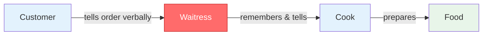
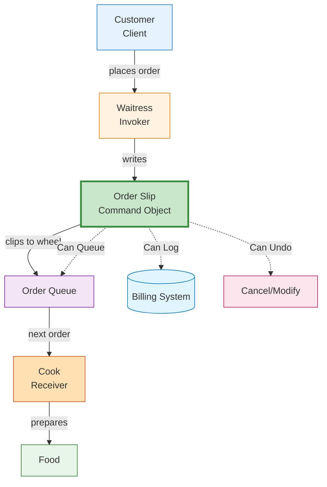
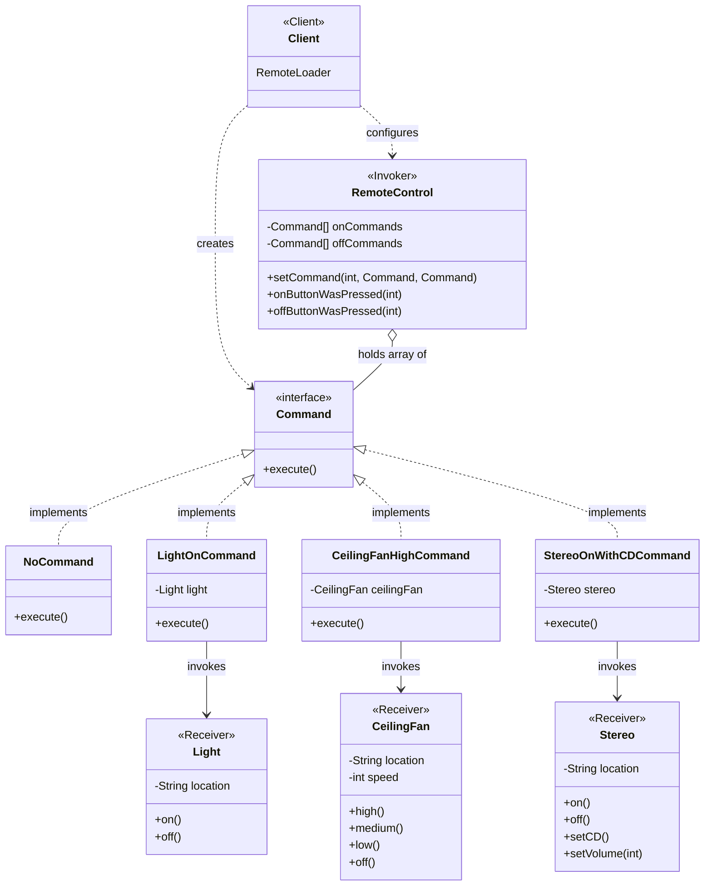
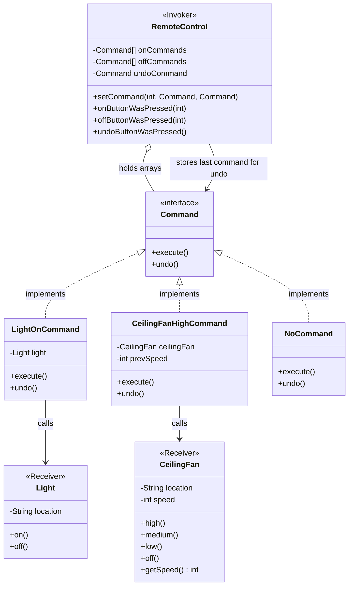
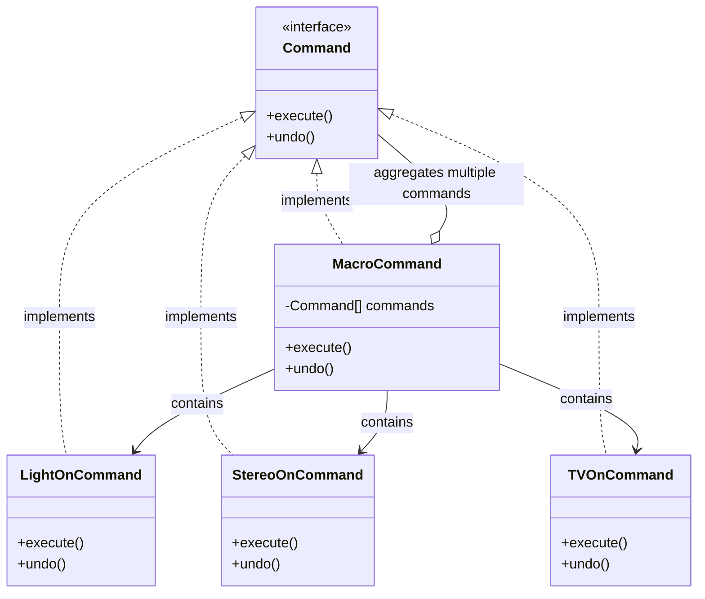
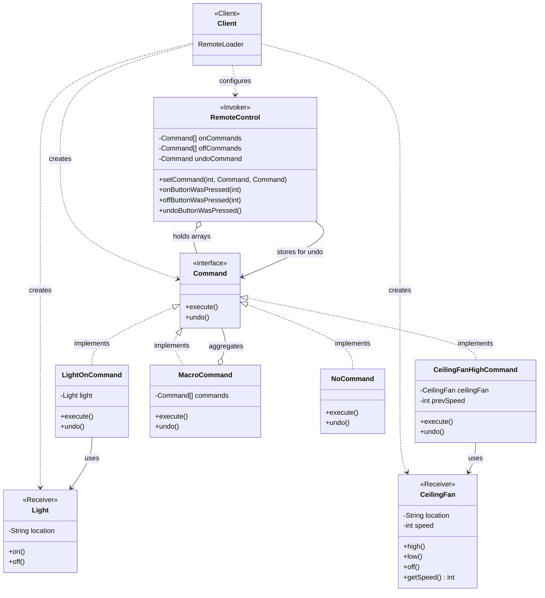

# Pattern Recognition #6: The Command Pattern 🎮

*"From tight coupling to flexible commands - A journey of decoupling requests"*

---

## Introduction: The Art of Giving Orders

Hey there! Welcome back to our design patterns journey. We've covered Strategy, Observer, Decorator, Factory, and Singleton patterns. Today, we're diving into something really powerful—**the Command Pattern**.

But before we jump into theory, let me ask you something: Have you ever worked on a project where pressing a button needs to do different things at different times? Or where you needed to add "undo" functionality? Or maybe you wanted to queue up a series of actions to execute later?

If you've faced any of these scenarios and felt like your code was becoming a tangled mess of if-else statements and tight coupling, you're in the right place. The Command Pattern is going to change how you think about handling requests in your applications.

Let's learn this the fun way—through a story, a conversation, and step-by-step building.

---

## The Problem: Welcome to Home Automation Inc.

Imagine this: You just got hired at **"Home Automation or Bust, Inc."**—a startup building smart home devices. Your first task? Build a universal remote control that can control all these devices:

- **Lights** (Living room, Kitchen, Bedroom)
- **Ceiling Fans** (Different speeds)
- **Stereo Systems** (Play, Stop, Volume)
- **Garage Door** (Open, Close)
- **Smart TV** (On, Off, Change channels)
- **Thermostat** (Temperature control)

The remote has 7 slots, each with an ON button and an OFF button. Plus, there's an UNDO button to reverse the last action.

Here's the catch: Your company wants this remote to be **highly flexible**. Customers should be able to:
- Assign any device to any slot
- Change assignments anytime
- Support new devices without changing the remote's code
- Use the UNDO button to reverse any action

Sounds exciting, right? Let's see how we'd solve this.

---

## The Naive Approach: "Let's Just Hard-Code Everything!"

When you're new to programming (or even when you're experienced but in a hurry), the most obvious solution that comes to mind is:

> "I'll create a `RemoteControl` class that knows about all the devices and calls their methods directly!"

So you start coding:

```java
public class RemoteControl {
    Light livingRoomLight;
    Light kitchenLight;
    CeilingFan ceilingFan;
    Stereo stereo;
    GarageDoor garageDoor;
    TV tv;
    
    // Constructor to initialize all devices
    public RemoteControl(Light living, Light kitchen, CeilingFan fan, 
                         Stereo stereo, GarageDoor garage, TV tv) {
        this.livingRoomLight = living;
        this.kitchenLight = kitchen;
        this.ceilingFan = fan;
        this.stereo = stereo;
        this.garageDoor = garage;
        this.tv = tv;
    }
    
    // Slot 0: Living Room Light
    public void onButtonSlot0Pressed() {
        livingRoomLight.on();
    }
    
    public void offButtonSlot0Pressed() {
        livingRoomLight.off();
    }
    
    // Slot 1: Kitchen Light
    public void onButtonSlot1Pressed() {
        kitchenLight.on();
    }
    
    public void offButtonSlot1Pressed() {
        kitchenLight.off();
    }
    
    // Slot 2: Ceiling Fan
    public void onButtonSlot2Pressed() {
        ceilingFan.high();
    }
    
    public void offButtonSlot2Pressed() {
        ceilingFan.off();
    }
    
    // Slot 3: Stereo
    public void onButtonSlot3Pressed() {
        stereo.on();
        stereo.setCD();
        stereo.setVolume(11);
    }
    
    public void offButtonSlot3Pressed() {
        stereo.off();
    }
    
    // ... and so on for all 7 slots
    
    public void undoButtonPressed() {
        // Um... how do we implement this? 🤔
        // We don't know what the last button press was!
    }
}
```

You show this to your team lead, feeling pretty confident.

---

## The Conversation: Junior meets Senior

**Junior (You):** "Hey, I've finished the remote control implementation! It works perfectly. Each button is mapped to a device."

**Senior:** "Let me take a look... Hmm, I see. Can you walk me through what happens if a customer wants to swap the living room light from slot 0 to slot 3?"

**Junior:** "Uh... I'd have to change the code in `onButtonSlot0Pressed()` and `onButtonSlot3Pressed()` methods... and recompile."

**Senior:** "Right. And what if we add a new device next month—let's say, a Smart Curtain?"

**Junior:** "I'd need to add new methods in the RemoteControl class... and modify existing code..."

**Senior:** "I see. And how about that UNDO button? How would you implement it?"

**Junior:** "That's the tricky part. I'd need to track what the last button press was... maybe with a bunch of flags? Like `lastActionWasLivingRoomLightOn`, `lastActionWasKitchenLightOff`... But that gets messy fast with 7 slots and ON/OFF for each..."

**Senior:** "Exactly. Let me show you the problems with this approach:

### Problems with the Naive Approach:

1. **Tight Coupling:** Your `RemoteControl` knows about every single device. It's tightly bound to `Light`, `CeilingFan`, `Stereo`, etc.

2. **Violates Open/Closed Principle:** Every time you add a new device or change an assignment, you have to modify the `RemoteControl` class.

3. **Hard to Extend:** Want to add features like:
   - Logging what commands were executed?
   - Queuing commands to execute later?
   - Saving favorite configurations?
   - Good luck! Your code will become spaghetti.

4. **No Undo/Redo:** How do you remember what the last action was and how to reverse it? With this design, it's nearly impossible.

5. **No Macro Commands:** What if a customer wants one button to execute multiple actions (like "Movie Mode": dim lights + turn on TV + close curtains)?

6. **Testing Nightmare:** You can't test the remote without all the actual devices.

**Junior:** "Wow, I didn't think about all that. So... what's the solution?"

**Senior:** "Let me show you a different way of thinking about this problem. But first, let me tell you a story about a diner..."

---

## The Analogy: The Diner's Order System 🍔

**Senior:** "Think about how a classic diner works. Let me draw this for you:

### Without Command Pattern (Chaotic Way):



**Problems:** 
- ❌ Waitress tightly coupled to both customer and cook
- ❌ Must remember every detail
- ❌ Can't queue multiple orders easily
- ❌ No tracking or logging
- ❌ Can't undo if customer changes mind

### With Command Pattern (Smart Way using Order Slips):



### Flow Comparison:

**Old Way:** `Customer → Waitress → Cook` (Direct, Tight Coupling)

**Command Way:** `Customer → Waitress → Order Slip → Cook` (Decoupled via Command)

### The Pattern Mapping:

| Diner Component | Command Pattern | Our Remote Problem |
|-----------------|-----------------|-------------------|
| Customer | **Client** | Your application |
| Order Slip | **Command** | LightOnCommand |
| Waitress | **Invoker** | RemoteControl |
| Cook | **Receiver** | Light, Fan, Stereo |
| "Order up!" | **execute()** | command.execute() |
| Cross out order | **undo()** | command.undo() |

**Key Insight:** The order slip (Command) encapsulates:
- ✅ **What to do** (make a burger)
- ✅ **Who does it** (the cook)
- ✅ **How to undo it** (if needed)

The waitress doesn't need to know HOW to cook—she just passes the order slip!

**Junior:** "Ohhh! So instead of the remote directly calling methods on devices, we create 'command objects' that know how to call those methods?"

**Senior:** "Exactly! The order slip = Command object. Let's apply this to our remote control problem."

---

## The Solution: Enter the Command Pattern

The **Command Pattern** says:

> **Encapsulate a request as an object, thereby letting you parameterize clients with different requests, queue or log requests, and support undoable operations.**

Let's break this down into simple terms:
- **Turn actions into objects** (like order slips)
- The object knows what to do and who to do it to
- The invoker (remote) just tells the command "execute yourself"
- The invoker doesn't need to know the details

### The Players:

| Role | Description | Diner Analogy | Our Problem |
|------|-------------|---------------|-------------|
| **Command** | Interface with `execute()` | Order slip format | Command interface |
| **ConcreteCommand** | Specific command implementation | Specific order (burger order) | LightOnCommand |
| **Receiver** | Knows how to do the work | Cook | Light, Fan, Stereo |
| **Invoker** | Asks command to execute | Waitress | RemoteControl |
| **Client** | Creates commands and sets receivers | Customer | Our app setup code |

---

## Building the Solution: Version 1 (Without Undo)

Let's build this step by step. We'll start simple and add complexity gradually.

### Step 1: Create the Command Interface

First, we need a common interface for all commands:

```java
public interface Command {
    void execute();
}
```

That's it! Every command must know how to execute itself.

### Step 2: Create the Receivers (The Devices)

These are the devices that know how to do the actual work:

```java
// Light is a Receiver
public class Light {
    private String location;
    
    public Light(String location) {
        this.location = location;
    }
    
    public void on() {
        System.out.println(location + " light is ON");
    }
    
    public void off() {
        System.out.println(location + " light is OFF");
    }
}

// CeilingFan is a Receiver
public class CeilingFan {
    private String location;
    private int speed;
    
    public static final int HIGH = 3;
    public static final int MEDIUM = 2;
    public static final int LOW = 1;
    public static final int OFF = 0;
    
    public CeilingFan(String location) {
        this.location = location;
        this.speed = OFF;
    }
    
    public void high() {
        speed = HIGH;
        System.out.println(location + " ceiling fan is on HIGH");
    }
    
    public void medium() {
        speed = MEDIUM;
        System.out.println(location + " ceiling fan is on MEDIUM");
    }
    
    public void low() {
        speed = LOW;
        System.out.println(location + " ceiling fan is on LOW");
    }
    
    public void off() {
        speed = OFF;
        System.out.println(location + " ceiling fan is OFF");
    }
    
    public int getSpeed() {
        return speed;
    }
}

// Stereo is a Receiver
public class Stereo {
    private String location;
    
    public Stereo(String location) {
        this.location = location;
    }
    
    public void on() {
        System.out.println(location + " stereo is ON");
    }
    
    public void off() {
        System.out.println(location + " stereo is OFF");
    }
    
    public void setCD() {
        System.out.println(location + " stereo is set for CD input");
    }
    
    public void setRadio() {
        System.out.println(location + " stereo is set for Radio");
    }
    
    public void setVolume(int volume) {
        System.out.println(location + " stereo volume set to " + volume);
    }
}
```

### Step 3: Create Concrete Commands

Now we create specific commands that know how to control these devices:

```java
// Command to turn light ON
public class LightOnCommand implements Command {
    Light light;
    
    public LightOnCommand(Light light) {
        this.light = light;
    }
    
    @Override
    public void execute() {
        light.on();
    }
}

// Command to turn light OFF
public class LightOffCommand implements Command {
    Light light;
    
    public LightOffCommand(Light light) {
        this.light = light;
    }
    
    @Override
    public void execute() {
        light.off();
    }
}

// Command for Ceiling Fan High
public class CeilingFanHighCommand implements Command {
    CeilingFan ceilingFan;
    
    public CeilingFanHighCommand(CeilingFan ceilingFan) {
        this.ceilingFan = ceilingFan;
    }
    
    @Override
    public void execute() {
        ceilingFan.high();
    }
}

// Command for Ceiling Fan Off
public class CeilingFanOffCommand implements Command {
    CeilingFan ceilingFan;
    
    public CeilingFanOffCommand(CeilingFan ceilingFan) {
        this.ceilingFan = ceilingFan;
    }
    
    @Override
    public void execute() {
        ceilingFan.off();
    }
}

// Command for Stereo ON with CD
public class StereoOnWithCDCommand implements Command {
    Stereo stereo;
    
    public StereoOnWithCDCommand(Stereo stereo) {
        this.stereo = stereo;
    }
    
    @Override
    public void execute() {
        stereo.on();
        stereo.setCD();
        stereo.setVolume(11);
    }
}

// Command for Stereo OFF
public class StereoOffCommand implements Command {
    Stereo stereo;
    
    public StereoOffCommand(Stereo stereo) {
        this.stereo = stereo;
    }
    
    @Override
    public void execute() {
        stereo.off();
    }
}
```

**Notice:** Each command:
- Implements the `Command` interface
- Holds a reference to a receiver (the device)
- In `execute()`, it calls methods on the receiver

### Step 4: Create a "Do Nothing" Command (Null Object Pattern)

Before we create the remote, we need a smart trick. What if a slot hasn't been programmed yet? We don't want null checks everywhere. Solution: Create a command that does nothing!

```java
public class NoCommand implements Command {
    @Override
    public void execute() {
        // Do nothing!
    }
}
```

This is called the **Null Object Pattern**—instead of null, we use an object that does nothing.

### Step 5: Create the Invoker (Remote Control)

Now for the star of the show—the remote control:

```java
public class RemoteControl {
    Command[] onCommands;
    Command[] offCommands;
    
    public RemoteControl() {
        onCommands = new Command[7];
        offCommands = new Command[7];
        
        // Initialize all slots with NoCommand
        Command noCommand = new NoCommand();
        for (int i = 0; i < 7; i++) {
            onCommands[i] = noCommand;
            offCommands[i] = noCommand;
        }
    }
    
    public void setCommand(int slot, Command onCommand, Command offCommand) {
        onCommands[slot] = onCommand;
        offCommands[slot] = offCommand;
    }
    
    public void onButtonWasPressed(int slot) {
        onCommands[slot].execute();
    }
    
    public void offButtonWasPressed(int slot) {
        offCommands[slot].execute();
    }
    
    @Override
    public String toString() {
        StringBuffer stringBuff = new StringBuffer();
        stringBuff.append("\n------ Remote Control -------\n");
        for (int i = 0; i < onCommands.length; i++) {
            stringBuff.append("[slot " + i + "] " 
                + onCommands[i].getClass().getSimpleName() + "    " 
                + offCommands[i].getClass().getSimpleName() + "\n");
        }
        return stringBuff.toString();
    }
}
```

**Key Points:**
- Remote holds arrays of commands (one ON and one OFF per slot)
- `setCommand()` lets us assign commands to slots
- When a button is pressed, we just call `execute()` on the command
- **The remote has NO IDEA what the commands do!** It just knows they implement `Command`

### Step 6: The Client Code (Putting It All Together)

```java
public class RemoteLoader {
    public static void main(String[] args) {
        // Create the remote (Invoker)
        RemoteControl remoteControl = new RemoteControl();
        
        // Create all the devices (Receivers)
        Light livingRoomLight = new Light("Living Room");
        Light kitchenLight = new Light("Kitchen");
        CeilingFan ceilingFan = new CeilingFan("Living Room");
        Stereo stereo = new Stereo("Living Room");
        
        // Create all the command objects (Commands)
        LightOnCommand livingRoomLightOn = new LightOnCommand(livingRoomLight);
        LightOffCommand livingRoomLightOff = new LightOffCommand(livingRoomLight);
        
        LightOnCommand kitchenLightOn = new LightOnCommand(kitchenLight);
        LightOffCommand kitchenLightOff = new LightOffCommand(kitchenLight);
        
        CeilingFanHighCommand ceilingFanHigh = new CeilingFanHighCommand(ceilingFan);
        CeilingFanOffCommand ceilingFanOff = new CeilingFanOffCommand(ceilingFan);
        
        StereoOnWithCDCommand stereoOnWithCD = new StereoOnWithCDCommand(stereo);
        StereoOffCommand stereoOff = new StereoOffCommand(stereo);
        
        // Assign commands to remote slots
        remoteControl.setCommand(0, livingRoomLightOn, livingRoomLightOff);
        remoteControl.setCommand(1, kitchenLightOn, kitchenLightOff);
        remoteControl.setCommand(2, ceilingFanHigh, ceilingFanOff);
        remoteControl.setCommand(3, stereoOnWithCD, stereoOff);
        
        // Print out the remote configuration
        System.out.println(remoteControl);
        
        // Test the remote
        System.out.println("\n--- Pressing buttons ---");
        remoteControl.onButtonWasPressed(0);   // Living room light ON
        remoteControl.offButtonWasPressed(0);  // Living room light OFF
        
        remoteControl.onButtonWasPressed(1);   // Kitchen light ON
        remoteControl.offButtonWasPressed(1);  // Kitchen light OFF
        
        remoteControl.onButtonWasPressed(2);   // Ceiling fan HIGH
        remoteControl.offButtonWasPressed(2);  // Ceiling fan OFF
        
        remoteControl.onButtonWasPressed(3);   // Stereo ON with CD, volume 11
        remoteControl.offButtonWasPressed(3);  // Stereo OFF
    }
}
```

**Output:**
```
------ Remote Control -------
[slot 0] LightOnCommand    LightOffCommand
[slot 1] LightOnCommand    LightOffCommand
[slot 2] CeilingFanHighCommand    CeilingFanOffCommand
[slot 3] StereoOnWithCDCommand    StereoOffCommand
[slot 4] NoCommand    NoCommand
[slot 5] NoCommand    NoCommand
[slot 6] NoCommand    NoCommand

--- Pressing buttons ---
Living Room light is ON
Living Room light is OFF
Kitchen light is ON
Kitchen light is OFF
Living Room ceiling fan is on HIGH
Living Room ceiling fan is OFF
Living Room stereo is ON
Living Room stereo is set for CD input
Living Room stereo volume set to 11
Living Room stereo is OFF
```

### Class Diagram (Without Undo)



**Key Relationships:**
- **Client** creates Command objects and configures the Invoker
- **Command** interface is implemented by all concrete commands
- **Concrete Commands** (LightOnCommand, etc.) hold references to **Receivers** (Light, Fan, Stereo)
- **RemoteControl** (Invoker) holds arrays of Command objects
- When a button is pressed, RemoteControl calls `execute()` on the appropriate Command

---

## Let's Review: What We've Achieved

**Junior:** "Wow! This is much better! Now I see:

1. **Decoupling:** The remote doesn't know anything about lights, fans, or stereos. It only knows about the `Command` interface!

2. **Easy to Extend:** Want to add a new device? Just:
   - Create the receiver class
   - Create command classes for it
   - Assign them to slots
   - **No need to modify RemoteControl!**

3. **Flexibility:** We can change slot assignments at runtime. Customer can reprogram their remote!

4. **Testing:** We can test the remote with mock commands without needing real devices.

But... what about the UNDO button?"

**Senior:** "Great question! That's where the pattern really shines. Let's add undo functionality."

---

## Version 2: Adding Undo Functionality

To support undo, we need to:
1. Add an `undo()` method to the Command interface
2. Implement `undo()` in each concrete command
3. Track the last command executed in the remote

### Step 1: Update the Command Interface

```java
public interface Command {
    void execute();
    void undo();  // New method!
}
```

### Step 2: Update NoCommand

```java
public class NoCommand implements Command {
    @Override
    public void execute() { }
    
    @Override
    public void undo() { }  // Still do nothing
}
```

### Step 3: Update Commands with Simple Undo

For simple cases, undo is just doing the opposite:

```java
public class LightOnCommand implements Command {
    Light light;
    
    public LightOnCommand(Light light) {
        this.light = light;
    }
    
    @Override
    public void execute() {
        light.on();
    }
    
    @Override
    public void undo() {
        light.off();  // Undo ON by turning OFF
    }
}

public class LightOffCommand implements Command {
    Light light;
    
    public LightOffCommand(Light light) {
        this.light = light;
    }
    
    @Override
    public void execute() {
        light.off();
    }
    
    @Override
    public void undo() {
        light.on();  // Undo OFF by turning ON
    }
}
```

### Step 4: Undo with State (More Complex)

For the ceiling fan, it's not as simple. If the fan was on MEDIUM and we set it to HIGH, undoing should return it to MEDIUM, not just turn it OFF.

We need to **remember the previous state**:

```java
public class CeilingFanHighCommand implements Command {
    CeilingFan ceilingFan;
    int prevSpeed;  // Store previous state
    
    public CeilingFanHighCommand(CeilingFan ceilingFan) {
        this.ceilingFan = ceilingFan;
    }
    
    @Override
    public void execute() {
        prevSpeed = ceilingFan.getSpeed();  // Remember current state
        ceilingFan.high();                   // Execute the command
    }
    
    @Override
    public void undo() {
        // Restore to previous state
        if (prevSpeed == CeilingFan.HIGH) {
            ceilingFan.high();
        } else if (prevSpeed == CeilingFan.MEDIUM) {
            ceilingFan.medium();
        } else if (prevSpeed == CeilingFan.LOW) {
            ceilingFan.low();
        } else if (prevSpeed == CeilingFan.OFF) {
            ceilingFan.off();
        }
    }
}

public class CeilingFanMediumCommand implements Command {
    CeilingFan ceilingFan;
    int prevSpeed;
    
    public CeilingFanMediumCommand(CeilingFan ceilingFan) {
        this.ceilingFan = ceilingFan;
    }
    
    @Override
    public void execute() {
        prevSpeed = ceilingFan.getSpeed();
        ceilingFan.medium();
    }
    
    @Override
    public void undo() {
        if (prevSpeed == CeilingFan.HIGH) {
            ceilingFan.high();
        } else if (prevSpeed == CeilingFan.MEDIUM) {
            ceilingFan.medium();
        } else if (prevSpeed == CeilingFan.LOW) {
            ceilingFan.low();
        } else if (prevSpeed == CeilingFan.OFF) {
            ceilingFan.off();
        }
    }
}

public class CeilingFanOffCommand implements Command {
    CeilingFan ceilingFan;
    int prevSpeed;
    
    public CeilingFanOffCommand(CeilingFan ceilingFan) {
        this.ceilingFan = ceilingFan;
    }
    
    @Override
    public void execute() {
        prevSpeed = ceilingFan.getSpeed();
        ceilingFan.off();
    }
    
    @Override
    public void undo() {
        if (prevSpeed == CeilingFan.HIGH) {
            ceilingFan.high();
        } else if (prevSpeed == CeilingFan.MEDIUM) {
            ceilingFan.medium();
        } else if (prevSpeed == CeilingFan.LOW) {
            ceilingFan.low();
        } else if (prevSpeed == CeilingFan.OFF) {
            ceilingFan.off();
        }
    }
}
```

### Step 5: Update the Remote Control with Undo

```java
public class RemoteControl {
    Command[] onCommands;
    Command[] offCommands;
    Command undoCommand;  // Track last command
    
    public RemoteControl() {
        onCommands = new Command[7];
        offCommands = new Command[7];
        
        Command noCommand = new NoCommand();
        for (int i = 0; i < 7; i++) {
            onCommands[i] = noCommand;
            offCommands[i] = noCommand;
        }
        undoCommand = noCommand;  // Initialize undo
    }
    
    public void setCommand(int slot, Command onCommand, Command offCommand) {
        onCommands[slot] = onCommand;
        offCommands[slot] = offCommand;
    }
    
    public void onButtonWasPressed(int slot) {
        onCommands[slot].execute();
        undoCommand = onCommands[slot];  // Save for undo
    }
    
    public void offButtonWasPressed(int slot) {
        offCommands[slot].execute();
        undoCommand = offCommands[slot];  // Save for undo
    }
    
    public void undoButtonWasPressed() {
        undoCommand.undo();  // Undo the last command!
    }
    
    @Override
    public String toString() {
        StringBuffer stringBuff = new StringBuffer();
        stringBuff.append("\n------ Remote Control -------\n");
        for (int i = 0; i < onCommands.length; i++) {
            stringBuff.append("[slot " + i + "] " 
                + onCommands[i].getClass().getSimpleName() + "    " 
                + offCommands[i].getClass().getSimpleName() + "\n");
        }
        stringBuff.append("[undo] " + undoCommand.getClass().getSimpleName() + "\n");
        return stringBuff.toString();
    }
}
```

### Step 6: Testing Undo

```java
public class RemoteLoader {
    public static void main(String[] args) {
        RemoteControl remoteControl = new RemoteControl();
        
        Light livingRoomLight = new Light("Living Room");
        
        LightOnCommand livingRoomLightOn = new LightOnCommand(livingRoomLight);
        LightOffCommand livingRoomLightOff = new LightOffCommand(livingRoomLight);
        
        remoteControl.setCommand(0, livingRoomLightOn, livingRoomLightOff);
        
        // Test with undo
        remoteControl.onButtonWasPressed(0);    // Light ON
        remoteControl.offButtonWasPressed(0);   // Light OFF
        System.out.println(remoteControl);
        remoteControl.undoButtonWasPressed();   // UNDO! Light should be ON again
        
        remoteControl.offButtonWasPressed(0);   // Light OFF
        remoteControl.onButtonWasPressed(0);    // Light ON
        System.out.println(remoteControl);
        remoteControl.undoButtonWasPressed();   // UNDO! Light should be OFF again
        
        // Test ceiling fan with state
        CeilingFan ceilingFan = new CeilingFan("Living Room");
        
        CeilingFanMediumCommand ceilingFanMedium = new CeilingFanMediumCommand(ceilingFan);
        CeilingFanHighCommand ceilingFanHigh = new CeilingFanHighCommand(ceilingFan);
        CeilingFanOffCommand ceilingFanOff = new CeilingFanOffCommand(ceilingFan);
        
        remoteControl.setCommand(1, ceilingFanMedium, ceilingFanOff);
        remoteControl.setCommand(2, ceilingFanHigh, ceilingFanOff);
        
        remoteControl.onButtonWasPressed(1);    // Medium
        remoteControl.onButtonWasPressed(2);    // High
        System.out.println(remoteControl);
        remoteControl.undoButtonWasPressed();   // Should go back to Medium!
        
        remoteControl.offButtonWasPressed(2);   // Off
        System.out.println(remoteControl);
        remoteControl.undoButtonWasPressed();   // Should go back to Medium!
    }
}
```

**Output:**
```
Living Room light is ON
Living Room light is OFF

------ Remote Control -------
[slot 0] LightOnCommand    LightOffCommand
...
[undo] LightOffCommand

Living Room light is ON

Living Room light is OFF
Living Room light is ON

------ Remote Control -------
[slot 0] LightOnCommand    LightOffCommand
...
[undo] LightOnCommand

Living Room light is OFF

Living Room ceiling fan is on MEDIUM
Living Room ceiling fan is on HIGH

------ Remote Control -------
...
[undo] CeilingFanHighCommand

Living Room ceiling fan is on MEDIUM

Living Room ceiling fan is OFF

------ Remote Control -------
...
[undo] CeilingFanOffCommand

Living Room ceiling fan is on MEDIUM
```

Perfect! The undo works, even for stateful commands like the ceiling fan.

### Class Diagram (With Undo)



**Key Additions for Undo:**
- **Command interface** now includes `undo()` method
- **CeilingFanHighCommand** stores `prevSpeed` to remember previous state
- **RemoteControl** has `undoCommand` field to track the last executed command
- **State Management**: Commands with complex undo (like fan speed) store previous state before executing

---

## Senior's Wisdom: What Did We Learn?

**Junior:** "This is amazing! The undo works perfectly. And I can see how much more flexible this is than my original approach."

**Senior:** "Exactly. But wait—there's more! Let me show you some advanced features..."

---

## Advanced Feature: Macro Commands (Party Mode! 🎉)

**Senior:** "What if a customer wants one button to do multiple things at once? Like a 'Party Mode' button that:
- Dims the living room lights
- Turns on the stereo with CD
- Turns off the TV

This is called a **Macro Command**—a command that executes multiple commands!"

### Creating the Macro Command

```java
public class MacroCommand implements Command {
    Command[] commands;
    
    public MacroCommand(Command[] commands) {
        this.commands = commands;
    }
    
    @Override
    public void execute() {
        for (int i = 0; i < commands.length; i++) {
            commands[i].execute();
        }
    }
    
    @Override
    public void undo() {
        // Undo in REVERSE order
        for (int i = commands.length - 1; i >= 0; i--) {
            commands[i].undo();
        }
    }
}
```

### Using the Macro Command

```java
public class RemoteLoader {
    public static void main(String[] args) {
        // Create devices
        Light light = new Light("Living Room");
        TV tv = new TV("Living Room");
        Stereo stereo = new Stereo("Living Room");
        
        // Create commands for Party ON
        LightOffCommand lightOff = new LightOffCommand(light);
        StereoOnCommand stereoOn = new StereoOnCommand(stereo);
        TVOnCommand tvOn = new TVOnCommand(tv);
        
        Command[] partyOn = { lightOff, stereoOn, tvOn };
        Command[] partyOff = { 
            new LightOnCommand(light), 
            new StereoOffCommand(stereo), 
            new TVOffCommand(tv) 
        };
        
        MacroCommand partyOnMacro = new MacroCommand(partyOn);
        MacroCommand partyOffMacro = new MacroCommand(partyOff);
        
        // Assign to remote
        RemoteControl remote = new RemoteControl();
        remote.setCommand(6, partyOnMacro, partyOffMacro);
        
        System.out.println("--- Pushing Macro On ---");
        remote.onButtonWasPressed(6);
        
        System.out.println("\n--- Pushing Macro Off ---");
        remote.offButtonWasPressed(6);
        
        System.out.println("\n--- Pushing Undo ---");
        remote.undoButtonWasPressed();
    }
}
```

**Output:**
```
--- Pushing Macro On ---
Living Room light is OFF
Living Room stereo is ON
Living Room TV is ON

--- Pushing Macro Off ---
Living Room light is ON
Living Room stereo is OFF
Living Room TV is OFF

--- Pushing Undo ---
Living Room TV is ON
Living Room stereo is ON
Living Room light is OFF
```

**Notice:** The macro undo works in reverse order! This is important because if we turned things on in a certain sequence, we should turn them off in reverse.

### Macro Command Class Diagram



**How Macro Works:**
- **MacroCommand** implements Command interface just like any other command
- It holds an **array of Command objects** internally
- When `execute()` is called, it loops through and executes each command in order
- When `undo()` is called, it loops through commands in **reverse order** and undos each one
- This is the **Composite Pattern** applied to commands!

---

## More Practical Applications

### 1. Queuing Commands

Since commands are objects, we can queue them:

```java
public class CommandQueue {
    private Queue<Command> queue = new LinkedList<>();
    
    public void addCommand(Command command) {
        queue.add(command);
        System.out.println("Command added to queue");
    }
    
    public void processCommands() {
        System.out.println("Processing all commands...");
        while (!queue.isEmpty()) {
            Command command = queue.remove();
            command.execute();
        }
        System.out.println("All commands processed!");
    }
}

// Usage:
CommandQueue jobQueue = new CommandQueue();
jobQueue.addCommand(new LightOnCommand(light));
jobQueue.addCommand(new StereoOnCommand(stereo));
jobQueue.addCommand(new TVOnCommand(tv));
jobQueue.processCommands();  // Execute all at once
```

**Use cases:**
- Thread pools
- Job schedulers
- Background task processing

### 2. Logging Commands

```java
public class LoggingRemoteControl extends RemoteControl {
    @Override
    public void onButtonWasPressed(int slot) {
        logCommand(onCommands[slot]);
        super.onButtonWasPressed(slot);
    }
    
    @Override
    public void offButtonWasPressed(int slot) {
        logCommand(offCommands[slot]);
        super.offButtonWasPressed(slot);
    }
    
    private void logCommand(Command command) {
        // Log to file or database
        System.out.println("[LOG] Executing: " + command.getClass().getSimpleName() 
                          + " at " + new Date());
    }
}
```

**Use cases:**
- Audit trails
- Debugging
- Analytics
- Crash recovery (replay logged commands)

### 3. Scheduling Commands

```java
public class CommandScheduler {
    private Map<String, Command> scheduledCommands = new HashMap<>();
    
    public void scheduleCommand(String time, Command command) {
        scheduledCommands.put(time, command);
        System.out.println("Command scheduled for " + time);
    }
    
    public void executeScheduledCommand(String time) {
        Command command = scheduledCommands.get(time);
        if (command != null) {
            System.out.println("Executing scheduled command for " + time);
            command.execute();
        }
    }
}

// Usage:
CommandScheduler scheduler = new CommandScheduler();
scheduler.scheduleCommand("7:00 AM", new LightOnCommand(bedroomLight));
scheduler.scheduleCommand("11:00 PM", new LightOffCommand(bedroomLight));
```

---

## Complete Class Diagram (Full Pattern)



**Key Relationships:**
1. **Client** creates Command objects, Receivers, and configures the Invoker
2. **Command interface** is implemented by all concrete commands (LightOnCommand, CeilingFanHighCommand, MacroCommand, NoCommand)
3. **Concrete Commands** hold references to their **Receivers** (Light, CeilingFan)
4. **MacroCommand** aggregates multiple Command objects (Composite Pattern)
5. **RemoteControl** (Invoker) holds arrays of Command objects and tracks last command for undo
6. **Invoker** calls `execute()`/`undo()` on Commands without knowing their implementation
7. **Commands** delegate actual work to **Receivers**

**Pattern Flow:**
```
Client → creates → Commands → configure → Invoker
                      ↓
                   Receivers (do the work)
```

---

## The Command Pattern: Formal Definition

Now that we've built it from scratch, let's revisit the formal definition:

> **The Command Pattern encapsulates a request as an object, thereby letting you parameterize clients with different requests, queue or log requests, and support undoable operations.**

Breaking it down:
- **"Encapsulates a request as an object"** - We turned method calls into Command objects
- **"Parameterize clients"** - The RemoteControl works with ANY command; it's parameterized with different commands
- **"Queue or log requests"** - Since commands are objects, we can store them, queue them, log them
- **"Support undoable operations"** - Commands know how to undo themselves

---

## Benefits of the Command Pattern

### ✅ 1. Decoupling
- The invoker doesn't need to know anything about receivers
- You can change receivers without changing invokers
- Easy to add new commands without modifying existing code

### ✅ 2. Flexibility
- Commands can be assigned at runtime
- Different buttons can do different things without code changes
- Easy to reconfigure behavior

### ✅ 3. Undo/Redo
- Commands encapsulate state needed to reverse operations
- Easy to implement undo/redo with a command history stack
- Each command knows how to undo itself

### ✅ 4. Macro Commands
- Combine multiple commands into one
- Execute complex sequences with a single call
- Undo macros in reverse order

### ✅ 5. Queuing & Scheduling
- Commands are objects—can be stored, queued, transmitted
- Great for job queues, thread pools, distributed systems
- Delayed execution becomes trivial

### ✅ 6. Logging & Crash Recovery
- Log commands before execution
- Replay commands after crash to restore state
- Audit trails for debugging and compliance

### ✅ 7. Testability
- Easy to test invokers with mock commands
- No need for actual devices during testing
- Each component can be tested independently

---

## When to Use the Command Pattern

**✅ USE IT WHEN:**
- You need to parameterize objects with operations
- You want to queue operations, schedule their execution, or execute them remotely
- You need to implement undo functionality
- You want to structure a system around high-level operations built from primitives
- You need to log changes so you can recover or replay them
- You want to support macro commands (grouped operations)
- You need to decouple the sender of a request from its receiver

**❌ AVOID IT WHEN:**
- Operations are simple and unlikely to change
- You don't need undo, queuing, or logging
- The overhead of creating many command classes isn't justified
- Direct method calls are clearer and sufficient
- You're building a small, simple application
- Performance is critical and object creation overhead matters

---

## Real-World Examples

### 1. **GUI Frameworks**
Every button and menu item is backed by a Command:
```java
JButton saveButton = new JButton("Save");
saveButton.addActionListener(e -> saveCommand.execute());

JMenuItem undoMenuItem = new JMenuItem("Undo");
undoMenuItem.addActionListener(e -> lastCommand.undo());
```

### 2. **Text Editors**
Every edit operation is a command:
- InsertTextCommand
- DeleteTextCommand
- BoldCommand
- ItalicCommand

Undo/Redo stacks manage command history.

### 3. **Transaction Systems**
Database transactions use commands for commit/rollback:
```java
transaction.execute();  // Execute the transaction
transaction.rollback(); // Undo on error
```

### 4. **Game Engines**
Player actions are commands that can be replayed:
```java
moveCommand.execute();
attackCommand.execute();
// Replay for demo mode or network sync
```

### 5. **Job Schedulers**
Background tasks are commands in a queue:
```java
scheduler.schedule(emailCommand, "daily");
scheduler.schedule(backupCommand, "weekly");
```

### 6. **Smart Home Apps**
Exactly what we've been building! Alexa, Google Home, etc.

### 7. **Workflow Engines**
Each step in a workflow is a command that can be executed, undone, or re-executed.

---

## Design Principles Reinforced

The Command Pattern exemplifies several design principles:

1. **Encapsulate what varies** - Commands encapsulate requests that vary
2. **Favor composition over inheritance** - Commands compose with receivers
3. **Program to interfaces, not implementations** - The Command interface
4. **Strive for loosely coupled designs** - Invoker and receiver are decoupled
5. **Open/Closed Principle** - Open for extension (new commands), closed for modification (invoker doesn't change)
6. **Single Responsibility Principle** - Each command has one responsibility

---

## Related Patterns

### Command + Composite = Macro Commands
MacroCommand is the Composite pattern—a command that contains other commands.

### Command + Memento = Sophisticated Undo
For complex state, use Memento to save snapshots that Command can restore.

### Command + Observer = Reactive Systems
Commands can notify observers when executed.

### Command vs Strategy
- **Strategy** - encapsulates interchangeable algorithms
- **Command** - encapsulates requests with receivers
- Both use polymorphism, but different intents

### Command + Chain of Responsibility
Commands can be chained, where each command decides whether to handle the request or pass it on.

---

## Common Questions & Answers

**Q: Why not just use callbacks or lambdas?**

A: In Java 8+, you can use lambdas for simple cases:
```java
button.setOnAction(() -> light.on());
```
But Command Pattern gives you:
- Undo (lambdas don't know how to reverse)
- State storage (previous values)
- Composite commands
- Command queues and logging

**Q: Isn't this over-engineering?**

A: For simple cases, yes. But when you need undo, macros, queuing, or remote execution, the pattern pays off. It's about knowing when to use the tool. Start simple, add patterns when complexity demands it.

**Q: How do I handle commands that fail?**

A: Wrap in try-catch and store error state:
```java
@Override
public void execute() {
    try {
        light.on();
        success = true;
    } catch (Exception e) {
        success = false;
        error = e;
        // Optionally: log, notify, retry
    }
}
```

**Q: Can I have multiple levels of undo?**

A: Yes! Use a Stack:
```java
Stack<Command> undoStack = new Stack<>();
Stack<Command> redoStack = new Stack<>();

public void executeCommand(Command cmd) {
    cmd.execute();
    undoStack.push(cmd);
    redoStack.clear(); // Clear redo history
}

public void undo() {
    if (!undoStack.isEmpty()) {
        Command cmd = undoStack.pop();
        cmd.undo();
        redoStack.push(cmd);
    }
}

public void redo() {
    if (!redoStack.isEmpty()) {
        Command cmd = redoStack.pop();
        cmd.execute();
        undoStack.push(cmd);
    }
}
```

**Q: How do I persist commands?**

A: Make commands Serializable:
```java
public class LightOnCommand implements Command, Serializable {
    // ... implementation
}

// Save
ObjectOutputStream out = new ObjectOutputStream(new FileOutputStream("commands.ser"));
out.writeObject(command);

// Load
ObjectInputStream in = new ObjectInputStream(new FileInputStream("commands.ser"));
Command cmd = (Command) in.readObject();
cmd.execute();
```

---

## Key Takeaways 🎯

1. **Commands are objects** that encapsulate requests—turning method calls into first-class objects

2. **Decoupling** is the main benefit—invoker doesn't know about receivers, only the Command interface

3. **Undo is natural** with commands—each command knows how to reverse itself by storing previous state

4. **Macros are easy** by using the Composite pattern—commands can contain other commands

5. **Queuing and logging** become trivial when requests are objects—just add them to collections

6. **Use when flexibility matters**—not for every method call, but when you need undo, macros, queuing, or remote execution

7. **Think like a diner**—invokers are waitresses, commands are order slips, receivers are cooks

---

## What's Next?

In the next article, we'll explore the **Adapter Pattern** and **Facade Pattern**—two structural patterns that help us work with incompatible interfaces and simplify complex subsystems.

Until then, try implementing the command pattern in your own projects. You'll be surprised how often it applies once you start looking for it!

---

## Practice Exercise 🎯

**Challenge:** Create a simple text editor with these commands:
- `InsertTextCommand` - Inserts text at cursor position
- `DeleteTextCommand` - Deletes text
- `BoldCommand` - Makes text bold
- `ItalicCommand` - Makes text italic

Requirements:
- Implement undo/redo using command history stacks
- Support macro commands (e.g., "Format Title" = Bold + Increase Font Size)
- Add a command queue for batch operations

Try it yourself, then compare with the patterns we've learned!

---

**Previous Articles in This Series:**
- [Pattern Recognition #1: Strategy Pattern](https://swapnilagarwal2001.medium.com/pattern-recognition-1-strategy-design-pattern-25e2403b2b93)
- [Pattern Recognition #2: Observer Pattern](https://swapnilagarwal2001.medium.com/pattern-recognition-2-observer-pattern-da29b1cad16f)
- [Pattern Recognition #3: Decorator Pattern](https://swapnilagarwal2001.medium.com/pattern-recognition-3-decorator-pattern-66751a4b7899)
- [Pattern Recognition #4: Factory Method Pattern](https://swapnilagarwal2001.medium.com/pattern-recognition-4-the-factory-method-pattern-8fcc7d8c9e9d)
- [Pattern Recognition #5: Singleton Pattern](https://swapnilagarwal2001.medium.com/pattern-recognition-5-the-singleton-pattern-01cf0620a477)

---

**📚 References:**
- Head First Design Patterns (2nd Edition) by Eric Freeman & Elisabeth Robson
- Design Patterns: Elements of Reusable Object-Oriented Software by Gang of Four

---

*Found this helpful? Follow me for more design pattern deep-dives! 🚀*

*Have questions or suggestions? Drop them in the comments below! 💬*

*Happy Coding! 👨‍💻👩‍💻*
