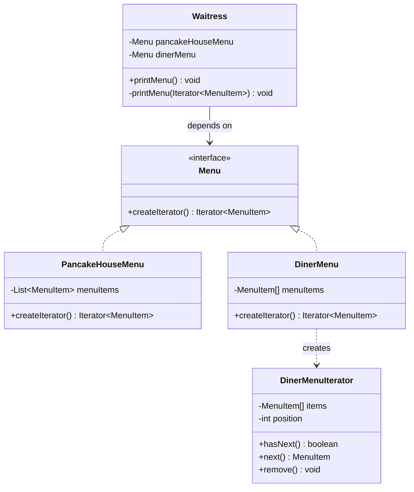

## Pattern Recognition #10: The Iterator Pattern 🍽️

*“Traverse collections without exposing how they’re stored.”*

---

Hey there! Welcome back to our design patterns journey. In the last article, we explored the Template Method Pattern — reusing an algorithm skeleton while customizing steps. Today we’re moving to **Chapter 9** of *Head First Design Patterns (2nd Edition)*: **the Iterator Pattern**.

But before we jump into theory, let me ask you:

- Have you ever written **two different loops** just because one collection was an `ArrayList` and the other was an `Array`?
- Have you ever had to expose a `getItems()` method that returns your internal data structure… and later regretted it?
- Have you ever wanted to write code that says: “Just give me a way to iterate — I don’t care how you store it”?

If yes, you’ve already met the Iterator problem.

---

### The Problem: Objectville Diner + Pancake House merger

Objectville Diner and Objectville Pancake House just merged. Great news for customers:

- Pancake House = **Breakfast menu** 
- Diner = **Lunch menu**

But there’s a problem:

- Lou (Pancake House) stores menu items in an **ArrayList**
- Mel (Diner) stores menu items in a **fixed-size Array**

Neither is willing to rewrite their codebase.

Now you’re hired to build a **Java-enabled Waitress** that can:

- print the breakfast menu
- print the lunch menu
- print the full menu
- (later) print vegetarian menu, etc.

---

### The Naive Approach: “Give me your internal list/array”

The naive way is: each menu exposes `getMenuItems()` and the waitress loops over them.

```java
PancakeHouseMenu pancakeHouseMenu = new PancakeHouseMenu();
ArrayList<MenuItem> breakfastItems = pancakeHouseMenu.getMenuItems();

DinerMenu dinerMenu = new DinerMenu();
MenuItem[] lunchItems = dinerMenu.getMenuItems();

// Loop #1 for ArrayList
for (int i = 0; i < breakfastItems.size(); i++) {
    MenuItem menuItem = breakfastItems.get(i);
    System.out.print(menuItem.getName() + " ");
    System.out.println(menuItem.getPrice() + " ");
    System.out.println(menuItem.getDescription());
}

// Loop #2 for Array
for (int i = 0; i < lunchItems.length; i++) {
    MenuItem menuItem = lunchItems[i];
    System.out.print(menuItem.getName() + " ");
    System.out.println(menuItem.getPrice() + " ");
    System.out.println(menuItem.getDescription());
}
```

But this gets ugly fast:

- PancakeHouse returns `ArrayList<MenuItem>`
- Diner returns `MenuItem[]`
- Waitress must write **two loops**
- if a third restaurant joins with `HashMap`, you’ll write **a third loop**

Worst part? The menu’s internal structure is now **leaking into client code**.

This violates encapsulation and makes the Waitress hard to maintain.

---

### The Conversation: Junior meets Senior

**Junior:** “I can print both menus. I just call `getMenuItems()` on each and loop. It works.”

**Senior:** “How many loops do you have?”

**Junior:** “Two… one for the `ArrayList`, and one for the array.”

**Senior:** “And what happens when another restaurant joins with a different data structure?”

**Junior:** “I guess… I’ll add another loop.”

**Senior:** “That’s the smell. Your iteration logic is varying based on collection type. Encapsulate the iteration.”

**Junior:** “Encapsulate iteration?”

**Senior:** “Yes. Make the menu return an object that knows how to traverse its items, without exposing how they’re stored. That object is an **Iterator**.”

---

### The Analogy: A TV channel list vs remote navigation

You don’t want to know whether the TV stores channels in an array, a list, or a database table.

You just want buttons:

- **Next**
- **Has Next**

That’s exactly what an iterator does for collections.

---

## The Solution: Enter the Iterator Pattern

**Definition (from the book):**

> The Iterator Pattern provides a way to access the elements of an aggregate object sequentially without exposing its underlying representation.

Key outcomes:

- Your **client** (Waitress) becomes independent of the data structure.
- Your **collection** (Menu) keeps its internal representation private.
- The responsibility of traversal moves to a dedicated object (Iterator) → **Single Responsibility**.

---

## Building the solution (book’s “Menu” example — implemented in your repo)

I added the book-style implementation here:

- `Design Patterns/Behavioral_Desing_pattern/Iterator/objectville/`

Run this class:

- `Behavioral_Desing_pattern.Iterator.objectville.MenuTestDrive`

---

### Step 1: Standardize menu items (`MenuItem`)

Both restaurants agree on this:

```java
public class MenuItem {
    private final String name;
    private final String description;
    private final boolean vegetarian;
    private final double price;
    // getters...
}
```

---

### Step 2: Define a common Menu interface

Instead of exposing internal arrays/lists, each menu exposes **one method**:

```java
public interface Menu {
    Iterator<MenuItem> createIterator();
}
```

Now the Waitress “programs to an interface, not an implementation.”

---

### Step 3: Implement menus using different storage (without leaking it)

**PancakeHouseMenu** uses `ArrayList` and returns the built-in iterator:

```java
public class PancakeHouseMenu implements Menu {
    private final List<MenuItem> menuItems = new ArrayList<>();

    @Override
    public Iterator<MenuItem> createIterator() {
        return menuItems.iterator();
    }
}
```

**DinerMenu** uses a fixed array and returns a custom iterator:

```java
public class DinerMenu implements Menu {
    private final MenuItem[] menuItems = new MenuItem[MAX_ITEMS];

    @Override
    public Iterator<MenuItem> createIterator() {
        return new DinerMenuIterator(menuItems);
    }
}
```

And the iterator knows how to traverse the array:

```java
public class DinerMenuIterator implements Iterator<MenuItem> {
    private final MenuItem[] items;
    private int position = 0;

    public boolean hasNext() {
        return position < items.length && items[position] != null;
    }

    public MenuItem next() {
        if (!hasNext()) throw new NoSuchElementException();
        return items[position++];
    }

    public void remove() {
        throw new UnsupportedOperationException(
            "You shouldn't be trying to remove menu items."
        );
    }
}
```

---

### Step 4: The Waitress becomes simple (and future-proof)

Waitress doesn’t care about arrays vs lists anymore:

```java
public class Waitress {
    private final Menu pancakeHouseMenu;
    private final Menu dinerMenu;

    public void printMenu() {
        Iterator<MenuItem> pancakeIterator = pancakeHouseMenu.createIterator();
        Iterator<MenuItem> dinerIterator = dinerMenu.createIterator();

        System.out.println("BREAKFAST");
        printMenu(pancakeIterator);

        System.out.println("LUNCH");
        printMenu(dinerIterator);
    }

    private void printMenu(Iterator<MenuItem> iterator) {
        while (iterator.hasNext()) {
            MenuItem item = iterator.next();
            System.out.println(item.getName() + " -- " + item.getPrice());
        }
    }
}
```

Notice:

- **only one loop** exists (`printMenu(Iterator)`)
- adding a new menu only requires it to implement `Menu.createIterator()`

---

## Class Diagram (Mermaid): Iterator Pattern (Menu example)



---

## The Single Responsibility Principle (Chapter 9 highlight)

Chapter 9 explicitly connects Iterator to SRP:

> A class should have only one reason to change.

If a menu class both:

- manages a collection **and**
- handles iteration logic

it now has **two reasons to change**:

- the collection implementation changes
- the traversal rules change

Iterator keeps these responsibilities separate.

---

## Java details from the chapter (Iterator + Iterable + enhanced for loop)

### `java.util.Iterator`

Java’s iterator has:

- `hasNext()`
- `next()`
- `remove()` (optional — can throw `UnsupportedOperationException`)

### `Iterable` and the enhanced for loop

If something is `Iterable`, you can do:

```java
for (MenuItem item : someIterable) { ... }
```

But the chapter points out an important gotcha:

- **Arrays are not Iterables** (they don’t implement `Iterable`)
- so you can’t unify everything purely with enhanced-for unless you wrap/convert

---

## The “tree structure” case study (teaser for Composite)

At the end of the Iterator chapter, the story evolves:

- more restaurants get acquired
- menus become “menus of menus”
- you naturally end up with a **tree**:

- All Menus
  - Pancake House Menu
  - Diner Menu
  - Cafe Menu
  - Dessert Menu (nested)

This is where **Composite Pattern** enters, because you want to treat:

- a single `MenuItem`
- and a `Menu` (which can contain more menus/items)

uniformly through one interface.

We’ll write **Composite Pattern** as the next article, and we’ll reuse Iterator heavily to traverse that tree.

---

## Key Takeaways 🎯

- **Iterator Pattern** = traverse a collection without exposing its internals.
- It enables **polymorphic iteration**: one loop works for many aggregates.
- It improves **encapsulation** (no leaking internal storage).
- It supports **SRP** (iteration responsibility moved out).
- Java’s `Iterator` + `Iterable` make this pattern extremely common in real projects.

---

## Practice Exercise

Imagine you have a collection of strings, and you want to be able to iterate over them using the Iterator Pattern—how would you design such a collection and its iterator? Think about how you’d structure the classes and what methods are necessary.

(We'll share a reference implementation and GitHub link in the next section so you can compare your approach. Try thinking it through yourself first!)

---

## References

- *Head First Design Patterns (2nd Edition)* — Chapter 9 (Iterator + Composite)
- Java Collections — `java.util.Iterator`, `java.lang.Iterable`

