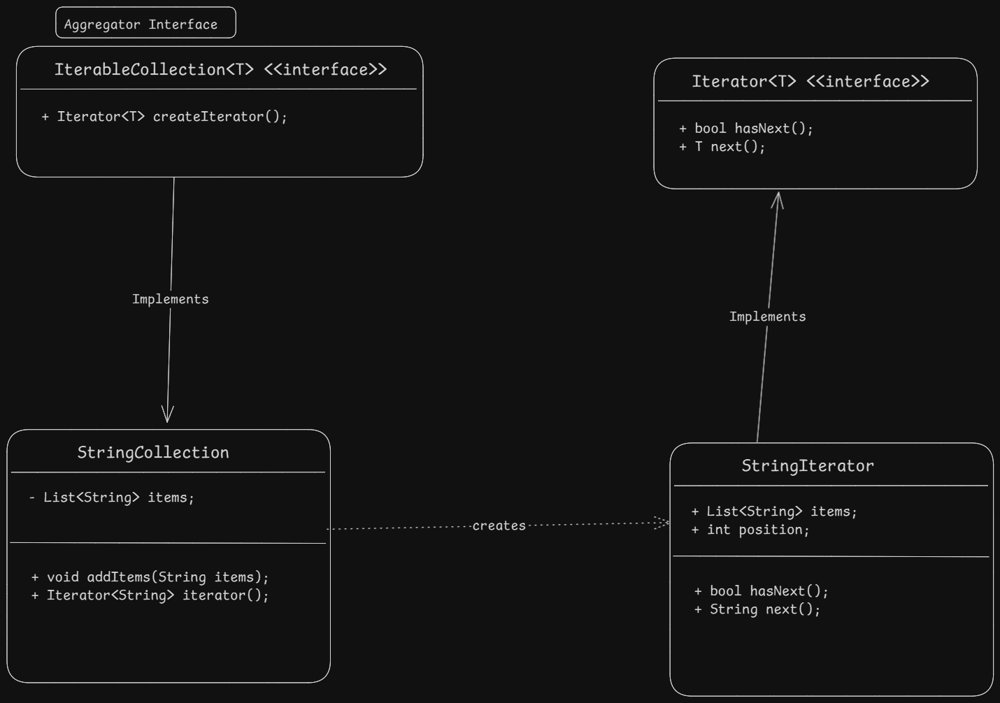

- Iterator design pattern is a behavioral design pattern which helps to access the elements of an aggregate object sequentially without exposing its underlying representation.

#### example
- Iterator class being used by Java to iterate over collections like List, Set, Map etc. is a good example of iterator design pattern.

#### Steps to-do
1. Create an interface for iterator with methods like hasNext(), next() etc.
2. Create concrete iterator class which implements the iterator interface and provides the implementation for the methods.
3. create an interface for aggregate with methods like createIterator() etc.

#### Diagram

#### Pros
1. Single Responsibility principle: The iterator pattern separates the responsibility of iterating over a collection from the collection itself, allowing for cleaner and more maintainable code.
2. Open/Closed principle: New iterator types can be added without modifying the existing collection classes, making the code more extensible.

#### Cons
1. Overhead of creating additional iterator classes.

Learn more of this pattern here. [Learn More here](https://refactoring.guru/design-patterns/iterator)