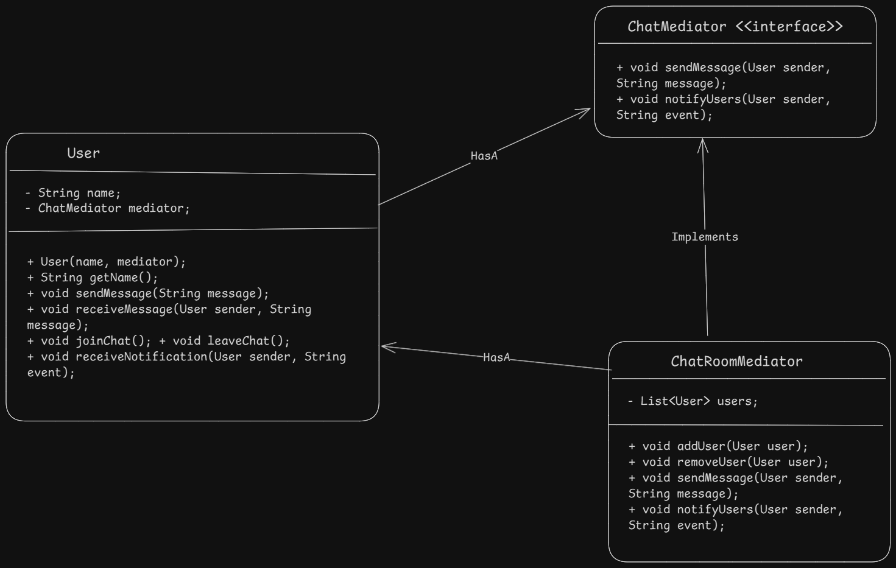

- Mediator design pattern is a behavioral design pattern which helps to reduce coupling by introducing a mediator object to handle communication between objects (colleagues). This helps to centralize mediator logic at a single place.

#### example
- This pattern can be used in managing user communication system like chat application.
- It can be used in Online auction system where mediator helps between different bidders to communicate with each other.
- Airplanes (colleagues) communicate through a control tower (mediator) to coordinate takeoffs and landings.

#### Steps to-do
1. Define the mediator interface
2. Create colleague classes that will communicate through the mediator and each has a reference to the mediator.
3. Implement the concrete mediator that implements mediator interface.

#### Diagram

#### Pros
1. Mediator helps to reduce coupling between objects.
2. Centralized logic at Mediator level
3. Scalable

#### Cons
1. Complexity of mediator class can increase as more colleagues are added.
2. Single point of failure: If the mediator fails, all communication between colleagues is disrupted.

Learn more of this pattern here. [Learn More here](https://refactoring.guru/design-patterns/mediator)