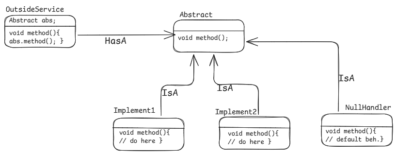

- Null object pattern is a behavioral design pattern which helps to avoid adding explicit null checks and provides a consistent way of handling null object.

#### example
- A vehicle rental service has vehicle. 

#### Steps to-do
1. Extend/Implement an abstract class/interface with NullHandlerClass along with their real implementation.
2. Now, this NullHandlerClass object can be used instead of real world objects to handle NPE/adding default behaviour.

#### Diagram

#### Pros
1. can be used to handle default behaviour/null pointer exceptions.
2. can get rid of putting check for potential NPE.

#### Cons
1. Too much of overheading of putting an extra classes for NullHandler

Learn more of this pattern here. [Learn More here](https://www.geeksforgeeks.org/null-object-design-pattern/)