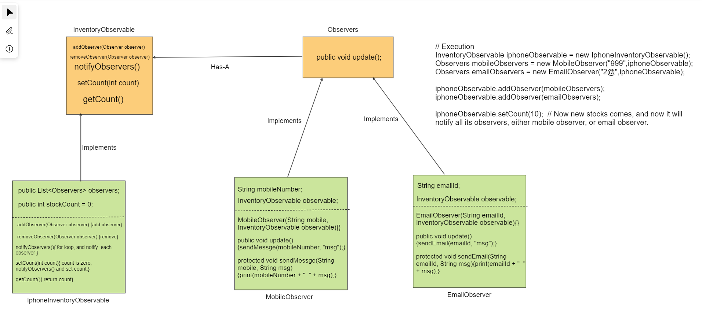

# Here we are dealing with Observer Design Pattern.

## Observer Pattern Basically consist of two main things, Observable(Subject: the thing which is being observed), Observer(people who observe subject.)

## Observer Pattern: Advantages and Disadvantages

- The code is more maintainable because it is less coupled between the observable classes and their dependencies (the observers).
- Clean code. The Open-Closed Principle is guaranteed since the new observers (subscribers) can be introduced without breaking the existing code in the observable (and vice versa).
- Cleaner code. The Single Responsibility Principle (SRP) is respected since the responsibility of each observer is transferred to its update method instead of having that business logic in the Observable object.

#### Examples

- An auction system in which there is an object (subject) that emits the change produced (push technique) in the price of a product that is being auctioned to all observers (observer) interested in acquiring that product. Every time the price of the product auction increases because some observador has increased the bid, it is notified to all observers.

    Question: Here we are going to create notify system of shopping website, in which whenever an item goes into empty state, then we will provide notify me functionality, so whenever that item is again comes on out shopping site, user (Subscribed) are able to get the notification either through mail or mobileNumber.

#### Let's identify the Subject, and Observer.

* Observer can be any user who has asked/subscribed for notify me on that product.
* So, as per the question user can subscribe on multiple products to be notified.
* So, Observable are also of multiple types, and observers are obviously multiple.
* So, Here Many-to-Many Relationship is going on.

* <u>Observable</u>: InventoryObservableInterface,    It will be implemented by multiple products Inventory like IphoneInventoryObservable,
  PumaShoesInventoryObservable etc.
* <u>Observer</u>: Now, we can have NotificationAlertObserver, Now user want to notify either using email or mobile or some other strategy.

