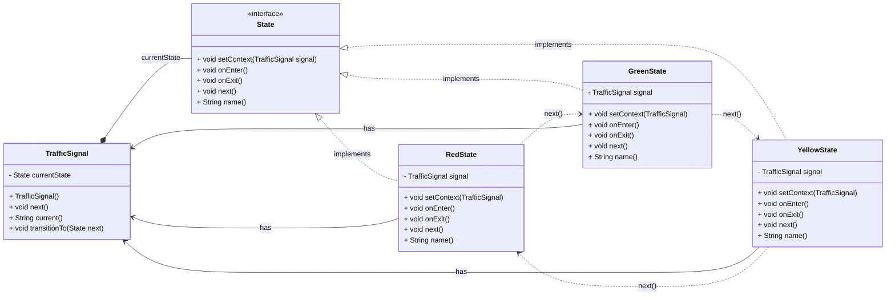

- State design pattern is a behavioural design pattern which helps to control the behaviour of the object based on certain states. This pattern is totally inspired from the `finite state machine` concept.

#### example
- For ex: A traffic signal can be in red, green or yellow state, on each state it can move to next state based on certain conditions or rules. Writing a lot of if-elif-else conditions can be cumborsome, and violates the `open/close` and `single responsibility` principle. So, state pattern helps to maintain a seperate concrete class for each state of the object.
- This seperate state extends/implements a common interface which defines the behaviour of the object in each state. Now, each concrete state class can define its own behaviour.

    ```py
    # Traffic signal if..elif..else block
    
    def handle_input(input):
        if input == "red":
            # do something
        elif input == "green":
            # do something
        elif input == "yellow":
            # do something
    
    # Converting above block into state pattern
    # This should be abstract class which have abstract method handle_input

    class TrafficSignal(ABC):

        def __init__(self, traffic_signal):
            self.traffic_signal = traffic_signal
        
        @abstractmethod
        def handle_input(self, input):
            pass

    class RedState(TrafficSignal):
        def handle_input(self, input):
            pass
    
    class GreenState(TrafficSignal):
        def handle_input(self, input):
            pass
    
    class YellowState(TrafficSignal):
        def handle_input(self, input):
            pass

    class TrafficSignalContext:
        def __init__(self):
            self.state = RedState(self)

        def set_state(self, state):
            self.state = state

        def handle_input(self, input):
            self.state.handle_input(input)

    ```

#### Steps to-do
1. Create a abstract class `TrafficSignal` which defines the common interface for all the states.
2. Create concrete state classes (`RedState`, `GreenState`, `YellowState`) for each state of the object.
3. Create a context class `TrafficSignalContext` which has a reference to the current state of the object.
4. The context class will delegate the request to the current state object.


#### Diagram

##### Class Diagram (Mermaid)



#### Pros
1. Follows `open/closed` and `single responsibility` principle.
2. Extendable code as new states can be added without changing existing code.
3. Easy to maintain and extend.

#### Cons
1. `Class Proliferation` - as new states are added, the number of classes increases and if there are 100 new states, then 100 new classes are created.
2. `No BirdEye View` - It is difficult to understand the flow of the code as it is not a single class.
3. `Not useful for 2/3 states` - If there are only 2/3 states, then it is not worth to create a separate class for each state.


Learn more of this pattern here. [Learn More here](https://refactoring.guru/design-patterns/state)