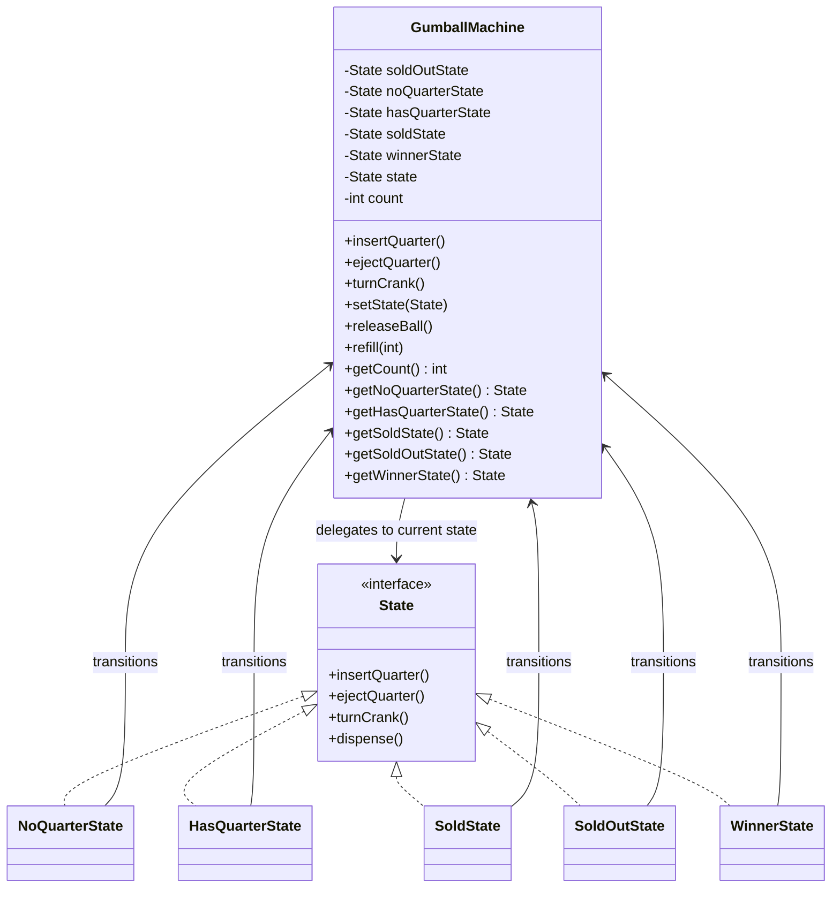

# Pattern Recognition #12: The State Pattern

*“Replace ugly conditionals with clean state objects.”*

---

## Introduction

Hey there! Welcome back to our design patterns journey. In the last article, we explored the Composite Pattern — building tree structures and treating parts and wholes uniformly. Today, we’re diving into another powerful behavioral pattern — **the State Pattern**.

But before we jump into theory, let me ask you:

- Have you ever built a feature where behavior changes depending on a status like `NEW`, `PROCESSING`, `COMPLETED`, `CANCELLED`?
- Did you end up with a giant `if-else` or `switch` block that kept growing with every new rule?
- Did adding a new state feel like “touching working code in 10 places”?

If yes, you’ve already met the State Pattern problem.

---

## The Problem: Mighty Gumball Machine

Suppose you’re building the software for a gumball vending machine. The machine supports these actions:

- `insertQuarter()`
- `ejectQuarter()`
- `turnCrank()`
- `dispense()`

And the machine can be in these states:

- `SOLD_OUT` (no gumballs left)
- `NO_QUARTER` (waiting for money)
- `HAS_QUARTER` (ready to vend)
- `SOLD` (currently dispensing)

Now, here’s the tricky part:

- In `NO_QUARTER`, inserting a quarter is valid.
- In `HAS_QUARTER`, inserting another quarter is invalid.
- In `SOLD_OUT`, everything is basically invalid (until refill).
- After turning the crank, we must dispense exactly one gumball (unless we add “game” rules later).

So behavior is **state-dependent**.

---

## The Naive Approach: `int state` + giant conditionals

The most common first attempt is something like:

```java
final static int SOLD_OUT = 0;
final static int NO_QUARTER = 1;
final static int HAS_QUARTER = 2;
final static int SOLD = 3;

int state = SOLD_OUT;

public void insertQuarter() {
    if (state == HAS_QUARTER) {
        System.out.println("You can't insert another quarter");
    } else if (state == NO_QUARTER) {
        state = HAS_QUARTER;
        System.out.println("You inserted a quarter");
    } else if (state == SOLD_OUT) {
        System.out.println("You can't insert a quarter, the machine is sold out");
    } else if (state == SOLD) {
        System.out.println("Please wait, we're already giving you a gumball");
    }
}
```

And you repeat similar blocks inside `ejectQuarter()`, `turnCrank()`, `dispense()`.

### What goes wrong?

- Adding a new state means modifying **every method**
- State transitions are buried inside conditionals
- Easy to introduce bugs while adding features
- Violates Open/Closed and becomes hard to reason about

---

## The Conversation: Junior meets Senior

**Junior:** “I implemented the gumball machine with a state variable and `if-else` blocks. It works!”

**Senior:** “Nice. Now add a new rule: 10% of the time, the user gets **two gumballs**.”

**Junior:** “Okay… I’ll add a `WINNER` state and update every method with new conditions.”

**Senior:** “Exactly. And that’s the problem. Your behavior changes by state — so the state logic should live in state objects, not inside a monolithic class.”

**Junior:** “So we create a class for each state?”

**Senior:** “Yes. Encapsulate what varies: state-dependent behavior.”

---

## The Solution: Enter the State Pattern

The State Pattern:

- lets an object **alter its behavior when its internal state changes**
- achieves this by delegating work to the **current state object**

### The roles

- **Context**: the main object whose behavior changes (GumballMachine)
- **State**: interface for all states (methods like insert/eject/turn/dispense)
- **Concrete States**: `NoQuarterState`, `HasQuarterState`, `SoldState`, `SoldOutState`, etc.

---

## Step-by-step implementation (Gumball Machine)

All code for this example is available here:

- `Design Patterns/Behavioral_Desing_pattern/State/gumball/`

Run:

- `Behavioral_Desing_pattern.State.gumball.GumballMachineTestDrive`

---

### Step 1: Create the `State` interface

Each action is delegated to the current state:

```java
public interface State {
    void insertQuarter();
    void ejectQuarter();
    void turnCrank();
    void dispense();
}
```

---

### Step 2: Create the `Context` (`GumballMachine`)

The context:

- holds a reference to the current state
- holds inventory count
- delegates actions to the state
- allows states to transition it

```java
public class GumballMachine {
    State soldOutState;
    State noQuarterState;
    State hasQuarterState;
    State soldState;
    State winnerState;

    State state;
    int count;

    // delegates: insertQuarter/ejectQuarter/turnCrank
    // helpers: setState(), releaseBall(), refill()
}
```

---

### Step 3: Implement the concrete states

Example: `SoldState` (dispensing a gumball)

```java
public class SoldState implements State {
    private final GumballMachine gumballMachine;

    public SoldState(GumballMachine gumballMachine) {
        this.gumballMachine = gumballMachine;
    }

    public void insertQuarter() {
        System.out.println("Please wait, we're already giving you a gumball");
    }

    public void ejectQuarter() {
        System.out.println("Sorry, you already turned the crank");
    }

    public void turnCrank() {
        System.out.println("Turning twice doesn't get you another gumball!");
    }

    public void dispense() {
        gumballMachine.releaseBall();
        if (gumballMachine.getCount() > 0) {
            gumballMachine.setState(gumballMachine.getNoQuarterState());
        } else {
            System.out.println("Oops, out of gumballs!");
            gumballMachine.setState(gumballMachine.getSoldOutState());
        }
    }
}
```

Notice:

- invalid actions are handled locally in the state
- transitions are explicit (`setState(...)`)
- no giant `if-else` blocks in the context

---

### Step 4: Add the “Winner” state (10% game rule)

Instead of modifying 4 methods with new conditions, you:

- add a new state
- update the crank-turn logic in exactly one place (`HasQuarterState`)

Winner state dispenses **two** gumballs:

```java
public class WinnerState implements State {
    private final GumballMachine gumballMachine;

    public void dispense() {
        gumballMachine.releaseBall();
        if (gumballMachine.getCount() == 0) {
            gumballMachine.setState(gumballMachine.getSoldOutState());
        } else {
            gumballMachine.releaseBall();
            System.out.println("YOU'RE A WINNER! You got two gumballs for your quarter");
            if (gumballMachine.getCount() > 0) {
                gumballMachine.setState(gumballMachine.getNoQuarterState());
            } else {
                System.out.println("Oops, out of gumballs!");
                gumballMachine.setState(gumballMachine.getSoldOutState());
            }
        }
    }
}
```

---

## Class Diagram (Mermaid)



---

## Common Pitfalls

1. **Too much logic in Context**
   - If the context still contains huge `if-else` blocks, you didn’t really move behavior into states.

2. **Hardcoding concrete state transitions**
   - If `HasQuarterState` does `new SoldState()` directly, you create strong dependencies.
   - Prefer using getters on the context like `getSoldState()`.

3. **State objects holding too much internal state**
   - If states store per-machine data, they may not be shareable.
   - If you want shared states across many contexts, keep states stateless or pass context data into methods.

4. **Class explosion**
   - State pattern adds classes. It’s worth it when rules grow. If you only have 2 trivial states, it might be overkill.

5. **Invalid action handling**
   - Be consistent: each state should define what happens for invalid actions (ignore, print message, throw exception).

---

## Exercise for User: Traffic Signal (your implementation)

Now try implementing State Pattern for a **Traffic Signal**:

- `RED` → `GREEN` → `YELLOW` → `RED`

### Requirements

- Context: `TrafficSignal`
- States: `RedState`, `GreenState`, `YellowState`
- Method: `next()` triggers state transition
- Optional: `onEnter()` / `onExit()` hooks for messages

### Hints

You already have a working reference implementation here:

- `Design Patterns/Behavioral_Desing_pattern/State/`
- Run: `Behavioral_Desing_pattern.State.Main`

Try to implement it yourself first, then compare with the code.

---

## State vs Strategy (small comparison)

State and Strategy often look similar in structure (composition + interface + concrete implementations), but the **intent** is different:

- **State Pattern**
  - behavior changes because the **internal state** changes
  - transitions are usually well-defined (finite state machine style)
  - client usually doesn’t choose states directly

- **Strategy Pattern**
  - behavior changes because the client (or configuration) chooses an **algorithm**
  - strategies are interchangeable and often selected externally
  - switching strategies at runtime is possible, but the context doesn’t necessarily “progress” through a state graph

Rule of thumb:

- Use **State** to replace complex state-based conditionals.
- Use **Strategy** when you need swappable algorithms.

---

## References

- Head First Design Patterns (2nd Edition) by Eric Freeman & Elisabeth Robson
- Github: Low-Level Design Repository ([`https://github.com/code123-tech/Low-Level-Design-Questions/`](https://github.com/code123-tech/Low-Level-Design-Questions/))

