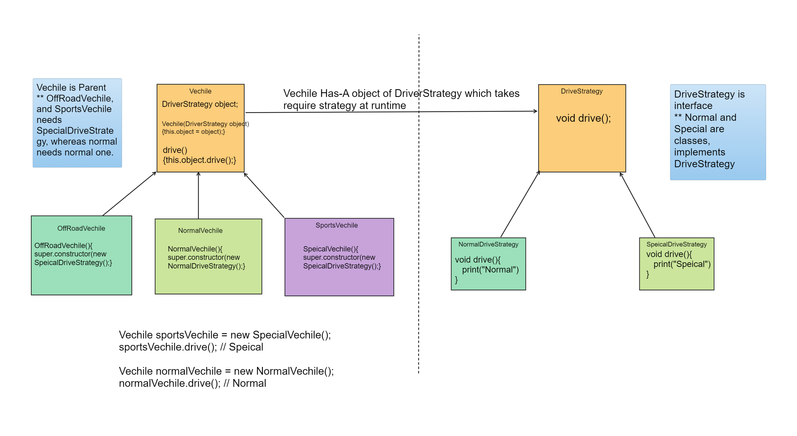

- Strategy Design pattern is most useful and common Behavioural design pattern.
- It indicates that when you have multiple strategies, or algorithms, then  on the basis of end-users' selected strategy,
   that class is executed.
- This Principle also asks you to follow Dependency Inversion Principle.

- Suppose, you have a AuthenticationProgram which provides three type of authentication mechanism like Basic, OAuth, OpenIDAuth.
   Now, Based at runtime, the object which is needed/passed by client ki i need this strategy, our code should be capable of handling
   it very easily. 
   
- Here, higher level module is AuthProgram, 
- Abstraction Layer is AuthStrategy  --> BasicAuthStrategy, OAuthStrategy, OpenIdAuthStrategy
- Strategy Pattern mainly shows Has-A relationship.  

