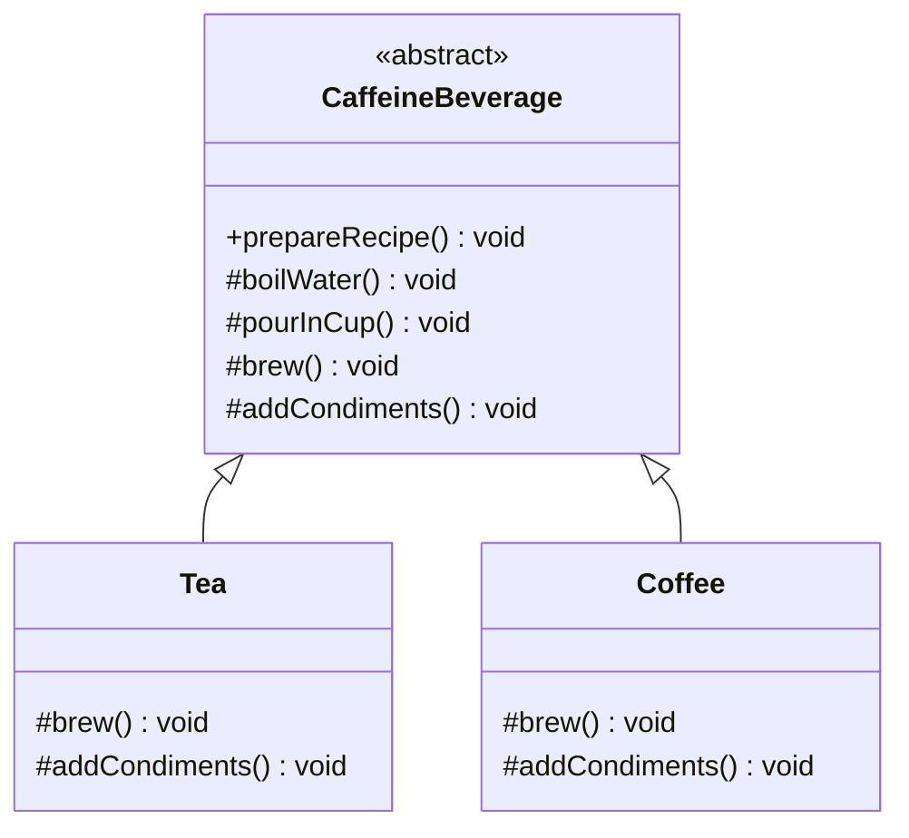

# Pattern Recognition #9: The Template Method Pattern ☕

*“Reuse the algorithm like a pro — while keeping control of the steps.”*

---

Hey there! Welcome back to our design patterns journey. In the last article, we explored the Facade Pattern — simplifying complex subsystems. Today, we’re diving into another behavioral pattern from **Chapter 8** of *Head First Design Patterns (2nd Edition)* — **the Template Method Pattern**.

But before we jump into theory, let me ask you: Have you ever implemented the same workflow in multiple classes with just 1–2 steps different? Like:

- processing different file formats (CSV vs JSON)
- different payment flows (card vs UPI)
- different beverage recipes (coffee vs tea)

If yes, you’ve likely duplicated code and then suffered when requirements changed.

The Template Method Pattern fixes this by placing the **algorithm skeleton** in one place (the superclass), while letting subclasses fill in the details.

---

### The Problem: Starbuzz Coffee Barista Training Manual

Suppose you’re implementing the internal “barista training” system for **Starbuzz**.

They give you two recipes:

- **Coffee**
  1. Boil water
  2. Brew coffee in boiling water
  3. Pour into cup
  4. Add sugar and milk

- **Tea**
  1. Boil water
  2. Steep tea in boiling water
  3. Pour into cup
  4. Add lemon

Looks familiar? Same structure, different steps.

So you write `Coffee` and `Tea` classes… and then you notice you’ve duplicated code (boil water, pour in cup) and duplicated the algorithm structure itself.

---

### The Naive Approach: Implement each recipe separately

The naive approach usually looks like this:

- each class has its own `prepareRecipe()`
- shared steps are copied and pasted
- the “order of steps” is repeated everywhere

This works… until the business says:

> “From now on, every beverage must log the start/end of preparation.”  
> or  
> “Condiments should be optional if the customer says no.”

Now you’re editing multiple classes and hoping you don’t miss any.

---

### The Conversation: Junior meets Senior

**Junior:** “I’ve implemented `Coffee` and `Tea`. They work. But I realized both classes have the same `boilWater()` and `pourInCup()` logic.”

**Senior:** “That duplication is your first warning sign.”

**Junior:** “So I’ll create a base class and share those methods.”

**Senior:** “Good start. But the bigger issue is: you’re duplicating the *algorithm skeleton* too. Both follow the same template:

1. boil water  
2. brew/steep  
3. pour into cup  
4. add condiments

Put the skeleton in the superclass and let subclasses define only the steps that vary.”

**Junior:** “So the superclass runs the show, and the subclasses plug in their implementations?”

**Senior:** “Exactly. That’s Template Method.”

---

### The Analogy: A recipe template card

Think of a printed recipe card where the structure is fixed:

1. Boil water  
2. Brew  
3. Pour into cup  
4. Add condiments  

The “brew” and “condiments” part changes based on what you’re making.

That *recipe skeleton* is the Template Method.

---

## The Solution: Enter the Template Method Pattern

**Definition (from the book):**

> Define the skeleton of an algorithm in an operation, deferring some steps to subclasses.  
> Template Method lets subclasses redefine certain steps of an algorithm without changing the algorithm’s structure.

In simple terms:

- superclass owns the workflow
- subclasses implement only the variable steps
- the algorithm structure stays protected

---

## Building the Solution (using your repo code)

All code is available in:

- `Design Patterns/Behavioral_Desing_pattern/TemplateMethod/beverages/`
- `Design Patterns/Behavioral_Desing_pattern/TemplateMethod/beverages/hooks/`

### Step 1: Create the abstract base class (template)

```java
public abstract class CaffeineBeverage {

    // Template Method (algorithm skeleton)
    public final void prepareRecipe() {
        boilWater();
        brew();
        pourInCup();
        addCondiments();
    }

    // Primitive operations (subclasses MUST implement)
    protected abstract void brew();
    protected abstract void addCondiments();

    // Concrete operations (shared)
    protected void boilWater() {
        System.out.println("Boiling water");
    }

    protected void pourInCup() {
        System.out.println("Pouring into cup");
    }
}
```

### Step 2: Implement the subclasses (Tea and Coffee)

```java
public class Tea extends CaffeineBeverage {
    @Override
    protected void brew() {
        System.out.println("Steeping the tea");
    }

    @Override
    protected void addCondiments() {
        System.out.println("Adding Lemon");
    }
}
```

```java
public class Coffee extends CaffeineBeverage {
    @Override
    protected void brew() {
        System.out.println("Dripping Coffee through filter");
    }

    @Override
    protected void addCondiments() {
        System.out.println("Adding Sugar and Milk");
    }
}
```

### Step 3: Test drive

Run: `TemplateMethod.beverages.BeverageTestDrive`

---

## Class Diagram (Mermaid)



---

## Hooks: Making steps optional (Chapter 8 highlight)

Now comes the fun part: **hooks**.

A **hook** is a method in the abstract class that has a default implementation (often “do nothing” or “return true/false”), and subclasses *may* override it.

In Chapter 8, the hook decides whether to add condiments:

```java
public abstract class CaffeineBeverageWithHook {
    public final void prepareRecipe() {
        boilWater();
        brew();
        pourInCup();
        if (customerWantsCondiments()) {   // hook controls flow
            addCondiments();
        }
    }

    protected boolean customerWantsCondiments() {
        return true; // default
    }

    // ...
}
```

In your repo, run the hook version via:

- `TemplateMethod.beverages.BeverageTestDrive`

It will ask you in console if you want lemon / sugar+milk.

**Rule of thumb (from the book):**

- Use **abstract methods** when the subclass **must** implement it.
- Use **hooks** when the step is **optional** (or to let subclasses “react”).

---

## The Hollywood Principle: “Don’t call us, we’ll call you”

Chapter 8 connects Template Method to the **Hollywood Principle**:

> “Don’t call us, we’ll call you.”

Meaning:

- the **high-level** component controls the algorithm (superclass)
- the **low-level** components (subclasses) plug in behavior
- subclasses don’t run the show — they get called when needed

That’s exactly what happens in `prepareRecipe()`:

- superclass calls `brew()` at the right time
- superclass calls `addCondiments()` at the right time

This reduces dependency rot and is one reason Template Method is used heavily in frameworks.

---

## Template Methods in the Wild (Java examples from Chapter 8)

### 1) `Arrays.sort()` + `Comparable`

Run: `TemplateMethod.wild.ducks.DuckSortTestDrive`

`Arrays.sort()` controls the sorting algorithm, but relies on your `compareTo()` to complete the comparison step — very “template-method-ish” (even though it’s not textbook inheritance-based due to arrays).

### 2) `JFrame.paint()` hook

Run: `TemplateMethod.wild.swing.MyFrame`

Swing’s drawing flow calls `paint()`; the default behavior is basically “do nothing” (hook), and you override it to insert custom drawing.

---

## Template Method vs Strategy (quick comparison)

- **Template Method**: algorithm reuse via **inheritance** (superclass defines skeleton)
- **Strategy**: algorithm swapping via **composition** (plug a different strategy at runtime)

If the skeleton is stable and only steps vary → Template Method  
If you want runtime switching and more flexibility → Strategy

---

## When to Use Template Method

- You have multiple classes with the **same workflow** but different steps
- You want **code reuse** and a **single source of truth** for the algorithm
- You want to **protect the algorithm structure** (use `final`)
- You want optional steps with **hooks**

## Common Pitfalls

- Not marking the template method `final` → subclasses can break the algorithm
- Too many hooks → flow becomes hard to reason about
- Forcing inheritance when composition would be cleaner → consider Strategy

---

## Practice Exercise

1. Add a new beverage `HotChocolate` in `beverages/`
   - override `brew()` and `addCondiments()`

2. Add a hook-controlled optional step like `addExtras()`

---

## References

- *Head First Design Patterns (2nd Edition)* — Chapter 8 (Template Method)
- Java API examples mentioned in Chapter 8: `Arrays.sort`, `Comparable`, `JFrame.paint`, `InputStream.read`


