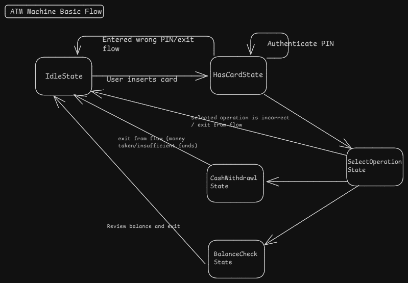
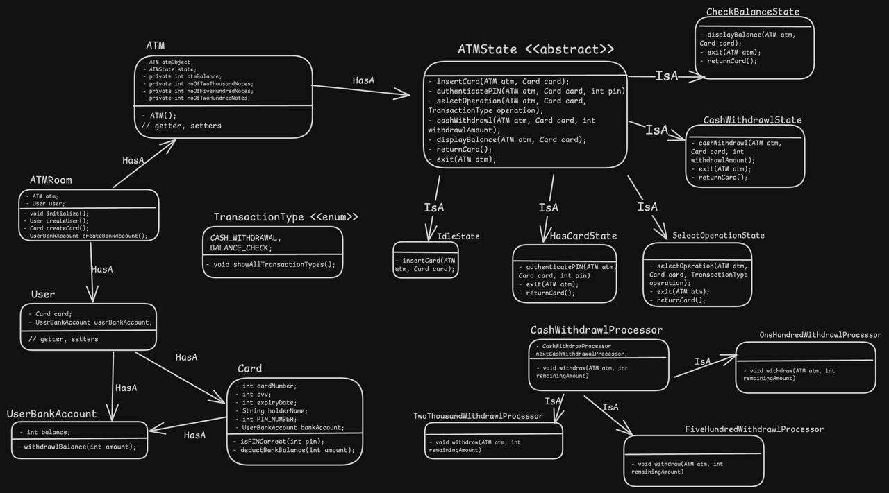

### What is ATM Machine?
It is an automated teller machine system that can be used to withdraw money from your bank account using a card called ATM card.

### Requirements
Now, Let's go through some requirements of ATM Machine
* User can insert ATM card into the machine.
* User can enter it's PIN into the machine
* User can perform following operations:
    * Withdrawl cash
    * Check Balance
* User can exist anytime from the flow.
* If user enters wrong pin, take it outside the flow.
* User can withdraw money in form of different notes like 2k, 500 and 100.

### Questions (With Scope of improvement)
* User can perform more operation in future such as ATM PIN change and etc.

### Models/Entities
* User
* Card
* BankAccount
* ATM
* ATM_Room
* TransactionType: {CASH_WITHDRAWL, CHECK_BALANCE}
* ATMState
    * IdleState
    * HasCardState
    * SelectOperationState
    * CashWithdrawlState
        * CashWithdrawlProcessor (Chain of responsibility)
            * TwoThousandWithdrawlProcessor
            * FiveHundredWithdrawlProcessor
            * TwoHundredWithdrawlProcessor
    * CheckBalanceState

### Diagram
1. Basic State Flow Diagram

2. UML Diagram

