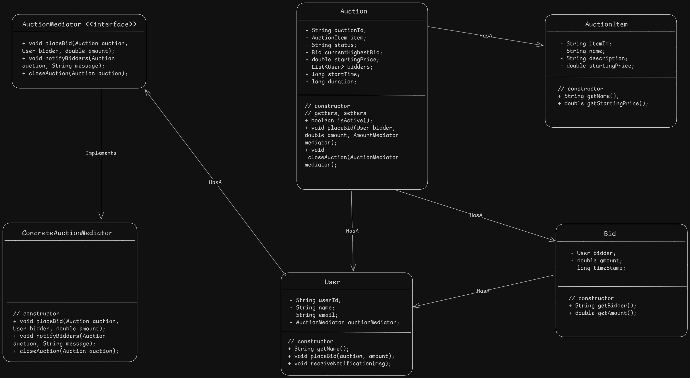

### Index
1. [What is Auction System](#what-is-auction-system)
2. [Let's understand a basic operations / Requirements](#lets-understand-a-basic-operations--requirements)  
3. [Questions (With Scope of improvement)](#questions-with-scope-of-improvement)
4. [Models/Entities](#modelsentities)
5. [Diagrams](#diagrams)
    * [UML Diagram](#uml-diagram)

### What is Auction System?
An Online Auction system is a platform where `Bidders` can `place Bids` on certain `Items` sold by `Selller`. There is auctioneer who manages the auction and can set rules for the auction and acts as `Mediator` between `Bidders` and `Seller`.

### Let's understand a basic operations / Requirements
- Auction can be created with items to be listed in auction, updated.
- Bidders can place their bids higher than last bid value
- Check auction status
- Notify other bidders that higher bid is placed
- Close auction as soon as Highest bidder is winner
- Handle multiple bidders and bids concurrently

### Questions (With scope of improvement)
* Notify other bidders in minimum possible time

### Models/Entities
* `User:` user who is seller/bidder, placeBid and receiveNotification
* `AuctionItem:` the item needs to be sold
* `Auction:` Auction which takes place to sell the item
* `Bid:` Bid placed by bidder
* `AuctionMediator (interface):` interface to manage auction and notify bidders
* `ConcreteAuctionMediator:` manages all auctions

### Diagrams
##### UML Diagram
