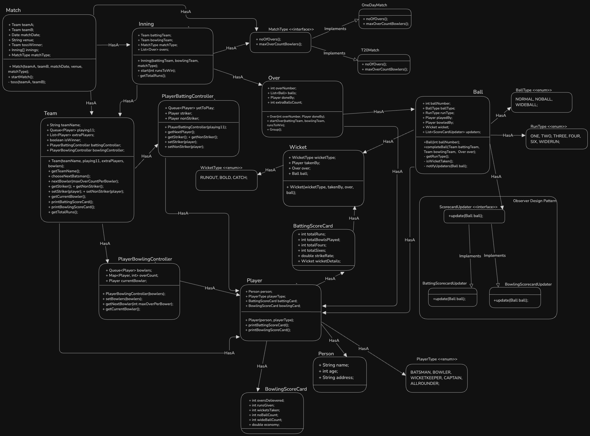

### Index
1. [What is CricBuzz](#what-is-cricbuzz)
2. [Let's understand a basic operations / Requirements](#lets-understand-a-basic-operations--requirements)  
3. [Questions (With Scope of improvement)](#questions-with-scope-of-improvement)
4. [Models/Entities](#modelsentities)
5. [Diagrams](#diagrams)
    * [UML Diagram](#uml-diagram)

### What is CricBuzz?
CricBuzz application tracks cricket matches scores, and works as live commentator during a match. It also provides information of players, teams and their scorecards.

### Let's understand a basic operations / Requirements
1. CricBuzz application has list of matches (live/done) and their scorecards.
2. On Opening a match, able to see innings of the match, batting score/bowling score of both the teams (innings wise) are visible. If match is live, then live score is also visible. 
If match is completed, result of the match is also visible.
3. A Match has been done in how many overs in each innings. 
4. Each match has two teams playing against each other. 
5. Each team has its playing 11 players, and certain extra players.
6. Each player has its own scorecard.

### Questions (With Scope of improvement)
* CricBuzz should show live commentry of the match.

### Models/Entities
* Match
* Team
* Player
* Inning
* Over
* Ball
* BattingScoreCard
* BowlingScoreCard
* MatchType: `interface`
    * OneDayMatch
    * T20Match
* RunType
* BallType
* ScoreCardUpdater: `interface`
    * BattingScoreCardUpdater
    * BowlingScoreCardUpdater
* PlayerBattingController
* PlayerBowlingController
* Wicket

### Diagrams
##### UML Diagram
