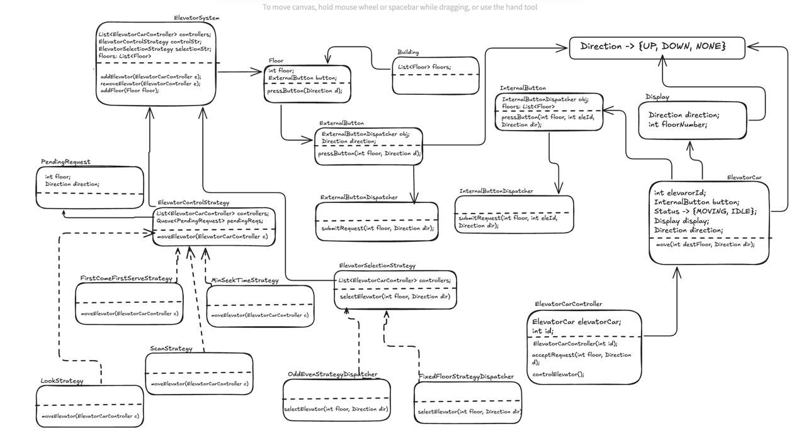

### What is Elevator system?
* Elevator system is a service which is responsible for vertical transportation of objects conveniently, timely and safely. This kind of system are very much required for many buildings with multiple floors.  

### Requirements
Now, Let's go through some requirements of Elevator system.
* Multiple elevator can be present in the buidling.
* User can ask for elevator from any floor, and can reach to any floor.
* Floors can be added in the buidling.
* Elevators can be marked as Un-operative due to some issue.
* Requests: i. Person on floor can press UP/DOWN button ii. Person in elevator can press floor number button
* Elevator selection/control algorithm can be dynamic as per future requirements.
* Elevator selection algos:
    * OddEven Selection 
    * Fixed Floor Selection
* Elevator control algos:
    * SCAN algo
    * LOOK algo
    * FirstComeFirstServe algo
    * MinSeekTime algo

### Questions (With Scope of improvement)
* Can elevator have certain max capacity constraint?
* can we in future keep limit for floors like for 1-10 floor this elevator can be used,
for 11-20 this and so on...

### Models/Entities
* Building
* Floor
* ElevatorCar
* Display
* ExternalButton
* ExternalButtonDispatcher
* InternalButton
* InternalButtonDispatcher
* Direction - UP, DOWN, IDLE
* ElevatorSystem
* ElevatorSelectionStrategy - OddEven, FixedFloor
* ElevatorControlStrategy - SCAN, LOOK, FirstComeFirstServe, MinSeekTime

### Diagram
1. UML Diagram

