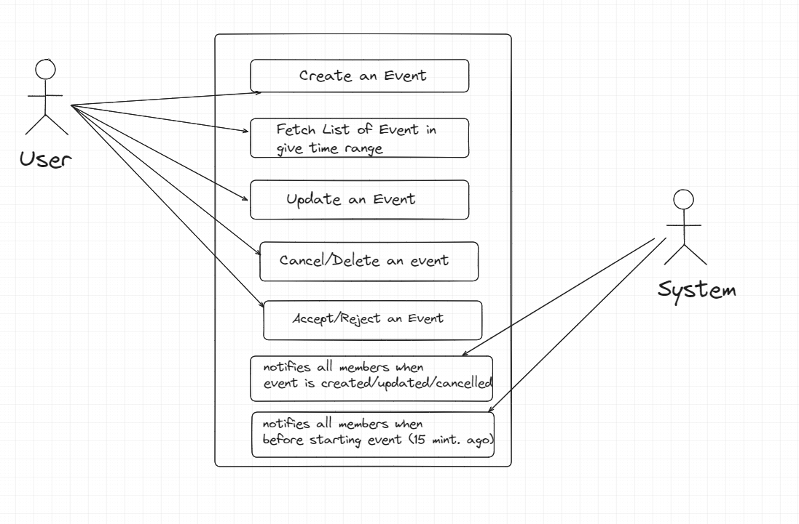

Google Calendar is service provided by Google where user can see a calendar (Monthly wise, Yearly, Day wise).
User can see events/reminders/.. created by user, or someone added user to the event.
User is able to change its view easily.
User can create an event as one-day event, repeatable event until a given date, repeatable for specific day of the week until
a given date.
User can add/schedule event/meeting for future, and can add other persons also by searching them.
If I have added some people in my event, It provides feature where it can suggest some common slots of time in which all 
participants are available.
User has power to accept/reject the event invite from others.

#### Requirements of Google Calendar
1. User should be able to perform CRUD for calendar event.
   1. An event can have fields title, start, end, createdBy/owner, location, participants (User-list) etc.
   2. Events are of type Reminder, Holidays, event/meeting (with guests-list, location, timing)
   3. User has power to accept/reject the event invite from others.
   4. Event can be repeatable.
2. Multiple Companies should be supporting, means participant of the event can be from different companies.
3. Individual user and email list can be participant for the system.
4. Suggesting Common timings while creating event and on adding participants.

### Questions (With Scope of improvement)
1. An Event can have multiple owners?
2. Is their any Limit we have to introduce for number of members in an event?
   1. Suppose Limit of 100, I already added 70, now i add an email which consists almost 50 people as a group
      , so in this case what I have to do for last 20 people as from that 50, only 30 will 
      be considered.
3. Do we have to validate a user when some-one is adding it, ki user exist or not.
4. What if common time doesn't exist, how our algo should go?
5. We can add limit on number of owner for an event?

### Possible Use cases
1. User creates an Event by putting eventType, and details as per eventType.
2. User can add list of invitees for event.
3. User updates event.
4. User cancel event.
5. User can make other person as event co-owner.
6. User can accept/reject an event (not his own event).
7. System notifies all participants of event, whenever event gets created, updated,
   cancelled, or any kind of event happens.
   Before event start (15 minutes ago/30 minutes ago), System notifies again to all users.
8. System shows list of common time (when all participants are available) for an event.
9. Event like reminder should snooze for how many minutes from its starting time?
10. System shows user's calendar on dashboard with all events who belong the user.

### Models/Entities
= Based on above things, we can have the following models:
1. Event: Main class which shows event, It has list of participants from own company
   or from other companies.
2. Participant: It's participant of the event who belongs to some Company.
3. Member: Member is also a participant, but it belongs to same Company.
4. Company: Company to which Member/Participant belongs to.
5. Calendar: this is for member who belongs to current org, and it has its own calendar, 
   list of events, and calendar view.
6. DistributedList: This is one profile which contain multiple participants inside it.
   1. For Ex: In a company, a department wise email is present, for HR.
   2. there is hr@test.com, java@test.com.
   3. now, this hr@test.com is parent of multiple other people's email who are hr's.
   4. This DistributedList is Participant, and it has List of members.
7. CalendarView: YEAR, MONTH, DAY.
8. EventStatus: CREATED, CANCELLED, RUNNING, COMPLETED; 
9. EventType: MEETING, REMINDER, BIRTHDAY;
10. MemberAcceptanceStatus: ACCEPTED, REJECTED, PENDING;

### Application Classes
1. Models/*.java ==> All models as shown above (Already Explained).
2. enums/*.java ==> All enums as shown above (Already explained).
3. repository/EventRepository ==> to create, update, delete, and read events.
4. repository/EventAcceptanceRepository ==> to accept, reject member's status for an event 
                                            and getStatus of a member's acceptance for an event.
5. service/EventService ===> For getting list of events, create, update, delete event. accept and reject event.
6. service/EventMemberService ==> This Service enables event members to accept/reject the event invitation, This interacts with
         EventAcceptance Repo where either event is accepted or rejected.

### Diagram
1. Use Case Diagram
