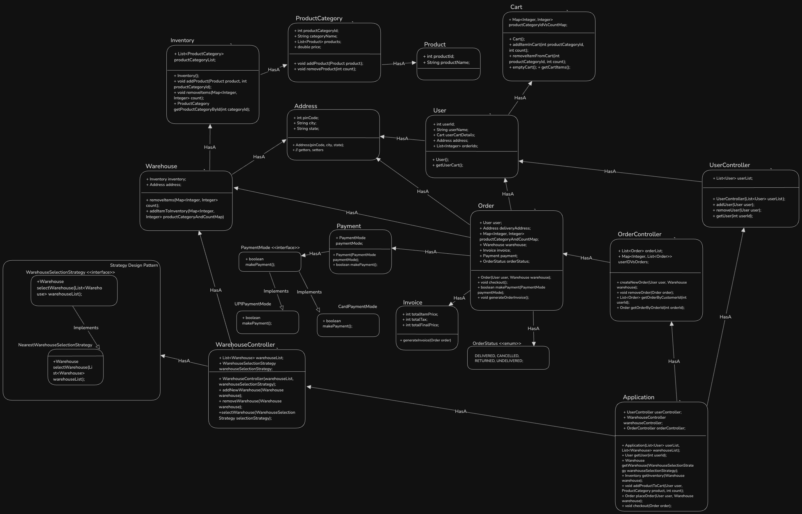

### Index
1. [What is Inventory Management](#what-is-inventory-management)
2. [Let's understand a basic operations / Requirements](#lets-understand-a-basic-operations--requirements)  
3. [Questions (With Scope of improvement)](#questions-with-scope-of-improvement)
4. [Models/Entities](#modelsentities)
5. [Diagrams](#diagrams)
    * [UML Diagram](#uml-diagram)

### What is Inventory Management?
- Inventory Management/Order Management is a system which helps to keep track of available products, categories, delieveries of products, and manage them through multiple warehouses. For ex: Zepto, BigBasket etc. 

### Let's understand a basic operations / Requirements
1. View products/ select product using category
2. Add product to cart
3. Place order - Invoice generation
4. Complete Payment
5. Handle Multiple warehouses
6. Select nearby warehouse to the customer/user

### Questions (With Scope of improvement)
* Usage of multi-threading to handle multiple requests and manage inventory.
* Add order to wishlist

### Models/Entities
* User
* Product
* Category
* Invoice
* Payment
* Warehouse
* Order
* Cart
* Address
* WarehouseController
* WarehouseSelectionStrategy
    * NearestWarehouseSelectionStrategy
    * RandomWarehouseSelectionStrategy
    * CheapestWarehouseSelectionStrategy
* UserController
* OrderController
* AppController

### Diagrams
##### UML Diagram
