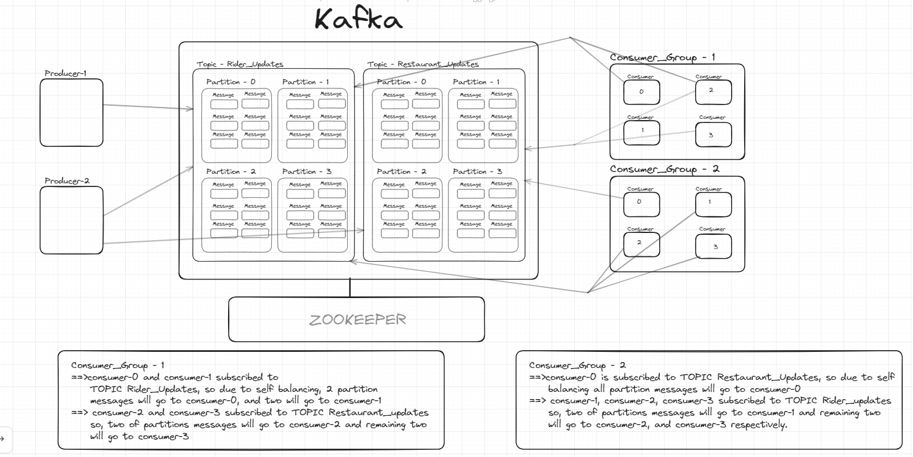

[Kafka Basic Understanding](https://www.youtube.com/watch?v=ZJJHm_bd9Zo&t=2s&ab_channel=PiyushGarg)
Kafka basically works with Producers, Consumers, Topics, Partitions, Messages, ConsumerGroups etc.

#### Requirements of Kafka
1. We need producer to generate messages and pass it to given topic name.
2. Consumer can consume message from single topic, although consumer within a group can consume from multiple partitions, but 
at a time consume from one partition. 
3. ConsumerGroup can have multiple consumers. 
4. Single Consumer maps to Single Partition.

#### Models
1. Producer: Identity of Producer who is producing messages.
2. Message:  Template for message with identity, and a string message.
3. Partition: Partition inside a topic, So it can have list of messages with offset.
4. Topic:   Kafka topic which is subscribed by a consumer, and partition belongs to it.
5. Consumer:  Consumer which is responsible for consuming messages from Kafka Topic: Partition
6. ConsumerGroup: Every Consumer belongs to a Consumer Group which keeps track that from which partition a consumer can
                  consume messages
7. MessageMetaData: Mapping of Message with Partition.

#### Strategy to publish message in the partition of a Topic
1. Round Robin Publish Message Strategy 

#### Points
1. Consumer Service internally uses Consumer Group service for the operations like consume message for consumer, and subscribe
    of a consumer for specific topic.
2. TopicService ==> create a new topic, publish given message to topic. We also store topics in a repository level.
3. ProducerWorker: responsible for generating message, and publishing to assigned topic that Producer worker. 
4. ConsumerWorker: responsible for consuming message for given consumer.

