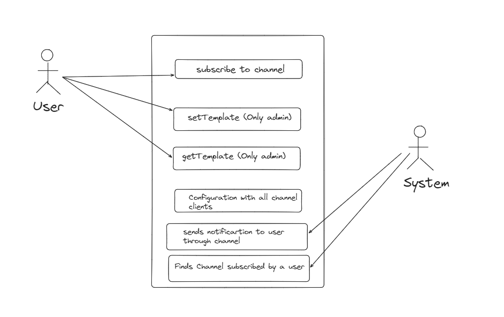
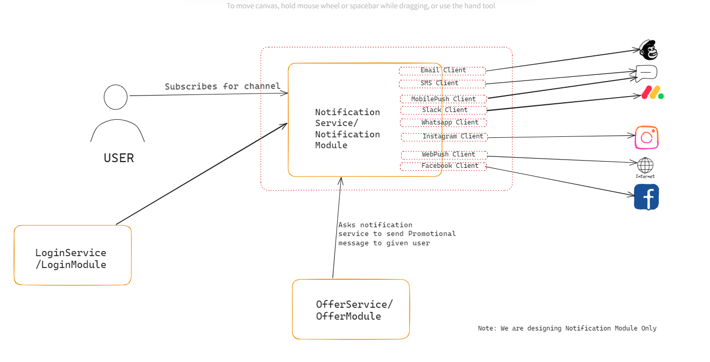

### What is Notification System, and its applications?
- Notification Systems are like information system that are used to notify/tell a user about an event only if user allows System.
- Now, System can inform user on his mobile/email/whatsapp/facebook/slack/Instagram/SMS/webPush etc.
- For ex: Suppose an application wants to use our service to send notification to its user via channels/mediums for which user agrees.
  - Inside application, if user signup, then application want to send en email to user, for welcome message.
  - If user gets OTP, then application sends otp message either through SMS or Email.
  - If Application wants to send some promotional/offer message to its user, then also it can send through those channels.

### Requirements
- Notification Service should be supporting Multiple channels/client for notifications.
- mobile, email, whatsapp, facebook, slack, Instagram, SMS, webPush etc.
- User will get a notification only through those channels for which user has subscribed.
- There are some messages like marketing message, and in same manner some messages are like Important (OTP, Bank Statement or others)
  So, what will be important for a user to get first? Obviously Important Message. So, Messages can be of some type, so we can put their
  priority to send.
- User can enable/disable a channel to be notified.
- System can have different templates for different type of message like OTP, Promotional etc.

### Questions (With Scope of improvement)
- can user also select which type of message notification it wants to enable? user can disable promotional type of messages.
- Do we have to put limit on Message Size?
- Does our message contains high size files/video files?
- What if two different threads want to notify for same user for two different messages?
- Some client might fail to send message so all other client will be failed or what?

### Possible Use cases
1. User First Register/Subscribe to a channel. --> subscribe()
2. Other System/Service asks our service to notify given user with given message. --> notifyToUser
3. System identifies all channels on which user is subscribed, one by one notifies user through each channel. 
4. System Initially establish connection/configuration with each channel/medium.
5. Admin/We can set template also in the system for each type of message.  --> setTemplate(), getTemplate()
   1. For Otp message, system can have one template
   2. For Promotional messages, system can have one template.

### Models/Entities
1. **Message**:  Message Body, type of message.
2. **MessageTemplate**: template of a message, messageType.
3. **User**: end user which is to be notified.

### Diagram
1. Use Case Diagram

2. Basic Flow Diagram

