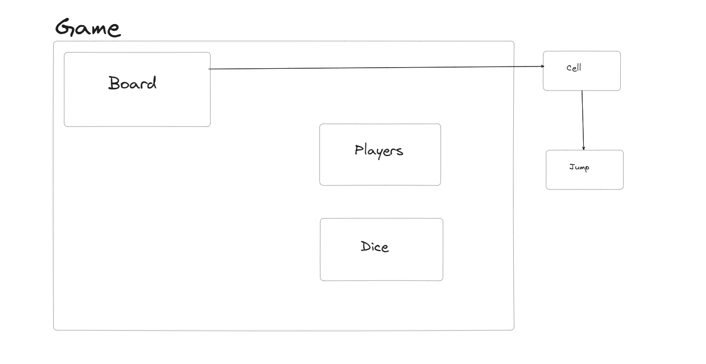

On a high level overview, below will be the rough flow for the Game:
1. We ask user for which size of board he wants and how many players are going to be played, and make a board and initialize board and players for the game.
2. Now, player1 plays first, then player2, then player3,....., player until and unless we do not get any winner.
3. When a dice is rolled by any player, he will get some jump points, and he will jump.
4. Suppose he reaches a cell, where he is bitten by any snake, then it comes to the tail cell of that snake, If it's ladders' starting point, then he moves to end point of ladder.
5. Thus, the player who reaches outside the board first, will be winner, and game will be stopped.

###### Doubts/Clarifications
1. As we are dynamically taking board size, then what could be the maximum board size?
   
   maximum board size could be 20.

2. How many players can play this game?
    
    currently make it like this, 2 player can play, but it should be extensible in future.

3. How many Dices we want in the Game?

    Currently only 1 dice, but extensible in future.

4. How many Snakes, and ladders we are going to take? (Take dynamically)

    take dynamically from user. but maximum (Snakes + ladders) <= boardSize/2

5. What will be the winning criteria?
    
    As soon as the player wins the game, Game finishes.

###### Objects
1. Player:

    id ------------------> String

    currentPosition -----> Integer

2. Jump (Snake/Ladder):

    startPoint -------------> Integer

    endPoint ---------------> Integer

3. Dice:

    numberOfDice ----------> Integer

    miniPoint -------------> Integer

    maxiPoint -------------> Integer

4. Cell:

    jump -----------------> Jump

5. Board:

    cells -----------------> Cell[][]

    ------------------------------

    * contstructor(boardSize, numberOfSnakes, numberOfLadders)
    * initializeCells()
    * addSnakesAndLadders(snakes, ladders)
    * getCell(int playerPosition)

6. Game:
    * board  -----------------------> Board
    * players ----------------------> List<Player>               
    * dice -------------------------> Dice
    * currentyPlayerToPlay ---------> Integer
    * winner -----------------------> Player
    ----------------------------------
    * constructor(boardSize, snakes, ladders, players, dices)
    * addPlayers(int players)
    * startGame()
    * findPlayerTurn()
    * checkSnakeOrLadderCell(int playerNewPosition)

### Diagram
1. UML diagram

