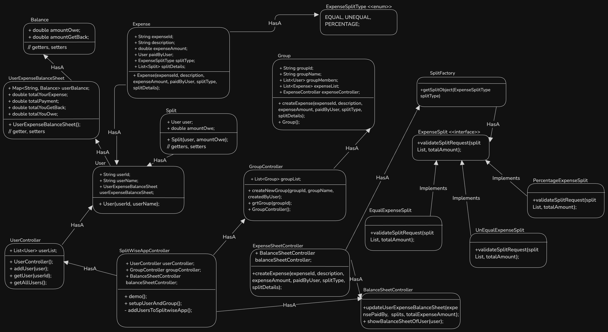

### Index
1. [What is Splitwise?](#what-is-splitwise)
2. [Let's understand a basic operations / Requirements](#lets-understand-a-basic-operations--requirements)  
3. [Questions (With Scope of improvement)](#questions-with-scope-of-improvement)
4. [Models/Entities](#modelsentities)
5. [Diagrams](#diagrams)
    * [UML Diagram](#uml-diagram)

### What is Splitwise?
Splitwise application helps users to manage expenses done by a group of people, calculates who is owed to whom and how much money. For ex: User can add their expense of a trip, lunch, party, rent etc. It helps to add expense equally, unequally among users who has done expense on certain activity.  

### Let's understand a basic operations / Requirements
1. Open splitwise application, get the list of groups/friends, and expense sheet of it. This sheet gives a overview, how much money user gets back, and how much money user owes to others. Also shows users who are involved in this expense.
2. User can add/remove a new friend from its friend list.
3. User can add/remove a new group from its group list.
4. User can add/remove/edit expense to a group or friend. 
5. User can add expense with split capability: equally, unequally among users who has done expense on certain activity.
6. User can manage friend inside a group.
7. System should manage expense sheet of each user.

### Questions (With Scope of improvement)
* Enable payment gateway to pay money to other users using any payment method.
* Feature to send reminder to users who owes money when user wants.
* Recurring expense feature.

### Models/Entities
* SPLITWISE DRIVER
* USER
* GROUP
* EXPENSE
* SPLIT
* USER EXPENSE BALANCE SHEET
* SPLIT_TYPE { EQUALLY, UNEQUALLY, PERCENTAGE }
* BALANCE

What happens when a new expense is added?
- User sends following details while adding an expense to a group/friend:
    - amountPaid
    - description
    - paidBy
    - splitType
    - splitDetails: 
        - user
        - amount
    - Split type (Equally, Unequally, Percentage)
    - groupId

- Firstly, If groupId given, validate: 
    - If groupId is valid or not
    - If groupId is valid, check if each user is part of this group or not.

- If groupId is not given, validate
    - If paidBy is valid or not
    - check all users are friend of paidBy or not.

- After above validation, based on given split type (EQUALLY, UNEQUALLY, PERCENTAGE), system should validate the given split details (amount distribution), and add the expense to the group/friend.

- system should be able to update the expense sheet of each user involved in this expense.

### Diagrams
##### UML Diagram
