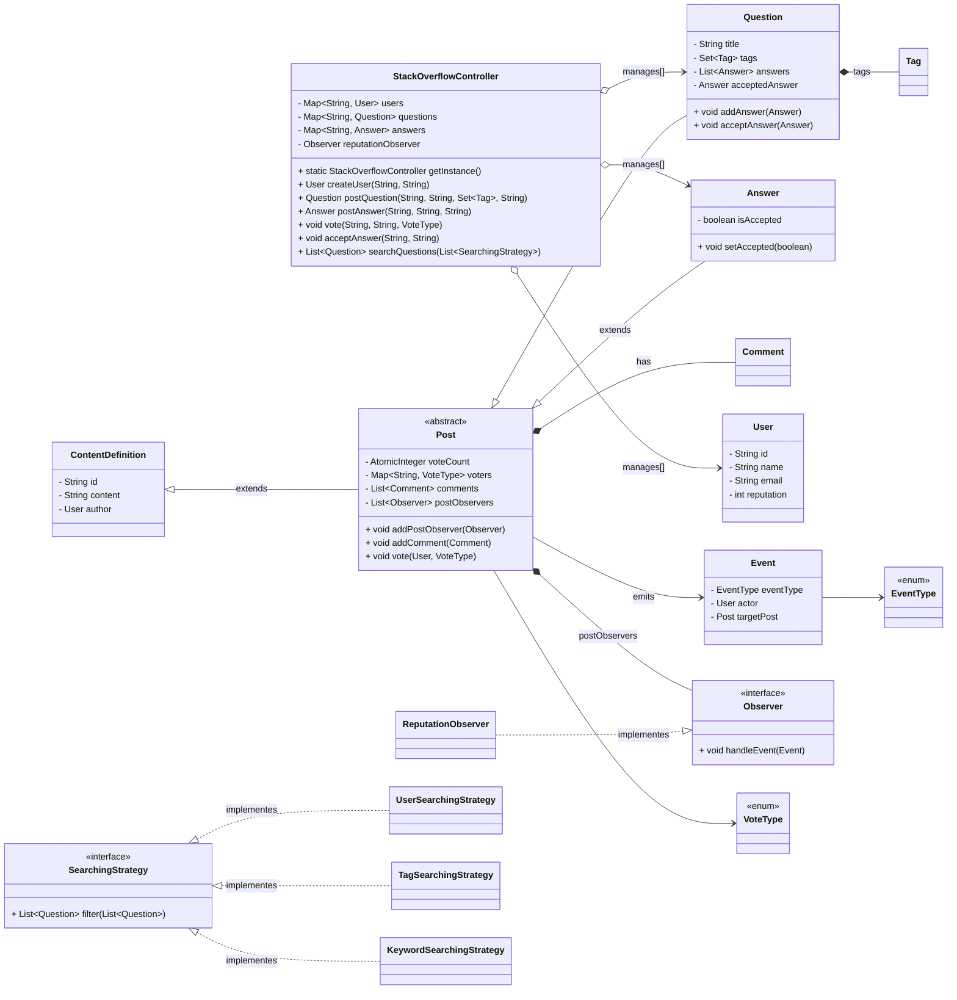
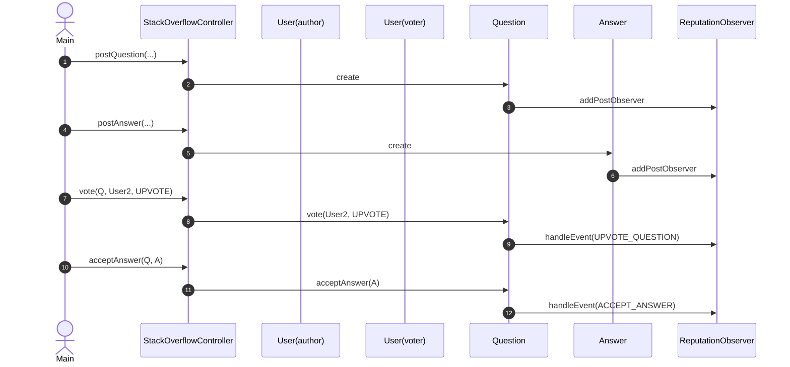

### Index
1. [What is StackOverflow](#what-is-stackoverflow)
2. [Let's understand a basic operations / Requirements](#lets-understand-a-basic-operations--requirements)
3. [Questions (With scope of improvements)](#questions-with-scope-of-improvements)

### What is StackOverflow
Stack Overflow is a question and answer website for programming questions. It is a platform where a user
- can ask questions, answer on other's questions, comment etc.
- can upvote/downvote the question, comment and answer.
- can get reputation points based on their activity.
- can search the questions etc.

### Let's understand a basic operations / Requirements
- User can post question, comment and answer on those questions.
- User can upvote/downvote the question, comment and answer.
- Questions can be tagged with multiple tags.
- Search based on keywords, tags, user profile etc.
- System should assign user reputation to user based on their activity.
- should be able to handle concurrent requests.

### Questions (With scope of improvements)
- can tell user of a alrady asked question, if user posts similar type of question again.
- can handle concurrent requests.

### Models/Entities

- `StackOverflowController` (singleton):
  - Central service orchestrating users, questions, answers, votes, and accept actions.
  - In-memory stores: `Map<String, User> users`, `Map<String, Question> questions`, `Map<String, Answer> answers`.
  - Methods: `createUser(...)`, `postQuestion(...)`, `postAnswer(...)`, `vote(postId, userId, VoteType)`, `acceptAnswer(questionId, answerId)`, `searchQuestions(List<SearchingStrategy>)`.

- `ContentDefinition`:
  - Base class for content with common fields: `id`, `content`, `User author`.

- `Post` (abstract) extends `ContentDefinition`:
  - Voting and comments: `AtomicInteger voteCount`, `Map<String, VoteType> voters`, `List<Comment> comments`.
  - Observer integration: `List<Observer> postObservers`, `addPostObserver`, `notifyPostObservers`.
  - Method `vote(User voter, VoteType voteType)` determines score changes and emits an `Event`.

- `Question` extends `Post`:
  - Fields: `String title`, `Set<Tag> tags`, `List<Answer> answers`, `Answer acceptedAnswer`.
  - Methods: `addAnswer(Answer)`, `acceptAnswer(Answer)` which emits `EventType.ACCEPT_ANSWER`.

- `Answer` extends `Post`:
  - Field: `boolean isAccepted` with setter used during accept flow.

- `Comment`:
  - Text comment tied to a `Post` (added via `Post.addComment`).

- `Tag`:
  - Represents a topic label attached to questions, used for search.

- `User`:
  - Fields: `id`, `name`, `email`, `int reputation`.
  - Reputation changes are applied via observers reacting to `Event`s.

- `Event`:
  - Fields: `EventType eventType`, `User actor`, `Post targetPost`.
  - Emitted on votes and accept actions to drive reputation updates.

- Enums:
  - `VoteType`: `UPVOTE`, `DOWNVOTE`.
  - `EventType`: `UPVOTE_QUESTION`, `DOWNVOTE_QUESTION`, `UPVOTE_ANSWER`, `DOWNVOTE_ANSWER`, `ACCEPT_ANSWER`.

- Observer Pattern:
  - `Observer` interface and `ReputationObserver` implementation subscribe to `Post` events to adjust reputations.

- Strategy Pattern (Search):
  - `SearchingStrategy` interface with implementations like `UserSearchingStrategy`, `TagSearchingStrategy` to filter questions.

### Diagrams
##### Class Diagram

##### Sequence Diagram (Voting and Accept Flow)

