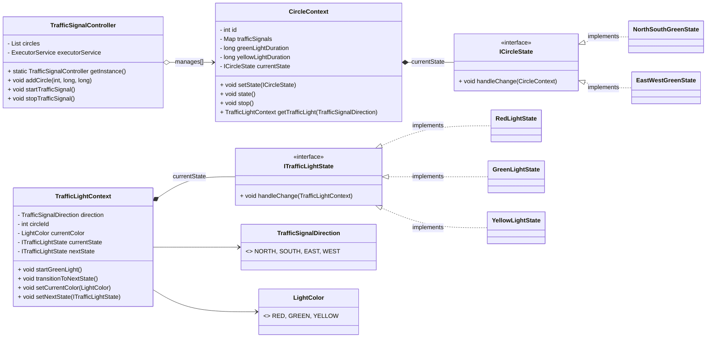
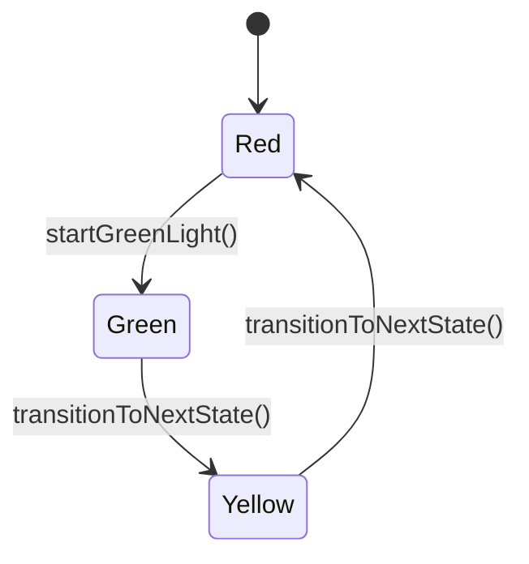
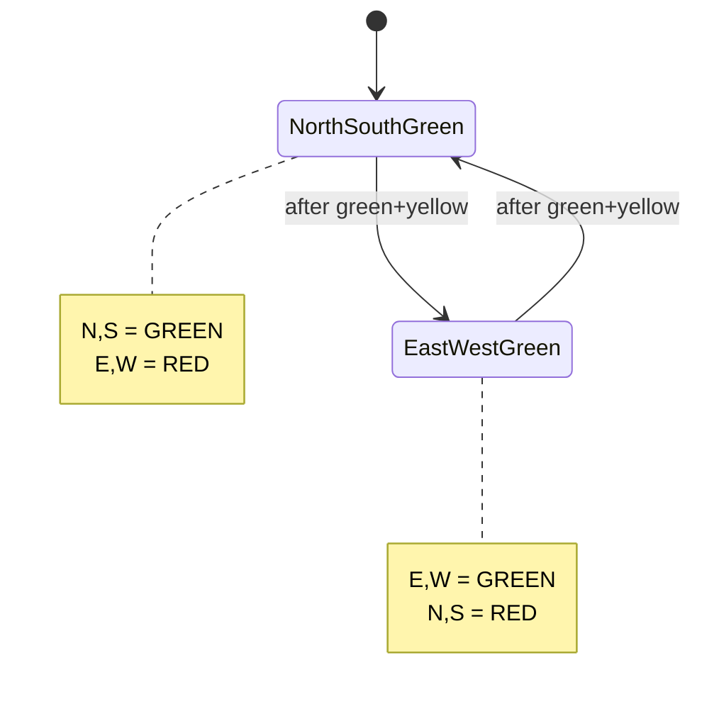
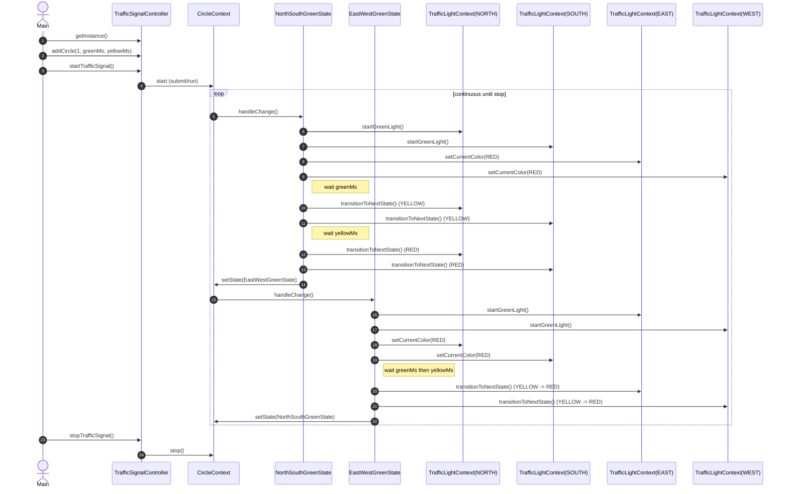

### Index
1. [What is Traffic Signal System](#what-is-traffic-signal-system)
2. [Let's understand a basic operations / Requirements](#lets-understand-a-basic-operations--requirements)
3. [Questions (With scope of improvement)](#questions-with-scope-of-improvement)
4. [Models/Entities](#modelsentities)
5. [Diagrams](#diagrams)
    * [Class Diagram](#class-diagram)
    * [State Flows](#state-flows)

### What is Traffic Signal System
A concurrent traffic-signal controller that coordinates multiple intersections ("circles"). Each circle alternates right-of-way between North/South and East/West using the State pattern at two levels:
- Circle-level states toggle which pair of directions gets the green phase.
- Per-signal light states model RED → GREEN → YELLOW transitions.

### Let's understand a basic operations / Requirements
- Manage multiple circles with independent timings.
- For each circle: grant GREEN to one pair (N/S or E/W), others RED.
- Respect configured durations for GREEN and YELLOW per circle.
- Transition lights deterministically using state machines.
- Start/stop all circles concurrently and shutdown gracefully.

### Questions (With scope of improvement)
- Dynamic/adaptive timing based on traffic density and time-of-day.
- Pedestrian crossings and protected turns (e.g., dedicated left-turn phases).
- Emergency vehicle preemption and priority rules across adjacent circles.
- Fault tolerance (node failure, clock skew) and centralized coordination.
- Simulation clock abstraction for deterministic testing (avoid `Thread.sleep`).

### Models/Entities
- `TrafficSignalController` (singleton):
  - Holds a list of `CircleContext`.
  - Starts circles via a fixed thread pool; stops with graceful shutdown.

- `CircleContext` (Runnable):
  - Fields: `id`, `Map<TrafficSignalDirection, TrafficLightContext> trafficSignals`, `greenLightDuration`, `yellowLightDuration`.
  - State machine via `ICircleState currentState`:
    - `NorthSouthGreenState` → `EastWestGreenState` toggling which pair is GREEN.
    - Each state drives per-direction `TrafficLightContext` and sleeps according to durations.

- `TrafficLightContext`:
  - Fields: `TrafficSignalDirection direction`, `int circleId`, `LightColor currentColor`, `ITrafficLightState currentState`, `ITrafficLightState nextState`.
  - Methods: `startGreenLight()`, `transitionToNextState()`, `setCurrentColor(LightColor)`, `setNextState(ITrafficLightState)`.
  - Per-light State pattern:
    - `RedLightState`, `GreenLightState`, `YellowLightState` implement `ITrafficLightState` and set `currentColor` and `nextState`.

- Enums:
  - `TrafficSignalDirection`: `NORTH`, `SOUTH`, `EAST`, `WEST`.
  - `LightColor`: `RED`, `GREEN`, `YELLOW`.

### Diagrams
##### Class Diagram

##### State Flows
Per-light state machine:

Circle-level coordination:

##### Sequence Diagram

