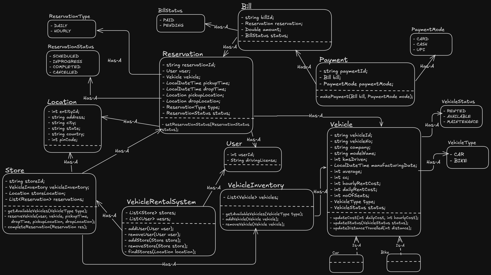

### What is Vehicle Rental system?
* Vehicle rental system is a service which acts as a middleman between customers and vehicle rental agencies. IT provides a seamless experience for customer to search vehicles, rent vehicle on the hourly/daily basis.

### Requirements
Now, Let's go through some requirements of Vehicle Rental system.
* User can get all the stores of on the basis of location.
* User can select store and get all available vehicles of certain type in the store.
* User can reserve a vehicle in the store if it is available hourly basis/daily basis.
* Users must pay bill against their reservation to confirm booking.

### Questions (With Scope of improvement)
* Should vehicle include all type of vehicles for booking?
* should initial search should be happend based on user input, like take user's date first and search available vehicles according to it?

### Models/Entities
* User
* Vehicle
* VehicleRentalSystem
* Bill
* Payment
* Store
* Location
* VehicleInventory
* Reservation
* BillStatus, PaymentMode, VehicleStatus, VehicleType, ReservationType, ReservationStatus

### Diagram
1. UML Diagram

