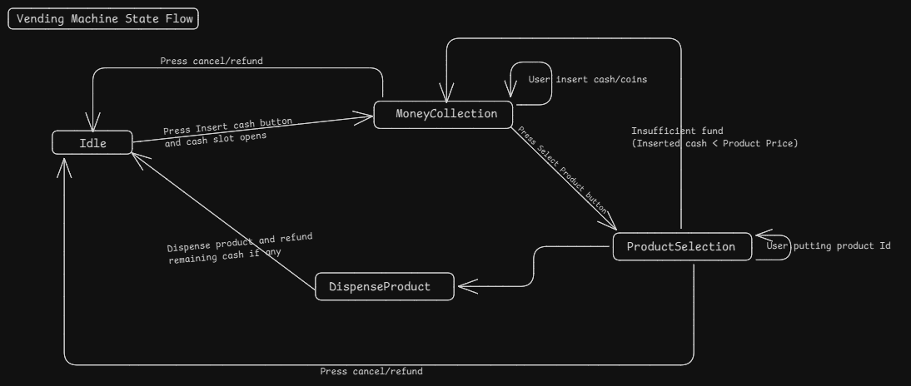

### What is Vending Machine System?
It is an automated system that allows users to purchase goods, like snacks, drinks, or tickets, by inserting money

### Requirements
Now, Let's go through some requirements of Vending Machine system
* User can insert cash by pressing cash button
* User can select required product.
* Product should be dispensed if inserted cash is above or equal to product price.
* Machine should return remaining amount if any.

### Questions (With Scope of improvement)
* Can their by any other Payment method other than cash?

### Models/Entities
* 

### Diagram
1. Basic State Flow Diagram

