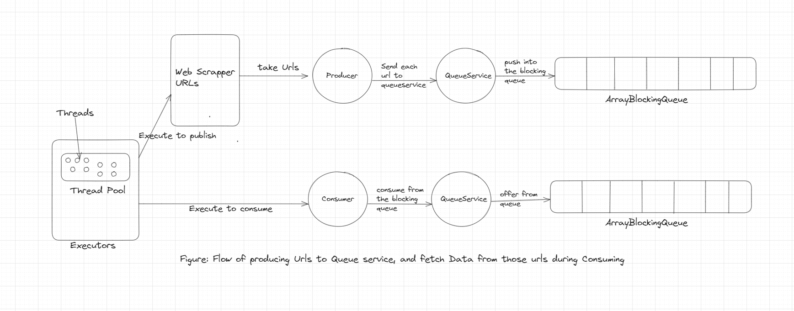

#### Requirements of WebScrapper
1. The Scrapper System should support to fetch data from given urls
2. Use Producer and Consumer to publish and consume to the queue simultaneously.

#### Needed
- We need a queue service to handle operations of blocking Queue.
- We need producers and consumers which implements runnable interfaces.
- we need two types of models

    - Request consists request information such url, headers, params - Request
    - Response consists response information such as code, message, data.

#### Elements
- ArrayBlockingQueue<?> to produce and consume tasks asynchronously, it's a fixed-sized array holds elements inserted by
  producers and extracted by consumers.
- Executors to create a thread pool of size 100 for producers and consumers. [Understand Executors from here](https://github.com/code123-tech/Basics_Java_With_OOP_Concepts/blob/main/Concurrency/ExecutorsHansOn.java)
  produced and printed/consumed by arrayBlockingQueue.
- QueueService: deals with ArrayBlockingQueue operations, publish and consume.
- InternalLogger: to log the printableMessage.
- ApplicationConstants/DEFAULT_PUBLISH_TIMEOUT_MS: the time for each, the arrayBlockingQueue waits to push element into queue
  if queue is full, and waits for queue to be freed for this time.
- ApplicationConstants/DEFAULT_CONSUME_TIMEOUT_MS: if queue is empty, waits for this timeout that during this wait time, any new
  element is pushed or not.
- Utils/Data.java: to get examples Request list.

- Other Similar Examples to Do: 
1. Parallel Image Processing: We have multiple Images, we want them to processed in a fast way.
2. Download Manager: We have multiple locations, we want to download files from those location fast and parallely.

In above approach, we can create an executor pool, and provide that pool to a runnable task (image processing or download 
from location).
