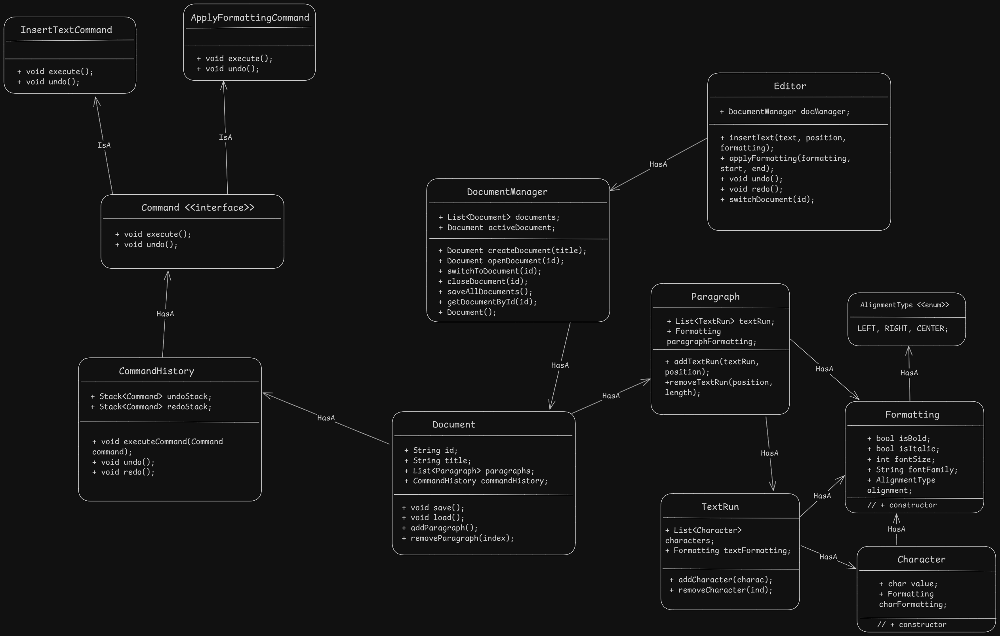

### Index
1. [What is Word Processor](#what-is-word-processor)
2. [Let's understand a basic operations / Requirements](#lets-understand-a-basic-operations--requirements)  
3. [Questions (With Scope of improvement)](#questions-with-scope-of-improvement)
4. [Models/Entities](#modelsentities)
5. [Diagrams](#diagrams)
    * [UML Diagram](#uml-diagram)

### What is Word Processor?
Word Processor is an application or program that helps to write, edit, format and store a text document. It can also give you feature like under/redo, spell check, grammer check etc.

### Let's understand a basic operations / Requirements
- *Functional Requirements:*
    1. Create and edit text in a document.
    2. Support paragraphs with alignment (e.g., left, center).
    3. Allow users to create, open, edit and save multiple docuemnts.
    4. Support undo/redo operations.
    5. Users can do formatting like bold, italic, font size, font family etc.

- *Non-Functional Requirements:*
    - Extensible for adding new formatting or features.

### Questions (With Scope of improvement)
* New feature like Adding tables, Images into document, spell check.
* Word Processor should have a feature to add comments in the document.
* Copy to clipboard.

### Models/Entities
* `DocumentManager:` Manages multiple Document instances
* `Document:` Retains its structure (List<Paragraph>, title, etc.).
* `Paragraph:` Contains a list of TextRun objects and paragraph-level formatting
* `TextRun:` A sequence of Character objects with uniform formatting (e.g., bold).
* `Character:` Stores a single character and optional formatting
* `Command:` Abstract class with execute() and undo(), with subclasses like InsertTextCommand, DeleteTextCommand, and ApplyFormattingCommand.
* `CommandHistory:` Manages undo/redo stacks.
* `Editor:` Now operates on the activeDocument from DocumentManager instead of a single Document.

### Diagrams
##### UML Diagram
