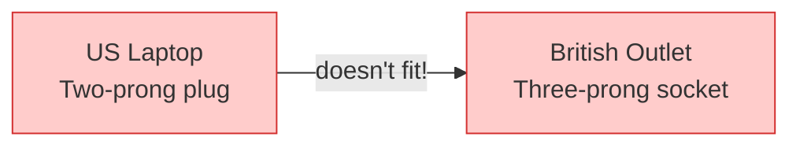
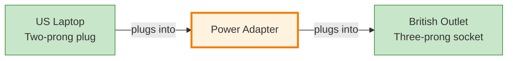
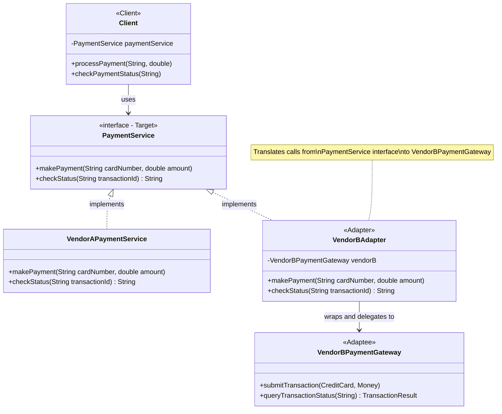
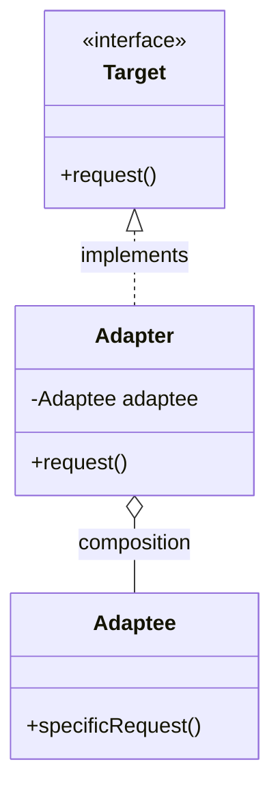
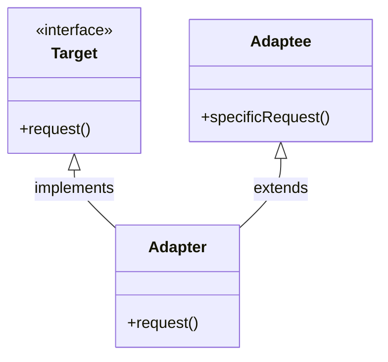
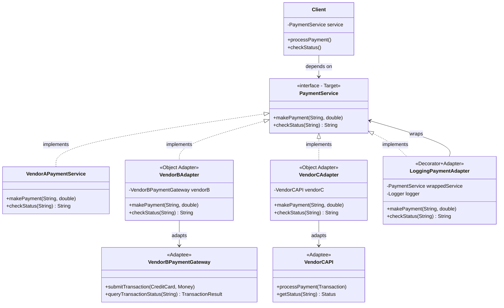

# Pattern Recognition #7: The Adapter Pattern 🔌

*"Making Incompatible Interfaces Work Together - The Art of Translation"*

---

## Introduction: When Interfaces Don't Match

Hey there! Welcome back to our design patterns journey. We've explored behavioral patterns like Command and Strategy. Today, we're diving into a structural pattern—**the Adapter Pattern**.

But before we jump into theory, let me ask you: Have you ever tried using your laptop in a foreign country and realized the plug doesn't fit the socket? Or attempted to integrate a third-party library only to find its interface is completely different from what your code expects? Or maybe you wanted to use a new vendor's API that has different method names than the old one?

If any of these scenarios sound familiar, you've already encountered the adapter problem. The Adapter Pattern is like a universal power adapter for your code—it makes incompatible interfaces work together without changing either of them.

Let's learn this through a real story, conversations, and step-by-step building.

---

## The Problem: The API Integration Nightmare

Imagine this: You're working at **"DataFlow Solutions Inc."**, a company that processes customer data. Your system has been happily working with **VendorA's** payment processing API for years. Your code looks something like this:

```java
public class PaymentProcessor {
    private VendorAPaymentService vendorA;
    
    public PaymentProcessor() {
        this.vendorA = new VendorAPaymentService();
    }
    
    public void processPayment(String cardNumber, double amount) {
        vendorA.makePayment(cardNumber, amount);
        System.out.println("Payment processed through VendorA");
    }
    
    public String getPaymentStatus(String transactionId) {
        return vendorA.checkStatus(transactionId);
    }
}

// VendorA's API
public class VendorAPaymentService {
    public void makePayment(String cardNumber, double amount) {
        System.out.println("VendorA: Processing $" + amount);
    }
    
    public String checkStatus(String transactionId) {
        return "VendorA: Transaction " + transactionId + " - SUCCESS";
    }
}
```

Your entire codebase—dozens of classes—uses this interface. Everything works perfectly.

### Then Disaster Strikes 💥

One day, your manager calls you into a meeting:

**Manager:** "We have some bad news. VendorA is shutting down. We need to switch to **VendorB** immediately. They're cheaper and more reliable."

**You:** "No problem! I'll just swap out the API—"

**Manager:** "Oh, and VendorB has a completely different interface. Here's their API documentation."

You look at VendorB's API:

```java
// VendorB's API - COMPLETELY DIFFERENT!
public class VendorBPaymentGateway {
    public void submitTransaction(CreditCard card, Money amount) {
        System.out.println("VendorB: Submitting $" + amount.getValue());
    }
    
    public TransactionResult queryTransactionStatus(String txnId) {
        return new TransactionResult(txnId, "COMPLETED");
    }
    
    // They use different data types!
    public class CreditCard {
        private String number;
        private String cvv;
        // ... constructors, getters
    }
    
    public class Money {
        private double value;
        private String currency;
        // ... constructors, getters
    }
    
    public class TransactionResult {
        private String id;
        private String status;
        // ... constructors, getters
    }
}
```

**Your reaction:** 😱

- Different method names (`makePayment` vs `submitTransaction`)
- Different parameter types (String vs CreditCard, double vs Money)
- Different return types (String vs TransactionResult)
- Your entire codebase expects VendorA's interface!

You have **hundreds of places** in your code that call `makePayment()` and `checkStatus()`. Changing all of them would be:
- **Time-consuming** (weeks of work)
- **Error-prone** (easy to miss some places)
- **Risky** (breaking existing functionality)
- **Unextendable** (what if you switch vendors again?)

What do you do?

---

## The Naive Approach: "Let's Just Rewrite Everything!"

**Junior (You):** "I guess I'll search-and-replace all calls to VendorA with VendorB and update the method calls..."

You start changing code everywhere:

```java
// Before (with VendorA)
vendorA.makePayment(cardNumber, amount);

// After (with VendorB) - You have to change this EVERYWHERE
CreditCard card = new CreditCard(cardNumber);
Money money = new Money(amount, "USD");
vendorB.submitTransaction(card, money);
```

After two days of this tedious work:

- You've changed 47 files
- You've introduced 12 bugs
- You're exhausted
- The code is tightly coupled to VendorB now
- If you switch to VendorC next year, you'll have to do this all over again!

There has to be a better way...

---

## The Conversation: Junior meets Senior

You go to your senior developer, looking defeated.

**Junior:** "I've been rewriting all our payment code for VendorB. This is a nightmare. Every class that uses payment processing needs to be changed..."

**Senior:** "Stop right there. You're approaching this the wrong way."

**Junior:** "But... their interfaces are completely different. How else can I make them work?"

**Senior:** "Let me ask you something. When you travel to Europe with your US laptop, do you:
1. Buy a new European laptop?
2. Rewire your US laptop to accept European voltage?
3. Use a power adapter?"

**Junior:** "Well, obviously the adapter. It's cheaper and simpler—oh! Are you saying...?"

**Senior:** "Exactly! We need a **software adapter**. Let me explain."

### Problems with the Rewrite Approach:

**Senior:** "Here's why your approach is problematic:

1. **Violates Open/Closed Principle:** You're modifying existing code instead of extending it.

2. **Tight Coupling:** Now your code is married to VendorB. Switch vendors again? Rewrite again.

3. **Risky:** Every change is a chance to introduce bugs.

4. **Not Scalable:** What if you need to support BOTH vendors at the same time for gradual migration?

5. **Time-Consuming:** You're changing hundreds of files.

6. **Testing Nightmare:** You have to retest everything you touched.

Instead, what if we could keep all your existing code unchanged and just create a thin 'adapter' layer that translates VendorB's interface to look like VendorA's?"

**Junior:** "That sounds perfect! But how?"

**Senior:** "Let me tell you a story about a British traveler in America..."

---

## The Analogy: The Power Adapter 🔌

**Senior:** "Think about electrical outlets and plugs. Let me draw this for you:

### The Problem:



**Without Adapter:** Laptop and outlet are incompatible. You can't use your laptop!

### The Solution:



**With Adapter:** The adapter converts the British outlet interface to match what the laptop expects!

### The Pattern Mapping:

| Real World | Code World | Your Problem |
|------------|------------|--------------|
| US Laptop | Your existing code | PaymentProcessor |
| US Plug (two-prong) | Expected Interface | makePayment(), checkStatus() |
| British Outlet | Third-party library | VendorBPaymentGateway |
| British Socket (three-prong) | Third-party's Interface | submitTransaction(), queryTransactionStatus() |
| Power Adapter | **Adapter Class** | VendorBAdapter |

**Key Insight:** 
- ✅ The laptop doesn't change
- ✅ The outlet doesn't change  
- ✅ The adapter does the translation

In code terms:
- ✅ Your existing code doesn't change
- ✅ VendorB's API doesn't change
- ✅ The adapter wraps VendorB and makes it look like VendorA

**Junior:** "Ohhh! So we create an adapter class that implements VendorA's interface but uses VendorB internally?"

**Senior:** "Exactly! Let's build it."

---

## The Solution: Enter the Adapter Pattern

The **Adapter Pattern** says:

> **Converts the interface of a class into another interface the clients expect. Adapter lets classes work together that couldn't otherwise because of incompatible interfaces.**

Let's break this down:
- **"Converts the interface"** - Changes how something looks from the outside
- **"Into another interface clients expect"** - Makes it match what your code wants
- **"Work together"** - Incompatible things can now cooperate
- **"Incompatible interfaces"** - They have different method signatures

### The Players:

| **Role**    | **Description**                          | **Power Adapter Analogy**  | **Your Problem**      |
|-------------|------------------------------------------|----------------------------|-----------------------|
| Target      | Interface your code expects              | US plug format             | VendorA interface     |
| Adaptee     | The existing incompatible interface      | British outlet             | VendorB API           |
| Adapter     | Converts Adaptee to Target               | Power adapter device       | VendorBAdapter        |
| Client      | Uses Target interface                    | Your laptop                | PaymentProcessor      |

---

## Building the Solution: Step-by-Step

Let's solve your problem properly using the Adapter Pattern.

### Step 1: Define the Target Interface

First, let's extract what your existing code expects into an interface:

```java
// Target Interface - What your code expects
public interface PaymentService {
    void makePayment(String cardNumber, double amount);
    String checkStatus(String transactionId);
}
```

This is the interface your entire codebase is built around.

### Step 2: Make VendorA Implement the Target

Now let's make VendorA's service implement this interface:

```java
// VendorA already matches our interface!
public class VendorAPaymentService implements PaymentService {
    @Override
    public void makePayment(String cardNumber, double amount) {
        System.out.println("VendorA: Processing payment of $" + amount);
        System.out.println("VendorA: Card number: " + cardNumber);
    }
    
    @Override
    public String checkStatus(String transactionId) {
        System.out.println("VendorA: Checking status for " + transactionId);
        return "SUCCESS";
    }
}
```

### Step 3: Keep VendorB As-Is (The Adaptee)

VendorB's API stays unchanged. We can't modify it—it's a third-party library:

```java
// Adaptee - The incompatible interface (VendorB's API)
public class VendorBPaymentGateway {
    
    public void submitTransaction(CreditCard card, Money amount) {
        System.out.println("VendorB: Submitting transaction");
        System.out.println("VendorB: Card: " + card.getNumber());
        System.out.println("VendorB: Amount: $" + amount.getValue());
    }
    
    public TransactionResult queryTransactionStatus(String txnId) {
        System.out.println("VendorB: Querying transaction " + txnId);
        return new TransactionResult(txnId, "COMPLETED");
    }
    
    // Nested classes for VendorB's data types
    public static class CreditCard {
        private String number;
        
        public CreditCard(String number) {
            this.number = number;
        }
        
        public String getNumber() {
            return number;
        }
    }
    
    public static class Money {
        private double value;
        private String currency;
        
        public Money(double value, String currency) {
            this.value = value;
            this.currency = currency;
        }
        
        public double getValue() {
            return value;
        }
        
        public String getCurrency() {
            return currency;
        }
    }
    
    public static class TransactionResult {
        private String id;
        private String status;
        
        public TransactionResult(String id, String status) {
            this.id = id;
            this.status = status;
        }
        
        public String getId() {
            return id;
        }
        
        public String getStatus() {
            return status;
        }
    }
}
```

### Step 4: Create the Adapter (The Magic!)

Now comes the crucial part—the adapter that makes VendorB look like VendorA:

```java
// Adapter - Makes VendorB look like PaymentService
public class VendorBAdapter implements PaymentService {
    private VendorBPaymentGateway vendorB;
    
    public VendorBAdapter(VendorBPaymentGateway vendorB) {
        this.vendorB = vendorB;
    }
    
    @Override
    public void makePayment(String cardNumber, double amount) {
        // Translate from Target interface to Adaptee interface
        System.out.println("Adapter: Converting VendorA interface to VendorB interface...");
        
        // Convert String cardNumber to CreditCard object
        VendorBPaymentGateway.CreditCard card = 
            new VendorBPaymentGateway.CreditCard(cardNumber);
        
        // Convert double amount to Money object
        VendorBPaymentGateway.Money money = 
            new VendorBPaymentGateway.Money(amount, "USD");
        
        // Call VendorB's method
        vendorB.submitTransaction(card, money);
        
        System.out.println("Adapter: Translation complete!");
    }
    
    @Override
    public String checkStatus(String transactionId) {
        System.out.println("Adapter: Converting status check request...");
        
        // Call VendorB's method
        VendorBPaymentGateway.TransactionResult result = 
            vendorB.queryTransactionStatus(transactionId);
        
        // Convert TransactionResult to String
        String status = result.getStatus();
        
        System.out.println("Adapter: Translation complete!");
        return status;
    }
}
```

**What's happening here?**
- The adapter **implements** the Target interface (PaymentService)
- It **holds a reference** to the Adaptee (VendorBPaymentGateway)
- In each method, it **translates** the request:
  - Converts parameters from Target format to Adaptee format
  - Calls the Adaptee's methods
  - Converts the response back to Target format

### Step 5: Update Your Client Code (Minimal Changes!)

Now here's the beautiful part. Your `PaymentProcessor` needs only ONE tiny change:

```java
// Client code - Barely needs to change!
public class PaymentProcessor {
    private PaymentService paymentService;
    
    // Before: hardcoded to VendorA
    // public PaymentProcessor() {
    //     this.paymentService = new VendorAPaymentService();
    // }
    
    // After: can use ANY PaymentService implementation
    public PaymentProcessor(PaymentService paymentService) {
        this.paymentService = paymentService;
    }
    
    public void processPayment(String cardNumber, double amount) {
        // This code DOESN'T CHANGE AT ALL!
        paymentService.makePayment(cardNumber, amount);
        System.out.println("Payment processed successfully!\n");
    }
    
    public void checkPaymentStatus(String transactionId) {
        // This code DOESN'T CHANGE AT ALL!
        String status = paymentService.checkStatus(transactionId);
        System.out.println("Transaction Status: " + status + "\n");
    }
}
```

**Notice:** The PaymentProcessor has NO IDEA whether it's talking to VendorA or VendorB! It just knows it's working with a `PaymentService`.

### Step 6: Putting It All Together (Client/Test Code)

```java
public class AdapterDemo {
    public static void main(String[] args) {
        System.out.println("=== DEMO 1: Using VendorA (Original) ===");
        PaymentService vendorA = new VendorAPaymentService();
        PaymentProcessor processor1 = new PaymentProcessor(vendorA);
        processor1.processPayment("1234-5678-9012-3456", 99.99);
        processor1.checkPaymentStatus("TXN001");
        
        System.out.println("\n=== DEMO 2: Using VendorB (Through Adapter) ===");
        VendorBPaymentGateway vendorB = new VendorBPaymentGateway();
        PaymentService vendorBAdapter = new VendorBAdapter(vendorB);
        PaymentProcessor processor2 = new PaymentProcessor(vendorBAdapter);
        processor2.processPayment("1234-5678-9012-3456", 99.99);
        processor2.checkPaymentStatus("TXN002");
        
        System.out.println("\n=== DEMO 3: Easy to Switch Between Vendors ===");
        // Can switch at runtime!
        PaymentProcessor flexibleProcessor = new PaymentProcessor(vendorA);
        System.out.println("Using VendorA:");
        flexibleProcessor.processPayment("9999-8888-7777-6666", 49.99);
        
        // Switch to VendorB
        flexibleProcessor = new PaymentProcessor(vendorBAdapter);
        System.out.println("Switched to VendorB:");
        flexibleProcessor.processPayment("9999-8888-7777-6666", 49.99);
    }
}
```

**Output:**

```
=== DEMO 1: Using VendorA (Original) ===
VendorA: Processing payment of $99.99
VendorA: Card number: 1234-5678-9012-3456
Payment processed successfully!

VendorA: Checking status for TXN001
Transaction Status: SUCCESS


=== DEMO 2: Using VendorB (Through Adapter) ===
Adapter: Converting VendorA interface to VendorB interface...
VendorB: Submitting transaction
VendorB: Card: 1234-5678-9012-3456
VendorB: Amount: $99.99
Adapter: Translation complete!
Payment processed successfully!

Adapter: Converting status check request...
VendorB: Querying transaction TXN002
Adapter: Translation complete!
Transaction Status: COMPLETED


=== DEMO 3: Easy to Switch Between Vendors ===
Using VendorA:
VendorA: Processing payment of $49.99
VendorA: Card number: 9999-8888-7777-6666
Payment processed successfully!

Switched to VendorB:
Adapter: Converting VendorA interface to VendorB interface...
VendorB: Submitting transaction
VendorB: Card: 9999-8888-7777-6666
VendorB: Amount: $49.99
Adapter: Translation complete!
Payment processed successfully!
```

---

## Class Diagram: Seeing the Structure



**Key Relationships:**
1. **Client** depends on the **Target** interface (PaymentService)
2. **VendorAPaymentService** implements Target interface directly
3. **VendorBAdapter** implements Target interface
4. **VendorBAdapter** holds a reference to and delegates to **VendorBPaymentGateway** (Adaptee)
5. Client is completely decoupled from Adaptee—it never knows VendorB exists!

---

## Let's Review: What We've Achieved

**Junior:** "This is brilliant! Let me see if I understand:

1. **No changes to existing code:** My `PaymentProcessor` and all other client classes remain virtually unchanged!

2. **Encapsulated conversion:** All the messy translation logic is isolated in the adapter.

3. **Easy to switch vendors:** I can use VendorA or VendorB (or VendorC in the future) just by creating different adapters.

4. **Follows Open/Closed Principle:** My code is open for extension (new vendors via new adapters) but closed for modification (no changes to existing classes).

5. **Single Responsibility:** The adapter has ONE job—translate interfaces.

This is so much better than rewriting everything!"

**Senior:** "Exactly! But there's more to learn. Let me show you some variations..."

---

## Object Adapter vs Class Adapter

### Object Adapter (What We Just Built)



**Characteristics:**
- Uses **composition** (Adapter HAS-A Adaptee)
- Adapter holds a reference to Adaptee
- More flexible—can adapt Adaptee and its subclasses
- Can only adapt one specific Adaptee instance
- **This is the Java way** (Java doesn't support multiple inheritance)

### Class Adapter (Using Multiple Inheritance)



**Characteristics:**
- Uses **inheritance** (Adapter IS-A Target AND IS-A Adaptee)
- Adapter inherits from both Target and Adaptee
- Can override Adaptee's behavior
- **Can't be done in Java** (no multiple inheritance)
- Possible in C++ or Python
- Less flexible—committed to adapting a specific Adaptee class

**In Java, we always use Object Adapter because of no multiple inheritance.**

---

## Real-World Example: The Duck-Turkey Problem

Let's look at a classic example from "Head First Design Patterns":

### The Problem

You have a Duck interface and a Turkey interface that are incompatible:

```java
// Target interface
public interface Duck {
    void quack();
    void fly();
}

// Concrete Duck
public class MallardDuck implements Duck {
    @Override
    public void quack() {
        System.out.println("Quack!");
    }
    
    @Override
    public void fly() {
        System.out.println("I'm flying!");
    }
}

// Adaptee interface - incompatible!
public interface Turkey {
    void gobble();    // Turkeys gobble, not quack
    void fly();       // Turkeys can only fly short distances
}

// Concrete Turkey
public class WildTurkey implements Turkey {
    @Override
    public void gobble() {
        System.out.println("Gobble gobble!");
    }
    
    @Override
    public void fly() {
        System.out.println("I'm flying a short distance!");
    }
}
```

**Challenge:** You have code that expects Ducks, but you only have Turkeys available. How do you make Turkeys look like Ducks?

### Solution: Turkey Adapter

```java
// Adapter: Makes Turkey look like Duck
public class TurkeyAdapter implements Duck {
    Turkey turkey;
    
    public TurkeyAdapter(Turkey turkey) {
        this.turkey = turkey;
    }
    
    @Override
    public void quack() {
        // Translate Duck's quack to Turkey's gobble
        turkey.gobble();
    }
    
    @Override
    public void fly() {
        // Turkeys fly shorter distances, so we make them fly 5 times
        for (int i = 0; i < 5; i++) {
            turkey.fly();
        }
    }
}
```

### Testing

```java
public class DuckTestDrive {
    public static void main(String[] args) {
        // Real duck
        Duck duck = new MallardDuck();
        
        // Turkey disguised as duck!
        Turkey turkey = new WildTurkey();
        Duck turkeyAdapter = new TurkeyAdapter(turkey);
        
        System.out.println("The Turkey says:");
        turkey.gobble();
        turkey.fly();
        
        System.out.println("\nThe Duck says:");
        testDuck(duck);
        
        System.out.println("\nThe Turkey Adapter says:");
        testDuck(turkeyAdapter);  // Pass turkey as if it were a duck!
    }
    
    static void testDuck(Duck duck) {
        duck.quack();
        duck.fly();
    }
}
```

**Output:**

```
The Turkey says:
Gobble gobble!
I'm flying a short distance!

The Duck says:
Quack!
I'm flying!

The Turkey Adapter says:
Gobble gobble!
I'm flying a short distance!
I'm flying a short distance!
I'm flying a short distance!
I'm flying a short distance!
I'm flying a short distance!
```

**Notice:** The `testDuck()` method has NO IDEA it's working with a turkey! It just sees the Duck interface.

---

## Another Real-World Example: Java's Enumeration to Iterator

In old Java code, collections used `Enumeration`:

```java
public interface Enumeration<E> {
    boolean hasMoreElements();
    E nextElement();
}
```

Modern Java uses `Iterator`:

```java
public interface Iterator<E> {
    boolean hasNext();
    E next();
    void remove();  // Optional operation
}
```

**Problem:** You have legacy code that returns Enumerations, but your new code expects Iterators.

**Solution:** Create an adapter!

```java
public class EnumerationIteratorAdapter<E> implements Iterator<E> {
    private Enumeration<E> enumeration;
    
    public EnumerationIteratorAdapter(Enumeration<E> enumeration) {
        this.enumeration = enumeration;
    }
    
    @Override
    public boolean hasNext() {
        return enumeration.hasMoreElements();
    }
    
    @Override
    public E next() {
        return enumeration.nextElement();
    }
    
    @Override
    public void remove() {
        // Enumeration doesn't support remove!
        // We throw an exception (acceptable per Iterator contract)
        throw new UnsupportedOperationException(
            "Enumeration doesn't support remove"
        );
    }
}
```

**Usage:**

```java
// Legacy code returns Enumeration
Vector<String> vector = new Vector<>(Arrays.asList("A", "B", "C"));
Enumeration<String> enumeration = vector.elements();

// Adapt it to Iterator for modern code
Iterator<String> iterator = new EnumerationIteratorAdapter<>(enumeration);

while (iterator.hasNext()) {
    System.out.println(iterator.next());
}
```

**Note:** This adapter isn't "perfect" because it can't support `remove()`. But it's acceptable—the Iterator interface allows `remove()` to throw `UnsupportedOperationException`.

---

## Two-Way Adapter: Bidirectional Translation

Sometimes you need to adapt in BOTH directions. Let's say you need code that can work as EITHER a Duck OR a Turkey:

```java
// Two-Way Adapter: Can be used as Duck OR Turkey
public class DuckTurkeyAdapter implements Duck, Turkey {
    private Duck duck;
    private Turkey turkey;
    private Random random = new Random();
    
    public DuckTurkeyAdapter(Duck duck) {
        this.duck = duck;
    }
    
    public DuckTurkeyAdapter(Turkey turkey) {
        this.turkey = turkey;
    }
    
    // Duck methods
    @Override
    public void quack() {
        if (turkey != null) {
            turkey.gobble();  // Translate to Turkey
        } else {
            duck.quack();     // Use Duck directly
        }
    }
    
    @Override
    public void fly() {
        if (turkey != null) {
            // Turkeys fly shorter
            for (int i = 0; i < 5; i++) {
                turkey.fly();
            }
        } else {
            duck.fly();
        }
    }
    
    // Turkey methods
    @Override
    public void gobble() {
        if (duck != null) {
            duck.quack();  // Translate to Duck
        } else {
            turkey.gobble();
        }
    }
    
    // fly() already implemented above—works for both!
}
```

**Usage:**

```java
// Adapt Duck to Turkey
Duck duck = new MallardDuck();
Turkey duckAsтурkey = new DuckTurkeyAdapter(duck);
duckAsTurkey.gobble();  // Will call duck.quack()

// Adapt Turkey to Duck
Turkey turkey = new WildTurkey();
Duck turkeyAsDuck = new DuckTurkeyAdapter(turkey);
turkeyAsDuck.quack();  // Will call turkey.gobble()
```

This is useful when you have legacy systems with different expectations.

---

## Benefits of the Adapter Pattern

### ✅ 1. Client-Adaptee Decoupling
- Client doesn't know about Adaptee
- Easy to swap implementations
- Changes to Adaptee don't affect Client

### ✅ 2. Single Responsibility
- Adapter has ONE job: translate interfaces
- Conversion logic is isolated
- Easy to test

### ✅ 3. Open/Closed Principle
- Add new adapters without changing existing code
- System is open for extension, closed for modification

### ✅ 4. Reusable Adapter
- Same adapter can be used by multiple clients
- DRY (Don't Repeat Yourself)

### ✅ 5. Multiple Adaptees
- One adapter can adapt multiple incompatible classes
- Centralized conversion logic

### ✅ 6. Easy Testing
- Mock the Adaptee for testing Adapter
- Mock the Adapter for testing Client
- Test each component independently

---

## When to Use the Adapter Pattern

**✅ USE IT WHEN:**
- You want to use an existing class with an incompatible interface
- You're integrating third-party libraries or legacy code
- You need to work with classes you can't modify
- You want to create a reusable class that works with unrelated classes
- You're migrating from one vendor/API to another
- You need to support multiple incompatible interfaces

**❌ AVOID IT WHEN:**
- Interfaces are already compatible (no need for adapter!)
- You can modify the Adaptee (just change it directly)
- The adaptation is trivial (might be over-engineering)
- You have control over both sides (design compatible interfaces from the start)
- Adding a layer would hurt performance significantly

---

## Common Pitfalls and Solutions

### ❌ Pitfall 1: Adapter Does Too Much

**Wrong:**
```java
public class BadAdapter implements PaymentService {
    private VendorBPaymentGateway vendorB;
    
    @Override
    public void makePayment(String cardNumber, double amount) {
        // DON'T DO THIS: Adding business logic!
        if (amount > 1000) {
            sendNotification("Large payment detected!");
        }
        
        // DON'T DO THIS: Validation that doesn't belong here
        if (!isValidCard(cardNumber)) {
            throw new InvalidCardException();
        }
        
        // Adapter should ONLY translate!
        VendorBPaymentGateway.CreditCard card = new VendorBPaymentGateway.CreditCard(cardNumber);
        VendorBPaymentGateway.Money money = new VendorBPaymentGateway.Money(amount, "USD");
        vendorB.submitTransaction(card, money);
    }
}
```

**Right:**
```java
public class GoodAdapter implements PaymentService {
    private VendorBPaymentGateway vendorB;
    
    @Override
    public void makePayment(String cardNumber, double amount) {
        // ONLY translate - no business logic!
        VendorBPaymentGateway.CreditCard card = new VendorBPaymentGateway.CreditCard(cardNumber);
        VendorBPaymentGateway.Money money = new VendorBPaymentGateway.Money(amount, "USD");
        vendorB.submitTransaction(card, money);
    }
}
```

**Rule:** Adapters should ONLY translate interfaces, not add business logic.

### ❌ Pitfall 2: Creating Too Many Adapters

**Wrong:**
```java
// Don't create adapters for every minor difference!
public class VendorBPaymentAdapter implements PaymentService { ... }
public class VendorBRefundAdapter implements RefundService { ... }
public class VendorBStatusAdapter implements StatusService { ... }
// ... 10 more adapters ...
```

**Right:**
```java
// One comprehensive adapter for the entire service
public class VendorBServiceAdapter implements PaymentService, RefundService, StatusService {
    private VendorBPaymentGateway vendorB;
    
    // Implement all interfaces here
}
```

### ❌ Pitfall 3: Incomplete Adaptation

**Wrong:**
```java
public class IncompleteAdapter implements PaymentService {
    private VendorBPaymentGateway vendorB;
    
    @Override
    public void makePayment(String cardNumber, double amount) {
        // Implemented
    }
    
    @Override
    public String checkStatus(String transactionId) {
        // TODO: Implement later
        return null;  // ❌ DANGEROUS!
    }
}
```

**Right:**
```java
public class CompleteAdapter implements PaymentService {
    private VendorBPaymentGateway vendorB;
    
    @Override
    public void makePayment(String cardNumber, double amount) {
        // Fully implemented
    }
    
    @Override
    public String checkStatus(String transactionId) {
        // Fully implemented - even if imperfect
        VendorBPaymentGateway.TransactionResult result = vendorB.queryTransactionStatus(transactionId);
        return result.getStatus();
    }
}
```

---

## Advanced: Adapter with Logging

You can combine Adapter with other patterns like Decorator for added functionality:

```java
public class LoggingPaymentAdapter implements PaymentService {
    private PaymentService wrappedService;
    private Logger logger = Logger.getLogger(LoggingPaymentAdapter.class.getName());
    
    public LoggingPaymentAdapter(PaymentService wrappedService) {
        this.wrappedService = wrappedService;
    }
    
    @Override
    public void makePayment(String cardNumber, double amount) {
        logger.info("Payment initiated: $" + amount + " with card ending in " + 
                    cardNumber.substring(cardNumber.length() - 4));
        
        long startTime = System.currentTimeMillis();
        
        try {
            wrappedService.makePayment(cardNumber, amount);
            logger.info("Payment successful in " + 
                       (System.currentTimeMillis() - startTime) + "ms");
        } catch (Exception e) {
            logger.severe("Payment failed: " + e.getMessage());
            throw e;
        }
    }
    
    @Override
    public String checkStatus(String transactionId) {
        logger.info("Status check for transaction: " + transactionId);
        String status = wrappedService.checkStatus(transactionId);
        logger.info("Status: " + status);
        return status;
    }
}

// Usage: Wrap the adapter with logging
VendorBPaymentGateway vendorB = new VendorBPaymentGateway();
PaymentService adapter = new VendorBAdapter(vendorB);
PaymentService loggingAdapter = new LoggingPaymentAdapter(adapter);
PaymentProcessor processor = new PaymentProcessor(loggingAdapter);
```

This is **Adapter + Decorator** working together!

---

## Complete Class Diagram (With All Variations)



---

## Real-World Applications

### 1. **Legacy System Integration**
```java
// Modern REST API expects JSON
public interface ModernAPI {
    void sendData(JsonObject data);
}

// Legacy SOAP service uses XML
public class LegacySOAPService {
    void processXML(String xmlData) { ... }
}

// Adapter converts JSON to XML
public class SOAPAdapter implements ModernAPI {
    private LegacySOAPService legacyService;
    
    @Override
    public void sendData(JsonObject data) {
        String xml = convertJsonToXml(data);
        legacyService.processXML(xml);
    }
}
```

### 2. **Database Migration**
```java
// Your code expects MySQL interface
public interface DatabaseService {
    ResultSet query(String sql);
}

// Need to switch to MongoDB (NoSQL)
public class MongoAdapter implements DatabaseService {
    private MongoDatabase mongo;
    
    @Override
    public ResultSet query(String sql) {
        // Convert SQL to MongoDB query
        Document mongoQuery = convertSQLToMongo(sql);
        // Execute and convert results back
        return convertToResultSet(mongo.find(mongoQuery));
    }
}
```

### 3. **Third-Party Library Integration**
```java
// Your app's logging interface
public interface Logger {
    void log(String message);
}

// Third-party library (Log4j, SLF4J, etc.)
public class Log4jAdapter implements Logger {
    private org.apache.log4j.Logger log4j;
    
    @Override
    public void log(String message) {
        log4j.info(message);
    }
}
```

### 4. **Mobile Platform Adaptation**
```java
// Cross-platform camera interface
public interface Camera {
    void takePicture();
}

// Android-specific implementation
public class AndroidCameraAdapter implements Camera {
    private android.hardware.Camera androidCamera;
    
    @Override
    public void takePicture() {
        androidCamera.takePicture(null, null, callback);
    }
}

// iOS-specific implementation
public class iOSCameraAdapter implements Camera {
    private AVCaptureDevice iosCamera;
    
    @Override
    public void takePicture() {
        // iOS-specific code
    }
}
```

### 5. **File Format Conversion**
```java
// Application expects PDF
public interface DocumentReader {
    String readDocument(File file);
}

// Adapter for Word documents
public class WordDocumentAdapter implements DocumentReader {
    private WordAPI wordAPI;
    
    @Override
    public String readDocument(File file) {
        WordDocument doc = wordAPI.open(file);
        return doc.getText();
    }
}
```

---

## Design Principles Reinforced

The Adapter Pattern exemplifies several design principles:

1. **Encapsulate what varies** - Interface differences are encapsulated in adapters
2. **Favor composition over inheritance** - Object adapter uses composition
3. **Program to interfaces, not implementations** - Clients work with Target interface
4. **Open/Closed Principle** - Add new adapters without modifying existing code
5. **Single Responsibility** - Adapter's only job is interface translation
6. **Dependency Inversion** - High-level modules depend on abstractions (Target interface)

---

## Adapter vs Other Patterns

### Adapter vs Decorator

| Aspect | Adapter | Decorator |
|--------|---------|-----------|
| **Intent** | Convert interface to another | Add new responsibilities |
| **Interface** | Changes the interface | Keeps same interface |
| **Purpose** | Make incompatible things work | Enhance functionality |
| **Use Case** | Third-party library integration | Add features dynamically |

```java
// Adapter: Different interface
Duck duck = new TurkeyAdapter(turkey);  // Turkey → Duck interface

// Decorator: Same interface
InputStream stream = new BufferedInputStream(fileStream);  // Same interface
```

### Adapter vs Facade

| Aspect | Adapter | Facade |
|--------|---------|--------|
| **Intent** | Convert one interface to another | Simplify complex subsystem |
| **Complexity** | Usually adapts one class | Simplifies many classes |
| **Interface** | Implements existing interface | Creates new simplified interface |
| **Use Case** | Make incompatible work | Make complex simple |

```java
// Adapter: Makes VendorB look like VendorA
PaymentService adapter = new VendorBAdapter(vendorB);

// Facade: Simplifies entire subsystem
HomeTheaterFacade facade = new HomeTheaterFacade(amp, dvd, projector, ...);
facade.watchMovie();  // Simple interface to complex system
```

### Adapter vs Bridge

| Aspect | Adapter | Bridge |
|--------|---------|--------|
| **Intent** | Convert existing interface | Separate abstraction from implementation |
| **Timing** | Applied after classes are designed | Designed upfront |
| **Purpose** | Fix incompatibility | Enable independent variation |
| **Control** | Work with what you have | Design for flexibility |

---

## The Adapter Pattern: Formal Definition

Now that we've built it from scratch, let's revisit the formal definition:

> **The Adapter Pattern converts the interface of a class into another interface the clients expect. Adapter lets classes work together that couldn't otherwise because of incompatible interfaces.**

Breaking it down:
- **"Converts the interface"** - Translates method calls from one form to another
- **"Into another interface clients expect"** - Makes it match what existing code wants
- **"Work together"** - Enables collaboration between incompatible components
- **"Incompatible interfaces"** - Different method names, parameters, or return types

---

## Key Takeaways 🎯

1. **Adapters translate interfaces** - They convert method calls from one interface to another

2. **Don't modify existing code** - Adapter wraps the incompatible class, leaving both Client and Adaptee unchanged

3. **Object composition is key** - Adapter holds a reference to Adaptee and delegates to it

4. **Follows Open/Closed** - Add new vendor support by adding new adapters, not changing code

5. **Single responsibility** - Adapter's only job is translation, not business logic

6. **Think power adapter** - Just like electrical adapters, software adapters make incompatible things work together

7. **Use for integration** - Perfect for third-party libraries, legacy systems, vendor APIs

---

## What's Next?

In the next article, we'll explore the **Facade Pattern**—another structural pattern that simplifies complex subsystems by providing a unified, easy-to-use interface.

While Adapter makes incompatible interfaces work together, Facade makes complex systems simple to use!

---

## Practice Exercise 🎯

**Challenge:** Create an adapter for a shipping service migration

You have an existing system using `ShippingService`:

```java
public interface ShippingService {
    void ship(String address, double weight);
    String trackPackage(String trackingNumber);
}

// Current provider
public class DHLShipping implements ShippingService {
    @Override
    public void ship(String address, double weight) {
        System.out.println("DHL: Shipping " + weight + "kg to " + address);
    }
    
    @Override
    public String trackPackage(String trackingNumber) {
        return "DHL: Package " + trackingNumber + " is in transit";
    }
}
```

You need to switch to a new provider with a different API:

```java
public class FedExAPI {
    public void sendPackage(Address address, Package pkg) {
        System.out.println("FedEx: Sending package to " + address.getFullAddress());
    }
    
    public TrackingInfo getTrackingInfo(String trackingId) {
        return new TrackingInfo(trackingId, "IN_TRANSIT");
    }
    
    // Nested classes
    public static class Address {
        private String fullAddress;
        public Address(String fullAddress) { this.fullAddress = fullAddress; }
        public String getFullAddress() { return fullAddress; }
    }
    
    public static class Package {
        private double weightKg;
        public Package(double weightKg) { this.weightKg = weightKg; }
        public double getWeightKg() { return weightKg; }
    }
    
    public static class TrackingInfo {
        private String id;
        private String status;
        public TrackingInfo(String id, String status) { 
            this.id = id; 
            this.status = status; 
        }
        public String getId() { return id; }
        public String getStatus() { return status; }
    }
}
```

**Your Task:**
1. Create a `FedExAdapter` that implements `ShippingService`
2. The adapter should use `FedExAPI` internally
3. Make the conversion transparent to existing code
4. Test with both DHL and FedEx

Try it yourself, then compare with the patterns we've learned!

---

**Previous Articles in This Series:**
- [Pattern Recognition #1: Strategy Pattern](#)
- [Pattern Recognition #2: Observer Pattern](#)
- [Pattern Recognition #3: Decorator Pattern](#)
- [Pattern Recognition #4: Factory Method Pattern](#)
- [Pattern Recognition #5: Singleton Pattern](#)
- [Pattern Recognition #6: Command Pattern](https://medium.com/@swapnilagarwal2001/pattern-recognition-6-command-pattern-89e9c5cd2f7a)

---

**📚 References:**
- Head First Design Patterns (2nd Edition) by Eric Freeman & Elisabeth Robson
- Design Patterns: Elements of Reusable Object-Oriented Software by Gang of Four
- [Refactoring Guru: Adapter Pattern](https://refactoring.guru/design-patterns/adapter)

---

*Found this helpful? Follow me for more design pattern deep-dives! 🚀*

*Have questions or suggestions? Drop them in the comments below! 💬*

*Happy Coding! 👨‍💻👩‍💻*
