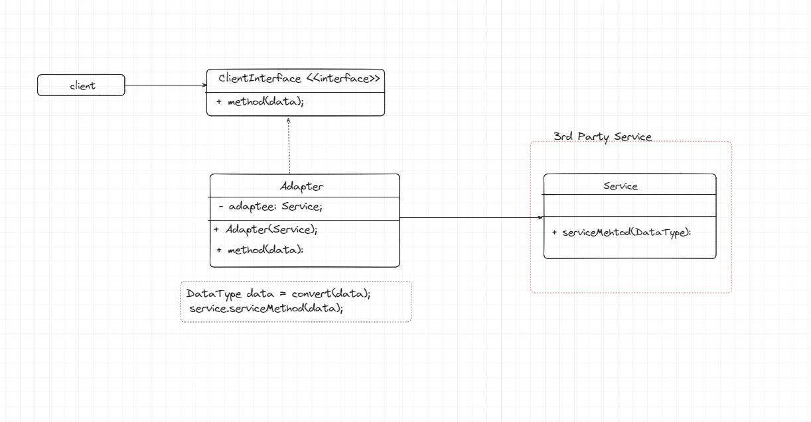

- Adapter is a structural design pattern which removes incompatibility between two different objects so that they can work together
    using Adapter interface. Object incompatibility means, when one object wants to use another object's functionality, but due to 
    some constraint another object (target) can't adapt first object. In that case an adapter interface comes and take first
    object (source), and makes it in such a way that it adapts target object.
- For example, Macbook laptop does not have ethernet slot, for connecting ethernet cable to Macbook, we need one adapter device
    which have both the slots through which we can easily connect Ethernet cable.

**Problem**
- Suppose, while working on a project, we might need to use some third party tool for some reason. That tool accepts data in some 
b format, but we have data in our a format. In that case how will we make compatibility with that tool as we want to use that
tool anyhow. Although, we can write a method/UtilityClass for completing the requirement but this is not extendable, and
code is not readable. What we can do here, we can use Adapter pattern to fulfilling requirement with readable, extendable code.

**Steps to-do**
1. Make sure you have least two different classes/instances which are incompatible with each other.
   1. Service class: which will make Composition with your adapter, and it's codebase we can't change.
   2. Client classes that want to use this services.
2. Create client interface and adapter class which will implement client interface.
3. Put a reference of service class in the adapter class, so that Client uses adapter via client interface.

**Pros**
1. No change in actual code.
2. Each class has its own responsibility which leads to Single Responsibility principle follows.
3. It follows Open/Close principle as in future some other format comes, we can easily use them.

**Cons**
1. Using extra layer of adapter increases the complexity of code.
2. Overuse of adapter can also lead to code issue.
3. Unit Testing becomes challenging to do as we need to test our per expected behaviour

Learn more of this pattern here. 
1. [Learn More here](https://refactoring.guru/design-patterns/adapter)
2. [Learn More here](https://www.pentalog.com/blog/design-patterns/adapter-design-pattern/)