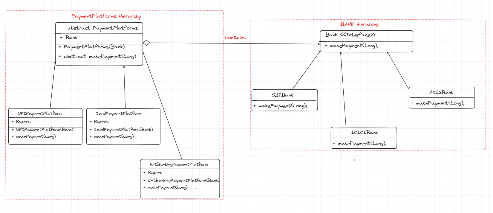

- Bridge design pattern is a structural design pattern which helps us to make a relationship/structure between multiple hierarchies
    by using `Abstraction and Implementation`.

**Problem**
- For example, You have Different Payment Platforms (UPI, Card, NetBanking) and each one of them can interact with different banks
    like (SBI, ICICI, AXIS and more).
- Now, now this combination will lead to n*m different classes if we don't use Builder pattern as Payment Platforms have different
  operations and Banks have difference operations to do.
- So, if we see, Platforms are one hierarchy and Banks are one hierarchy. We will link them using Has-A relationship. which is known
  as Bridge pattern.

**Steps to-do**
1. You need to find different hierarchies in your classes and relation among them.
2. Whatever operations client needs, define them in abstraction class.
3. Now, create concrete implementation of all required classes.
4. Each extended child class of abstraction class should have constructor to make a connection with other hierarchy. 

**Pros**
1. Platform Independent classes.
2. Single Responsibility of each class.
3. Open-Closed principle follows, as code is extendible.
4. Easy to maintain.

**Cons**
1. Code is more complicated to understand when structure becomes more complex.

Learn more of this pattern here. [Learn More here](https://refactoring.guru/design-patterns/bridge)