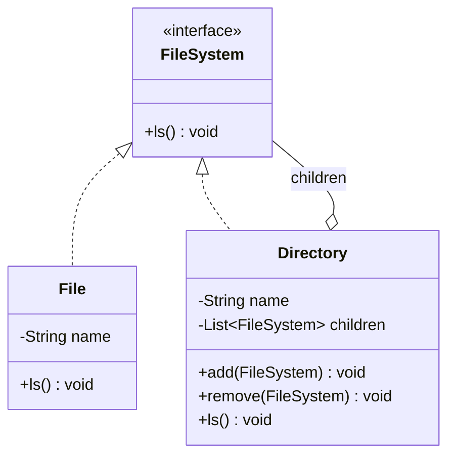

# Pattern Recognition #11: The Composite Pattern 📁
 
*“Build tree structures, treat parts and wholes the same.”*
 
---
 
## Introduction
 
Hey there! Welcome back to our design patterns journey. In the last article, we explored the Iterator Pattern — iterating collections without exposing internal representation. Today, we’re diving into another powerful structural pattern — **the Composite Pattern**.
 
But before we jump into theory, let me ask you:
 
- Have you ever started with a simple list… and later the business asked for **nested groups**?
- Have you ever ended up writing lots of `if/else` just to handle “folder vs file” or “menu vs menu item”?
 
If yes, you’ve already encountered the Composite problem.
 
---
 
## The Problem: File System (Folder + Files)
 
Let’s take a simple real-world problem: **File System**.
 
- A **File** is a single object (leaf)
- A **Directory** can contain files and subdirectories (composite)
 
Now the client wants to perform the same operation on both:
 
- `ls()` (list)
 
In short: treat a file and a directory **uniformly**.
 
---
 
## The Naive Approach: Two different APIs + type checks
 
Without Composite, we usually design like this:
 
- `File` has `ls()`
- `Directory` has `ls()` plus `addChild()`, `getChildren()`, etc.
 
And the client ends up doing:
 
```java
if (node is File) { ... }
else if (node is Directory) { ... iterate children ... }
```
 
As the structure grows deeper, this branching logic spreads everywhere and becomes painful to maintain.
 
---
 
## The Conversation: Junior meets Senior
 
**Junior:** “I have `File` and `Directory`. Directory contains children.”
 
**Senior:** “How does the client print everything?”
 
**Junior:** “It checks if it’s a directory and then loops children. If it’s a file, it prints directly.”
 
**Senior:** “That means client code knows the structure and has special cases. That’s going to explode once nesting grows.”
 
**Junior:** “So what should I do?”
 
**Senior:** “Give both `File` and `Directory` the same interface and let the tree handle recursion. That’s Composite.”
 
---
 
## The Solution: Enter the Composite Pattern
 
The Composite Pattern:
 
- lets you build **tree structures** (part-whole hierarchy)
- allows clients to treat:
  - a single object (**leaf**) and
  - a group of objects (**composite**)
  **the same way**
 
### The roles
 
- **Component**: common interface for everything in the tree (`FileSystem`)
 - **Leaf**: the simplest node, has no children (`File`)
 - **Composite**: a container node that holds children (`Directory`)
 
---
 
## Building the Solution
 
Your working implementation already exists here:
 
- `Structural_Desing_pattern/Composite/FileSystem.java`
 - `Structural_Desing_pattern/Composite/File.java`
 - `Structural_Desing_pattern/Composite/Directory.java`
 - `Structural_Desing_pattern/Composite/Main.java`
 
### Step 1: Create the Component interface
 
```java
public interface FileSystem {
    void ls();
}
```
 
### Step 2: Implement Leaf (`File`)
 
```java
public class File implements FileSystem {
    private String name;

    public File(String name) {
        this.name = name;
    }

    @Override
    public void ls() {
        System.out.println("File: " + name);
    }
}
```
 
### Step 3: Implement Composite (`Directory`)
 
```java
public class Directory implements FileSystem {
    private String name;
    private List<FileSystem> children;

    public void add(FileSystem fileSystem) { ... }

    @Override
    public void ls() {
        System.out.println("Directory: " + name);
        for (FileSystem fileSystem : children) {
            fileSystem.ls();  // recursion + uniform behavior
        }
    }
}
```
 
### Step 4: Client code becomes simple
 
Client creates a tree and calls one method:
 
```java
music.ls();
```
 
No type checks. No special cases. Just one operation on the root.
 
---
 
## Class Diagram (Mermaid)
 

 
---
 
## Common Pitfalls
 
1. **God interface**
   - Don’t put too many unrelated operations in the Component interface. Keep it minimal.
 
2. **Cycles in the tree**
   - Composite assumes a tree. If you accidentally allow a directory to include itself (directly or indirectly), recursion can blow up.
 
3. **Exposing children list directly**
   - Returning the raw `children` list lets callers bypass rules and creates tight coupling.
 
4. **Unsupported operations tradeoff**
   - Some Composite designs expose `add/remove/getChild` at the Component level. That’s convenient for clients but leaves will inherit methods that don’t make sense.
   - A common approach is throwing `UnsupportedOperationException` from leaf operations.
 
5. **Overusing Composite**
   - If the structure is truly flat and won’t become nested, Composite adds unnecessary complexity.
 
---
 
## Exercise for User: Menu + Submenu (Tree of menus)
 
Now that you understand Composite, try implementing a **Menu system** with:
 
- `Menu` (composite) can contain `MenuItem` and other `Menu` (submenus)
 - `MenuItem` (leaf) cannot contain children
 - both should be treated uniformly using a common `MenuComponent`
 
### Requirements
 
1. Create a tree like:
 
```
ALL MENUS
  PANCAKE HOUSE MENU
    MenuItem...
  DINER MENU
    MenuItem...
    DESSERT MENU
      MenuItem...
  CAFE MENU
    MenuItem...
```
 
2. Client should only do:
 
```java
allMenus.print();
```
 
### Hints
 
- Create `MenuComponent` (abstract class or interface) with methods like:
  - `print()`
  - optionally `add/remove/getChild` (your choice)
 - `MenuItem.print()` prints one item
 - `Menu.print()` prints its name/description and then calls `print()` on all children (recursive)
 
### Bonus
 
- Add `printVegetarianMenu()` by traversing the full tree and printing only vegetarian items.
 
---
 
## References
 
- Head First Design Patterns (2nd Edition) by Eric Freeman & Elisabeth Robson
 - Github: Low-Level Design Repository ([`https://github.com/code123-tech/Low-Level-Design-Questions/`](https://github.com/code123-tech/Low-Level-Design-Questions/))

