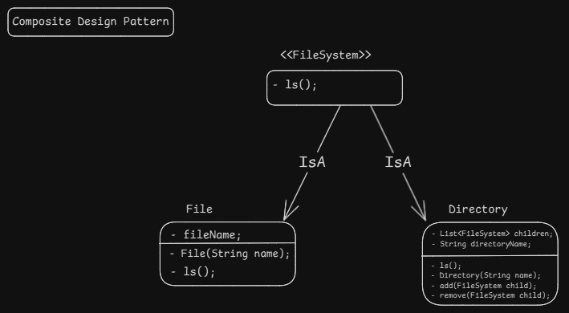

- Composite design pattern is a structural design pattern which helps to create objects into tree structure and further work with them as a single object.

#### example
- Folder and file system in OS where folder can have files and subfolders.
- Expression evaluation where expression can have subexpression and leaf expression.

#### Steps to-do
1. Create an interface which describes common operations for both leaf and composite objects of the tree.
2. The leaf is basic element of tree which doesn't have any further subelements.
3. The composite is a container which can have leaf and other composite objects.
4. Composite object should have a list of child objects (can be leaf or can be container).

#### Diagram

#### Pros
1. 

#### Cons
1. 

Learn more of this pattern here. [Learn More here](https://refactoring.guru/design-patterns/composite)