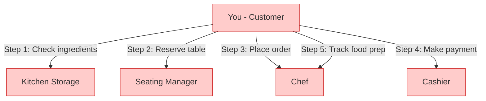
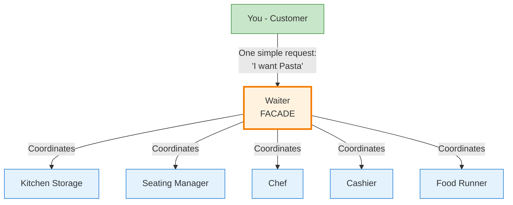
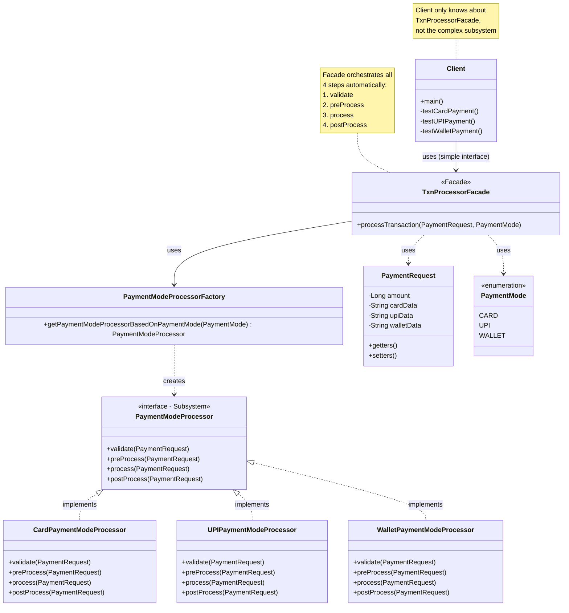

# Pattern Recognition #8: The Facade Pattern 💳

*"Simplifying Complexity - Making Complex Systems Easy to Use"*

---

## Introduction: When Systems Get Too Complex

Hey there! Welcome back to our design patterns journey. In the last article, we explored the Adapter Pattern—making incompatible interfaces work together. Today, we're diving into another structural pattern—**the Facade Pattern**.

But before we jump into theory, let me ask you: Have you ever integrated with a payment gateway where you had to manage validation, database interaction, bank API calls, and response handling separately? Or worked with a system that required you to call 5 different methods in exactly the right order just to accomplish one task? Or maybe you've built an API that was so complex, your clients complained about how hard it was to use?

If any of these scenarios sound familiar, you've encountered the facade problem. The Facade Pattern is like having a "one-click checkout" button instead of manually going through 5 different steps.

Let's learn this through a real story, conversations, and step-by-step building.

---

## The Problem: The Payment Gateway Integration Nightmare

Imagine this: You're working at **"PayFlow Solutions Inc."**, a company that provides payment gateway services to e-commerce platforms. Your system supports three payment modes:

- **Card Payments** (Credit/Debit cards)
- **UPI Payments** (Google Pay, PhonePe, etc.)
- **Wallet Payments** (Paytm, Amazon Pay, etc.)

For each payment, your system follows these mandatory steps:

1. **Validation** - Validate payment request data (card details, UPI ID, wallet info)
2. **Pre-Processing** - Create transaction record in database
3. **Processing** - Make actual bank/payment provider API call
4. **Post-Processing** - Update transaction status in database

Your current system has different processor classes for each payment mode. Here's what your client code looks like:

```java
public class EcommerceCheckout {
    public void processCardPayment(PaymentRequest request) {
        // Client has to know ALL the steps!
        CardPaymentProcessor processor = new CardPaymentProcessor();
        
        processor.validate(request);     // Step 1
        processor.preProcess(request);   // Step 2
        processor.process(request);      // Step 3
        processor.postProcess(request);  // Step 4
        
        System.out.println("Payment complete!");
    }
    
    public void processUPIPayment(PaymentRequest request) {
        // Same 4 steps repeated for UPI!
        UPIPaymentProcessor processor = new UPIPaymentProcessor();
        
        processor.validate(request);
        processor.preProcess(request);
        processor.process(request);
        processor.postProcess(request);
        
        System.out.println("Payment complete!");
    }
    
    public void processWalletPayment(PaymentRequest request) {
        // And again for Wallet!
        WalletPaymentProcessor processor = new WalletPaymentProcessor();
        
        processor.validate(request);
        processor.preProcess(request);
        processor.process(request);
        processor.postProcess(request);
        
        System.out.println("Payment complete!");
    }
}
```

**Your clients are complaining:**

😫 "Why do I need to call 4 different methods every time?"

😫 "What if I forget to call `preProcess()` or call methods in the wrong order?"

😫 "I have to duplicate this logic everywhere I process payments!"

😫 "Every time I integrate a new payment mode, I have to remember all these steps!"

This is getting out of hand!

---

## The Naive Approach: "I'll Just Document the Steps!"

**Junior (You):** "I'll write detailed documentation telling clients to follow these 4 steps..."

You create beautiful documentation:

```
PAYMENT PROCESSING GUIDE
========================

To process a payment, follow these steps:

1. Get the appropriate processor for your payment mode
   - CardPaymentProcessor for cards
   - UPIPaymentProcessor for UPI
   - WalletPaymentProcessor for wallets

2. Call validate() method
3. Call preProcess() method  
4. Call process() method
5. Call postProcess() method

IMPORTANT: DO NOT skip any step or call them in wrong order!
```

**But problems arise:**

- 😫 **Client makes mistakes:** "I called process() before preProcess() and the transaction failed!"
- 😫 **Duplicated code:** Every client has to write the same 4-step sequence
- 😫 **Hard to maintain:** If you add a 5th step (like `sendNotification()`), ALL clients need to update their code
- 😫 **Error-prone:** Easy to forget steps or call them in wrong order
- 😫 **Not user-friendly:** Clients want simplicity, not complexity

**Your manager:** "Our competitors have a single `processPayment()` method. Why do our clients need to call 4 methods? This is hurting our business!"

There has to be a better way...

---

## The Conversation: Junior meets Senior

You go to your senior developer, looking frustrated.

**Junior:** "Our clients keep making mistakes with the payment API. They forget to call `preProcess()` or they call methods in the wrong order. I've written documentation, but they still mess it up!"

**Senior:** "Let me see your code... Ah, I see the problem. You're exposing the internal complexity of your system to clients."

**Junior:** "But... they need to do all these steps. Validation, database operations, API calls—it's all necessary!"

**Senior:** "Yes, but do *they* need to know about it? Tell me, when you order food on Swiggy, do you:
1. Call the restaurant directly to check if item is available?
2. Call your bank to initiate payment?
3. Call the delivery person to schedule pickup?
4. Call the restaurant again to confirm?

Or do you just click 'Order Now' and Swiggy handles everything?"

**Junior:** "Well, obviously I just click 'Order Now'... Oh! You're saying I should hide all those steps behind one method?"

**Senior:** "Exactly! You need a **Facade**. Let me explain the problems with your current approach first."

### Problems with the Naive Approach:

**Senior:** "Here's why exposing all these steps is problematic:

1. **Violates Information Hiding:** Clients know TOO MUCH about your internal process. They shouldn't care about database operations!

2. **Violates Principle of Least Knowledge:** Clients are talking to 4 different methods when they should just talk to one.

3. **Error-Prone:** It's too easy to forget a step or call them in wrong order. One mistake = failed payment = angry customers.

4. **Code Duplication:** Every single client has to write the same 4-step sequence. Violates DRY (Don't Repeat Yourself).

5. **Hard to Extend:** Want to add a 5th step like fraud detection? Now ALL clients need to update their code. That's a breaking change!

6. **Tight Coupling:** Clients are tightly coupled to your internal implementation. Change anything, and clients break.

7. **Poor User Experience:** Your API is hard to use. Developers hate hard-to-use APIs.

What if we created a **single method** that does all 4 steps internally? Clients just call one method, and we handle the complexity."

**Junior:** "That sounds perfect! But how do we ensure the steps always run in the right order?"

**Senior:** "The Facade pattern solves exactly this problem. Let me tell you a story about a restaurant..."

---

## The Analogy: The Restaurant Experience 🍽️

**Senior:** "Think about how a restaurant works. Let me draw this for you:

### Without Facade (Do-It-Yourself Restaurant):



**Problems:**
- ❌ You need to know 5 different people/processes
- ❌ You need to follow exact sequence
- ❌ You handle all coordination
- ❌ Easy to mess up the order
- ❌ Exhausting experience!

### With Facade (Normal Restaurant with Waiter):



**Benefits:**
- ✅ You only talk to ONE person (waiter)
- ✅ Simple request: "I want Pasta"
- ✅ Waiter handles all complexity
- ✅ Waiter ensures correct sequence
- ✅ Great experience!

### The Pattern Mapping:

| **Restaurant**               | **Code World**       | **Payment Gateway**                                 |
|------------------------------|----------------------|-----------------------------------------------------|
| Customer                     | Client               | E-commerce application                              |
| Waiter                       | **Facade**           | TransactionProcessorFacade                          |
| Kitchen, Chef, Cashier       | **Subsystem**        | Processors (Validate, PreProcess, Process, PostProcess) |
| "I want Pasta"               | Simplified Method    | `processTransaction()`                              |
| Individual steps             | Complex Methods      | `validate()`, `preProcess()`, `process()`, `postProcess()` |

**Key Insight:**
- ✅ Customer talks to ONE interface (Waiter/Facade)
- ✅ Waiter talks to MANY subsystem components
- ✅ Complexity is hidden behind simple request
- ✅ Customer doesn't need to know the kitchen works

**Junior:** "Ohhh! So instead of clients calling 4 methods, they just call ONE method on the facade, and the facade orchestrates everything internally?"

**Senior:** "Exactly! The facade is like a waiter—it takes a simple request and coordinates all the complex steps behind the scenes. Let's build it!"

---

## The Solution: Enter the Facade Pattern

The **Facade Pattern** says:

> **Provides a unified interface to a set of interfaces in a subsystem. Facade defines a higher-level interface that makes the subsystem easier to use.**

Let's break this down:
- **"Unified interface"** - One simple method instead of many complex ones
- **"Set of interfaces in a subsystem"** - Multiple steps/methods that work together
- **"Higher-level interface"** - More abstract, simpler operations
- **"Makes the subsystem easier to use"** - Hides complexity from clients

### The Players:

| **Role**              | **Description**                       | **Restaurant Analogy**     | **Payment Gateway**                     |
|-----------------------|---------------------------------------|----------------------------|------------------------------------------|
| Facade                | Simplified unified interface          | Waiter                     | TransactionProcessorFacade               |
| Subsystem Classes     | Complex components that do the work   | Kitchen, Chef, Cashier     | Payment processors (Card, UPI, Wallet)   |
| Client                | Uses the simple facade interface      | Customer                   | E-commerce application                   |

---

## Building the Solution: Step-by-Step

Let's solve the payment gateway problem properly using the Facade Pattern.

### Step 1: Define the Subsystem Interface

First, let's define what each payment processor must do:

```java
package Facade.PaymentModeProcessors;

import Facade.model.PaymentRequest;

// Subsystem Interface - All processors implement this
public interface PaymentModeProcessor {
    void validate(PaymentRequest paymentRequest);
    void preProcess(PaymentRequest paymentRequest);
    void process(PaymentRequest paymentRequest);
    void postProcess(PaymentRequest paymentRequest);
}
```

This interface defines the 4 steps that EVERY payment mode must follow.

### Step 2: Create Supporting Classes

```java
package Facade.model;

// Data model for payment request
public class PaymentRequest {
    private String upiData;
    private String cardData;
    private String walletData;
    private Long amount;
    
    // Getters and setters
    public String getUpiData() {
        return upiData;
    }
    
    public void setUpiData(String upiData) {
        this.upiData = upiData;
    }
    
    public String getCardData() {
        return cardData;
    }
    
    public void setCardData(String cardData) {
        this.cardData = cardData;
    }
    
    public String getWalletData() {
        return walletData;
    }
    
    public void setWalletData(String walletData) {
        this.walletData = walletData;
    }
    
    public Long getAmount() {
        return amount;
    }
    
    public void setAmount(Long amount) {
        this.amount = amount;
    }
}

// Enum for payment modes
package Facade.model;

public enum PaymentMode {
    CARD,
    UPI,
    WALLET
}
```

### Step 3: Implement Subsystem Classes (Payment Processors)

Now let's create the concrete implementations for each payment mode:

```java
package Facade.PaymentModeProcessors.Impl;

import Facade.PaymentModeProcessors.PaymentModeProcessor;
import Facade.model.PaymentRequest;

// Subsystem Class 1: Card Payment Processor
public class CardPaymentModeProcessor implements PaymentModeProcessor {
    
    @Override
    public void validate(PaymentRequest paymentRequest) {
        System.out.println("CardPayment: Validating Card Details...");
        // Validate card number, CVV, expiry date, etc.
    }
    
    @Override
    public void preProcess(PaymentRequest paymentRequest) {
        System.out.println("CardPayment: Loading txn details in DB...");
        // Create transaction record in database
    }
    
    @Override
    public void process(PaymentRequest paymentRequest) {
        System.out.println("CardPayment: Respective Bank Call for Card Txn...");
        // Make actual API call to payment gateway/bank
    }
    
    @Override
    public void postProcess(PaymentRequest paymentRequest) {
        System.out.println("CardPayment: Updating Response received from Bank...");
        // Update transaction status in database
    }
}

// Subsystem Class 2: UPI Payment Processor
public class UPIPaymentModeProcessor implements PaymentModeProcessor {
    
    @Override
    public void validate(PaymentRequest paymentRequest) {
        System.out.println("UPIPayment: Validating Details...");
        // Validate UPI ID format
    }
    
    @Override
    public void preProcess(PaymentRequest paymentRequest) {
        System.out.println("UPIPayment: Loading txn details in DB...");
        // Create transaction record
    }
    
    @Override
    public void process(PaymentRequest paymentRequest) {
        System.out.println("UPIPayment: Respective Bank Call for UPI Txn...");
        // Make UPI payment API call
    }
    
    @Override
    public void postProcess(PaymentRequest paymentRequest) {
        System.out.println("UPIPayment: Updating Response received from Bank...");
        // Update status
    }
}

// Subsystem Class 3: Wallet Payment Processor
public class WalletPaymentModeProcessor implements PaymentModeProcessor {
    
    @Override
    public void validate(PaymentRequest paymentRequest) {
        System.out.println("WalletPayment: Validating Details...");
        // Validate wallet balance, user account, etc.
    }
    
    @Override
    public void preProcess(PaymentRequest paymentRequest) {
        System.out.println("WalletPayment: Loading txn details in DB...");
        // Create transaction record
    }
    
    @Override
    public void process(PaymentRequest paymentRequest) {
        System.out.println("WalletPayment: Respective Bank Call for WALLET Txn...");
        // Deduct from wallet
    }
    
    @Override
    public void postProcess(PaymentRequest paymentRequest) {
        System.out.println("WalletPayment: Updating Response received from Bank...");
        // Update wallet balance and transaction status
    }
}
```

**Notice:** Each processor implements the same interface but has different internal logic. This is your complex subsystem!

### Step 4: Create Factory (Optional but Recommended)

A factory helps us get the right processor based on payment mode:

```java
package Facade.factory;

import Facade.PaymentModeProcessors.Impl.CardPaymentModeProcessor;
import Facade.PaymentModeProcessors.Impl.UPIPaymentModeProcessor;
import Facade.PaymentModeProcessors.Impl.WalletPaymentModeProcessor;
import Facade.PaymentModeProcessors.PaymentModeProcessor;
import Facade.model.PaymentMode;

public class PaymentModeProcessorFactory {
    
    public static PaymentModeProcessor getPaymentModeProcessorBasedOnPaymentMode(
            PaymentMode paymentMode) {
        
        switch (paymentMode) {
            case CARD:
                return new CardPaymentModeProcessor();
            case UPI:
                return new UPIPaymentModeProcessor();
            case WALLET:
                return new WalletPaymentModeProcessor();
            default:
                throw new RuntimeException("Given Payment Mode is not integrated now!!");
        }
    }
}
```

### Step 5: Create the Facade (The Magic!)

Now comes the star of the show—the **TransactionProcessorFacade**:

```java
package Facade;

import Facade.PaymentModeProcessors.PaymentModeProcessor;
import Facade.factory.PaymentModeProcessorFactory;
import Facade.model.PaymentMode;
import Facade.model.PaymentRequest;

// FACADE - Simplifies the entire payment processing subsystem
public class TxnProcessorFacade {
    
    /**
     * ONE simple method that does EVERYTHING!
     * Client just calls this - we handle all the complexity.
     */
    public void processTransaction(PaymentRequest paymentRequest, PaymentMode paymentMode) {
        // Step 1: Get the right processor
        PaymentModeProcessor paymentModeProcessor = 
            PaymentModeProcessorFactory.getPaymentModeProcessorBasedOnPaymentMode(paymentMode);
        
        // Step 2: Execute all steps in the CORRECT order
        paymentModeProcessor.validate(paymentRequest);
        paymentModeProcessor.preProcess(paymentRequest);
        paymentModeProcessor.process(paymentRequest);
        paymentModeProcessor.postProcess(paymentRequest);
        
        System.out.println("✅ Transaction processed successfully!\n");
    }
}
```

**What's happening here?**
- The facade provides **ONE simple method**: `processTransaction()`
- Internally, it:
  1. Gets the appropriate processor using the factory
  2. Calls all 4 steps in the **correct order**
  3. Handles all the complexity
- Clients **don't need to know** about the 4 steps!

### Step 6: Client Code (Super Simple Now!)

Look how amazingly simple the client code becomes:

```java
package Facade;

import Facade.model.PaymentMode;
import Facade.model.PaymentRequest;

public class Client {
    public static void main(String[] args) {
        // Create the facade
        TxnProcessorFacade txnProcessorFacade = new TxnProcessorFacade();
        
        // Test different payment modes
        System.out.println("=== Testing Card Payment ===");
        testCardPayment(txnProcessorFacade);
        
        System.out.println("\n=== Testing UPI Payment ===");
        testUPIPayment(txnProcessorFacade);
        
        System.out.println("\n=== Testing Wallet Payment ===");
        testWalletPayment(txnProcessorFacade);
    }
    
    private static void testCardPayment(TxnProcessorFacade txnProcessorFacade) {
        PaymentRequest paymentRequest = new PaymentRequest();
        paymentRequest.setCardData("1234-5678-9012-3456");
        paymentRequest.setAmount(100L);
        
        // ONE method call - that's it!
        txnProcessorFacade.processTransaction(paymentRequest, PaymentMode.CARD);
    }
    
    private static void testUPIPayment(TxnProcessorFacade txnProcessorFacade) {
        PaymentRequest paymentRequest = new PaymentRequest();
        paymentRequest.setUpiData("user@paytm");
        paymentRequest.setAmount(200L);
        
        // ONE method call - that's it!
        txnProcessorFacade.processTransaction(paymentRequest, PaymentMode.UPI);
    }
    
    private static void testWalletPayment(TxnProcessorFacade txnProcessorFacade) {
        PaymentRequest paymentRequest = new PaymentRequest();
        paymentRequest.setWalletData("PaytmWallet");
        paymentRequest.setAmount(300L);
        
        // ONE method call - that's it!
        txnProcessorFacade.processTransaction(paymentRequest, PaymentMode.WALLET);
    }
}
```

**Output:**

```
=== Testing Card Payment ===
CardPayment: Validating Card Details...
CardPayment: Loading txn details in DB...
CardPayment: Respective Bank Call for Card Txn...
CardPayment: Updating Response received from Bank...
✅ Transaction processed successfully!

=== Testing UPI Payment ===
UPIPayment: Validating Details...
UPIPayment: Loading txn details in DB...
UPIPayment: Respective Bank Call for UPI Txn...
UPIPayment: Updating Response received from Bank...
✅ Transaction processed successfully!

=== Testing Wallet Payment ===
WalletPayment: Validating Details...
WalletPayment: Loading txn details in DB...
WalletPayment: Respective Bank Call for WALLET Txn...
WalletPayment: Updating Response received from Bank...
✅ Transaction processed successfully!
```

**Amazing transformation!** From **4 method calls** to just **1 method call**!

---

## Class Diagram: Payment Gateway Facade



**Key Relationships:**
1. **Client** only depends on **TxnProcessorFacade** (simple interface)
2. **TxnProcessorFacade** uses **PaymentModeProcessorFactory** to get the right processor
3. **Factory** creates appropriate **PaymentModeProcessor** implementation
4. **Three concrete processors** implement the **PaymentModeProcessor** interface
5. Each processor handles the 4 steps internally
6. Client is completely **decoupled** from subsystem complexity!

---

## Let's Review: What We've Achieved

**Junior:** "This is incredible! Let me summarize what we've done:

### Before Facade (The Problem):
```java
// Client had to know ALL 4 steps
CardPaymentProcessor processor = new CardPaymentProcessor();
processor.validate(request);      // Step 1
processor.preProcess(request);    // Step 2  
processor.process(request);       // Step 3
processor.postProcess(request);   // Step 4
```

**Problems:**
- ❌ Client calls 4 methods
- ❌ Client must know the correct order
- ❌ Easy to forget a step
- ❌ Code duplicated everywhere
- ❌ Client tightly coupled to subsystem

### After Facade (The Solution):
```java
// Client calls ONE simple method!
TxnProcessorFacade facade = new TxnProcessorFacade();
facade.processTransaction(request, PaymentMode.CARD);
```

**Benefits:**
- ✅ ONE method call instead of 4
- ✅ No need to know internal steps
- ✅ Can't forget steps or mess up order
- ✅ No code duplication
- ✅ Client decoupled from subsystem
- ✅ Easy to add new payment modes
- ✅ Easy to add new steps (e.g., fraud detection)

**Senior:** "Exactly! And notice some key design decisions we made:

1. **Simplified Interface:** One method (`processTransaction`) instead of exposing 4 methods

2. **Guaranteed Order:** The facade ensures steps ALWAYS execute in correct sequence

3. **Factory Pattern:** We used Factory to get the right processor (bonus pattern!)

4. **Open/Closed Principle:** Want to add NetBanking? Just create `NetBankingPaymentModeProcessor` and update factory. No client code changes!

5. **Single Responsibility:** Facade's ONLY job is orchestration, not business logic

6. **Information Hiding:** Clients don't know (or care) about validate/preProcess/process/postProcess"

**Junior:** "This pattern has transformed our API! But I heard you mention something about a 'Principle of Least Knowledge'?"

**Senior:** "Great question! Let me explain that crucial principle..."

---

## The Principle of Least Knowledge (Law of Demeter)

**Senior:** "The Facade Pattern beautifully demonstrates an important design principle:

> **Principle of Least Knowledge: Talk only to your immediate friends.**

Also known as the **Law of Demeter**, this principle is all about reducing coupling.

### The Rule:

**A method should only call methods belonging to:**

1. **The object itself** (its own methods)
2. **Objects passed as parameters** to the method
3. **Objects it creates/instantiates** within the method
4. **Components of the object** (instance variables/fields)

**DON'T call methods on objects returned from other method calls!**

### Why? Because it creates **tight coupling** and dependencies!

---

### Example 1: Violating the Principle ❌

```java
// BAD - Violating Principle of Least Knowledge
public class EcommerceCheckout {
    
    public void processPayment(PaymentRequest request, PaymentMode mode) {
        // Getting processor...
        PaymentModeProcessor processor = factory.getProcessor(mode);
        
        // Now calling FOUR methods on the processor
        // We're "talking to too many strangers"!
        processor.validate(request);        // Friend 1
        processor.preProcess(request);      // Friend 2
        processor.process(request);         // Friend 3
        processor.postProcess(request);     // Friend 4
    }
}
```

**Problems:**
- We're talking to 4 different methods (4 "friends")
- We know TOO MUCH about how payment processing works internally
- If the process changes (add a new step), we have to update this code
- High coupling!

---

### Example 2: Following the Principle ✅

```java
// GOOD - Following Principle of Least Knowledge
public class EcommerceCheckout {
    private TxnProcessorFacade facade;  // Our ONE friend
    
    public void processPayment(PaymentRequest request, PaymentMode mode) {
        // Only talking to ONE friend (the facade)!
        facade.processTransaction(request, mode);  // That's it!
    }
}
```

**Benefits:**
- We only talk to ONE friend (the facade)
- We don't know (or care) about the 4 internal steps
- If process changes, our code doesn't change
- Loose coupling!

---

### Real-World Example: Weather Station

```java
// ❌ BAD - Violating the Principle
public class WeatherDisplay {
    public float getTemperature(Station station) {
        // We're "reaching through" Station to get to Thermometer
        // We're calling a method on an object RETURNED from another call
        Thermometer thermometer = station.getThermometer();  // Get object
        return thermometer.getTemperature();                 // Call method on it
        
        // Or even worse: chaining!
        return station.getThermometer().getTemperature();    // ❌ BAD!
    }
}
```

**Problem:** We have TWO dependencies (Station AND Thermometer). We're "talking to a stranger" (Thermometer).

```java
// ✅ GOOD - Following the Principle
public class WeatherDisplay {
    public float getTemperature(Station station) {
        // Only talk to our immediate friend: Station
        return station.getTemperature();  // Station handles it internally
    }
}

// Station class provides a convenience method (Facade!)
public class Station {
    private Thermometer thermometer;
    
    public float getTemperature() {
        // Station talks to its own component
        return thermometer.getTemperature();
    }
}
```

**Benefits:** Now we only depend on Station. If Station changes how it measures temperature (maybe switches from Thermometer to TemperatureSensor), our code still works!

---

### Applying to Payment Gateway

**Without Facade (Violates Principle):**
```java
// ❌ Client talks to 4 different "friends"
processor.validate(request);       // Friend 1
processor.preProcess(request);     // Friend 2
processor.process(request);        // Friend 3  
processor.postProcess(request);    // Friend 4
```

**With Facade (Follows Principle):**
```java
// ✅ Client talks to only 1 "friend"
facade.processTransaction(request, mode);  // Only friend: TxnProcessorFacade
```

---

### The Tradeoff

**Advantages of Following the Principle:**
- ✅ Reduced dependencies between classes
- ✅ Easier to maintain (fewer ripple effects from changes)
- ✅ Looser coupling
- ✅ Changes are localized
- ✅ Code is easier to understand

**Disadvantages:**
- ❌ Need to create more "wrapper" methods
- ❌ Can increase number of classes slightly
- ❌ Small runtime overhead (extra method calls)

**Rule of Thumb:** Use it when it **simplifies** your design and **reduces** coupling. Don't go overboard creating wrappers for everything!

---

### Common Violation: System.out.println()

Interestingly, one of the most common violations of this principle in Java is:

```java
System.out.println("Hello");  // Violates the principle!
```

**Why?** Because we're calling:
1. `System` class
2. `.out` field (returns a PrintStream)
3. `.println()` method on that PrintStream

We're calling a method on an object RETURNED from another object! But should you care? **Probably not** - it's a well-established API that won't change.

**Lesson:** Principles are guidelines, not laws. Use judgment!

---

## Benefits of the Facade Pattern

### ✅ 1. Simplified Interface
- Clients use simple, high-level methods
- Complex subsystem hidden behind clean API
- One method instead of many

### ✅ 2. Principle of Least Knowledge
- Client talks to only ONE object (the facade)
- Fewer "friends" = less coupling
- More maintainable code

### ✅ 3. Guaranteed Correct Execution
- Facade ensures steps run in correct order
- No chance of forgetting a step
- Error-proof process

### ✅ 4. Decoupling
- Client doesn't know about subsystem components
- Changes to subsystem don't affect client
- Reduces dependencies

### ✅ 5. Easy to Extend
- Add new payment modes without changing client
- Add new steps (e.g., fraud detection) in facade only
- Open/Closed Principle

### ✅ 6. No Code Duplication
- Orchestration logic in ONE place (facade)
- DRY (Don't Repeat Yourself)
- Easier maintenance

### ✅ 7. Subsystem Still Accessible
- Facade doesn't hide subsystem
- Advanced users can still access low-level components if needed
- Flexibility for power users

---

## When to Use the Facade Pattern

**✅ USE IT WHEN:**
- You have a complex subsystem with many interdependent steps
- Clients keep repeating the same sequence of method calls
- You want to provide a simple interface to a complex system
- You want to enforce a specific order of operations
- You need to reduce dependencies between client and subsystem
- Your API is hard to use and clients complain
- You're building a library/framework for others to use

**❌ AVOID IT WHEN:**
- The subsystem is already simple (adding facade would add unnecessary complexity)
- Clients need fine-grained control over every step
- There's no common workflow to simplify
- Creating a facade would just move complexity, not reduce it
- The "simplified" interface would still be complex

---

## Common Pitfalls and Solutions

### ❌ Pitfall 1: Facade Becomes a God Object

**Wrong:**
```java
public class SystemFacade {
    // TOO MUCH! Facade does everything!
    public void processPayment() { ... }
    public void sendEmail() { ... }
    public void generateReport() { ... }
    public void manageUsers() { ... }
    public void handleInventory() { ... }
    public void processRefund() { ... }
    // ... 50 more unrelated methods
}
```

**Right:**
```java
// Create separate facades for different subsystems
public class PaymentFacade { 
    public void processPayment() { ... }
    public void processRefund() { ... }
}

public class NotificationFacade {
    public void sendEmail() { ... }
    public void sendSMS() { ... }
}

public class ReportingFacade {
    public void generateReport() { ... }
}
```

**Rule:** One facade per cohesive subsystem!

### ❌ Pitfall 2: Facade Contains Business Logic

**Wrong:**
```java
public class TxnProcessorFacade {
    public void processTransaction(PaymentRequest request, PaymentMode mode) {
        // DON'T: Adding business logic in facade!
        if (request.getAmount() > 10000) {
            applyPremiumDiscount(request);   // Business logic
            sendVIPNotification(request);     // Business logic
        }
        
        // DON'T: Complex validation in facade
        if (!validateAmount(request)) {
            throw new ValidationException();
        }
        
        // This is fine - orchestration
        PaymentModeProcessor processor = factory.getProcessor(mode);
        processor.validate(request);
        processor.process(request);
    }
}
```

**Right:**
```java
public class TxnProcessorFacade {
    public void processTransaction(PaymentRequest request, PaymentMode mode) {
        // ONLY orchestration, NO business logic
        PaymentModeProcessor processor = factory.getProcessor(mode);
        processor.validate(request);      // Validation done by subsystem
        processor.preProcess(request);
        processor.process(request);
        processor.postProcess(request);
    }
}
```

**Rule:** Facade should **orchestrate**, not **implement** business logic!

### ❌ Pitfall 3: Creating Too Many Methods

**Wrong:**
```java
public class TxnProcessorFacade {
    // Too granular - defeating the purpose!
    public void processCardPaymentWithValidation(PaymentRequest req) { ... }
    public void processCardPaymentWithoutValidation(PaymentRequest req) { ... }
    public void processUPIPaymentWithRetry(PaymentRequest req) { ... }
    public void processUPIPaymentWithoutRetry(PaymentRequest req) { ... }
    // ... 20 more variations
}
```

**Right:**
```java
public class TxnProcessorFacade {
    // One simple method with options if needed
    public void processTransaction(PaymentRequest request, 
                                   PaymentMode mode) { ... }
    
    // Or with optional configuration
    public void processTransaction(PaymentRequest request, 
                                   PaymentMode mode,
                                   TransactionOptions options) { ... }
}
```

**Rule:** Keep it simple! Don't create variations for every possible scenario.

---

## Facade vs Other Patterns

### Facade vs Adapter

| Aspect | Facade | Adapter |
|--------|--------|---------|
| **Intent** | Simplify complex interface | Convert one interface to another |
| **Complexity** | Simplifies many classes | Usually wraps one class |
| **Interface** | Creates new simplified interface | Implements existing interface |
| **Purpose** | Make complex simple | Make incompatible compatible |
| **Example** | 4 steps → 1 method | VendorB → VendorA interface |

```java
// Adapter: Interface conversion
PaymentService adapter = new VendorBAdapter(vendorB);

// Facade: Simplification
TxnProcessorFacade facade = new TxnProcessorFacade();
facade.processTransaction(request, mode);
```

**Can use both?** YES! An adapter can adapt to a facade!

### Facade vs Decorator

| Aspect | Facade | Decorator |
|--------|--------|-----------|
| **Intent** | Simplify interface | Add responsibilities |
| **Wrapping** | Wraps many objects | Wraps one object |
| **Interface** | Creates new interface | Keeps same interface |
| **Purpose** | Simplification | Enhancement |

```java
// Decorator: Same interface, added behavior
InputStream stream = new BufferedInputStream(new FileInputStream(file));

// Facade: New simpler interface
facade.processTransaction(request, mode);
```

---

## Real-World Applications

### 1. **Database ORM Facade**
```java
public class DatabaseFacade {
    public List<User> getAllUsers() {
        // Hides: connection, statement, result set, mapping
    }
    
    public void saveUser(User user) {
        // Hides: transaction, validation, SQL generation
    }
}
```

### 2. **File Upload Facade**
```java
public class FileUploadFacade {
    public String upload(File file, String bucket) {
        // Hides: S3 upload, CDN distribution, metadata storage
    }
}
```

### 3. **Email Service Facade**
```java
public class EmailFacade {
    public void sendWelcomeEmail(User user) {
        // Hides: template loading, personalization, SMTP config
    }
}
```

### 4. **Report Generation Facade**
```java
public class ReportFacade {
    public byte[] generatePDF(ReportData data) {
        // Hides: data validation, template merging, PDF generation
    }
}
```

---

## Example 2: Home Theater System (Practice Assignment) 🎬

**Senior:** "Now that you understand the pattern, let me give you a homework assignment to practice!"

### The Problem

You're building a smart home theater system with these components:

```java
// Component 1: Popcorn Popper
public class PopcornPopper {
    public void on() { System.out.println("Popcorn Popper on"); }
    public void off() { System.out.println("Popcorn Popper off"); }
    public void pop() { System.out.println("Popcorn Popper popping popcorn!"); }
}

// Component 2: Theater Lights
public class TheaterLights {
    public void on() { System.out.println("Theater Lights on"); }
    public void off() { System.out.println("Theater Lights off"); }
    public void dim(int level) { System.out.println("Theater Lights dimming to " + level + "%"); }
}

// Component 3: Screen
public class Screen {
    public void up() { System.out.println("Theater Screen going up"); }
    public void down() { System.out.println("Theater Screen going down"); }
}

// Component 4: Projector
public class Projector {
    public void on() { System.out.println("Projector on"); }
    public void off() { System.out.println("Projector off"); }
    public void wideScreenMode() { System.out.println("Projector in widescreen mode"); }
}

// Component 5: Amplifier
public class Amplifier {
    public void on() { System.out.println("Amplifier on"); }
    public void off() { System.out.println("Amplifier off"); }
    public void setStreamingPlayer(StreamingPlayer player) { 
        System.out.println("Amplifier setting Streaming player"); 
    }
    public void setSurroundSound() { 
        System.out.println("Amplifier surround sound on"); 
    }
    public void setVolume(int level) { 
        System.out.println("Amplifier setting volume to " + level); 
    }
}

// Component 6: Streaming Player
public class StreamingPlayer {
    public void on() { System.out.println("Streaming Player on"); }
    public void off() { System.out.println("Streaming Player off"); }
    public void play(String movie) { 
        System.out.println("Streaming Player playing \"" + movie + "\""); 
    }
    public void stop() { System.out.println("Streaming Player stopped"); }
}
```

**The Challenge:** To watch a movie, you currently need to do 13 steps:

1. Turn on the popcorn popper
2. Start popping
3. Dim lights to 10%
4. Put screen down
5. Turn on projector
6. Set projector to widescreen mode
7. Turn on amplifier
8. Set amplifier to streaming player
9. Set amplifier to surround sound
10. Set volume to 5
11. Turn on streaming player
12. Start playing movie

And then 7 steps to end the movie!

### Your Assignment

Create a `HomeTheaterFacade` that provides these simple methods:

```java
public class HomeTheaterFacade {
    // Your code here
    
    public void watchMovie(String movie) {
        // Should do all 13 steps automatically!
    }
    
    public void endMovie() {
        // Should shut everything down!
    }
}
```

### Hints to Help You

**Hint 1:** Start by storing all components as instance variables in the facade:
```java
public class HomeTheaterFacade {
    private Amplifier amp;
    private StreamingPlayer player;
    private Projector projector;
    // ... other components
    
    public HomeTheaterFacade(Amplifier amp, StreamingPlayer player, ...) {
        this.amp = amp;
        this.player = player;
        // ... store all components
    }
}
```

**Hint 2:** In `watchMovie()`, call methods on each component in sequence:
```java
public void watchMovie(String movie) {
    System.out.println("Get ready to watch a movie...");
    popper.on();
    popper.pop();
    lights.dim(10);
    // ... continue with other steps
    player.play(movie);
}
```

**Hint 3:** Don't forget `endMovie()` does the reverse:
```java
public void endMovie() {
    System.out.println("Shutting movie theater down...");
    popper.off();
    lights.on();
    // ... turn everything off
}
```

**Hint 4:** Your client code should look like this:
```java
public class HomeTheaterTest {
    public static void main(String[] args) {
        // Create all components
        Amplifier amp = new Amplifier();
        StreamingPlayer player = new StreamingPlayer();
        // ... create all components
        
        // Create facade
        HomeTheaterFacade homeTheater = new HomeTheaterFacade(
            amp, player, projector, lights, screen, popper
        );
        
        // Watch a movie with ONE method call!
        homeTheater.watchMovie("Inception");
        
        // End movie with ONE method call!
        homeTheater.endMovie();
    }
}
```

### Expected Output

```
Get ready to watch a movie...
Popcorn Popper on
Popcorn Popper popping popcorn!
Theater Lights dimming to 10%
Theater Screen going down
Projector on
Projector in widescreen mode
Amplifier on
Amplifier setting Streaming player
Amplifier surround sound on
Amplifier setting volume to 5
Streaming Player on
Streaming Player playing "Inception"

Shutting movie theater down...
Popcorn Popper off
Theater Lights on
Theater Screen going up
Projector off
Amplifier off
Streaming Player stopped
Streaming Player off
```

### Bonus Challenge 🌟

Add a `listenToRadio()` method that:
- Turns on amplifier
- Sets volume to 5
- Tunes to a radio frequency

Try implementing this yourself! It's great practice for understanding how facades work.

---

## Design Principles Reinforced

The Facade Pattern exemplifies several design principles:

1. **Principle of Least Knowledge** - Client talks to minimum number of objects
2. **Encapsulate what varies** - Complex subsystem is encapsulated
3. **Favor composition over inheritance** - Facade composes subsystem components
4. **Program to interfaces** - Facade provides abstract interface
5. **Loose Coupling** - Client is decoupled from subsystem
6. **Single Responsibility** - Facade's only job is orchestration
7. **DRY** - Don't repeat yourself (orchestration in one place)

---

## The Facade Pattern: Formal Definition

> **The Facade Pattern provides a unified interface to a set of interfaces in a subsystem. Facade defines a higher-level interface that makes the subsystem easier to use.**

Breaking it down:
- **"Unified interface"** - One consistent API (processTransaction)
- **"Set of interfaces"** - Multiple steps/components (validate, preProcess, process, postProcess)
- **"Higher-level interface"** - More abstract operation (one method instead of four)
- **"Easier to use"** - Hides complexity, enforces correct order

---

## Key Takeaways 🎯

1. **Simplification is the goal** - Turn 4 steps into 1 method call

2. **One interface for many** - Client talks to facade, facade coordinates subsystem

3. **Guaranteed correct execution** - Facade ensures steps run in right order

4. **Follows Principle of Least Knowledge** - Client has fewer dependencies

5. **Orchestration, not implementation** - Facade coordinates, doesn't do the work

6. **Think restaurant waiter** - Simple order, complex execution

7. **Easy to extend** - Add new features without breaking clients

---

## What's Next?

You've now learned both **Adapter** and **Facade** patterns!

**Adapter** makes incompatible interfaces work together.  
**Facade** makes complex interfaces simple to use.

Together, they're powerful tools for managing interface complexity!

In future articles, we'll explore more structural patterns like **Decorator**, **Proxy**, and **Composite**.

---

## Practice Exercises 🎯

### Exercise 1: Video Processing Facade

Create a facade for video processing:

**Subsystem:**
```java
VideoDecoder decoder;
AudioExtractor audioExtractor;
Transcoder transcoder;
ThumbnailGenerator thumbnailGen;
MetadataWriter metadataWriter;
```

**Task:** Create `VideoProcessorFacade` with one `process(String inputFile)` method.

### Exercise 2: Booking Facade

Create a facade for hotel booking:

**Subsystem:**
```java
AvailabilityChecker checker;
PaymentProcessor payment;
EmailService email;
InventoryManager inventory;
```

**Task:** Create `BookingFacade` with one `bookRoom(BookingDetails)` method.

Try them yourself!

---

**Previous Articles in This Series:**
- [Pattern Recognition #1: Strategy Pattern](#)
- [Pattern Recognition #2: Observer Pattern](#)
- [Pattern Recognition #3: Decorator Pattern](#)
- [Pattern Recognition #4: Factory Method Pattern](#)
- [Pattern Recognition #5: Singleton Pattern](#)
- [Pattern Recognition #6: Command Pattern](https://medium.com/@swapnilagarwal2001/pattern-recognition-6-command-pattern-89e9c5cd2f7a)
- [Pattern Recognition #7: Adapter Pattern](#)

---

**📚 References:**
- Head First Design Patterns (2nd Edition) by Eric Freeman & Elisabeth Robson
- Design Patterns: Elements of Reusable Object-Oriented Software by Gang of Four
- [Refactoring Guru: Facade Pattern](https://refactoring.guru/design-patterns/facade)

---

*Found this helpful? Follow me for more design pattern deep-dives! 🚀*

*Have questions or suggestions? Drop them in the comments below! 💬*

*Happy Coding! 👨‍💻👩‍💻*
