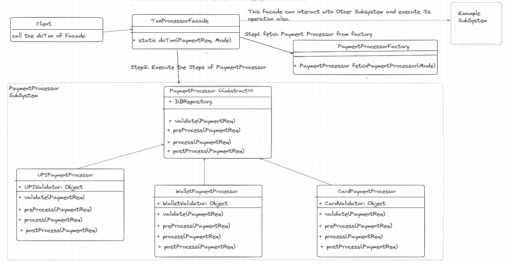

- Facade is a structural design pattern which let you refactor your code in a more readable, errorless, and more 
    operational way.
- Operational way means, if our code has some steps to be followed, we don't want our client to go through
    all those steps, instead of it we want that our client just call one method process and all these steps should be
    executed without client information.

**Problem**
- Suppose, You are a Payment Gateway, you are responsible for doing txn from any PaymentMode (UPI, Card, Wallet)
  For this, you take data from your client and pass it to bank for further process. Now your each Payment Mode
  follows the below Steps:
  - Validation of PaymentRequest --> PaymentModeValidator. --> UPIPaymentModeValidator, etc.
  - Processing
    - PreProcess: Fetch Data From DB for that user --> DBLayerInteraction.
    - Process: Make a Bank call by passing information to bank, and map client Response to our own PaymentResponse --> BankCall. 
  - PostProcessing: Update DB as soon as we get response from bank, and pass txn status to User --> DBLayerInteraction. 
- Now, think that will your client (who is consuming your payment gateway), will it call one-by-one each of your method.
  No, it will not do so. So, Facade Pattern comes into the solution, it provides an abstraction layer on top of our Solution.
  We expose this layer to Client, he just needs to pass information, and execute the process, all is taken care by facade.

**Steps to-do**
1. Check Whether your already existing subsystem can be divided into steps, and a generalized interface/abstraction layer
 can be given to client.
2. Implement this interface in facade class which redirects from client code to appropriate objects of the subsystem.

**Pros**
1. It simplifies your complete repetition of code at each step.
2. It enhances code readability by dividing process into multiple steps.
3. It reduces Error occurrence chances.
4. If your subsystem gets changed to new version, you only need to make change in your facade, client need to change
    their code as they are interacting with facade.

**Cons**
1. Little complex to understand until you are not handy with this pattern.

Learn more of this pattern here. [Learn More here](https://refactoring.guru/design-patterns/facade)