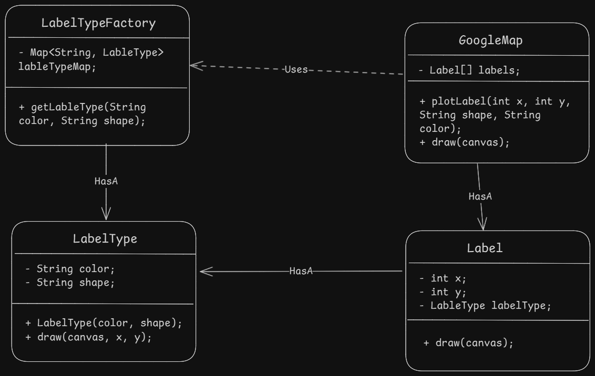

- Flyweight design pattern is a structural design pattern which helps to create multiple objects which share common state (called intrinsic state) and can be used to reduce memory usage. It other terms, `helps to create multiple objects in available memory by sharing common state between them.`
- `intrinsic state:` the common state betweem multiple objects which once defined, can not be changed.
- `Extrinsic state:` the state which can be changed and is not shared between multiple objects.

- So, the flyweight pattern says that, only intrinsic state should be stayed in the object and extrinsic state should be passed as a parameter to the method of the object. This way, we can create multiple objects in available memory by sharing common state between them.
- An object that stores the intrinsic state is called a `flyweight` object.
- A Flyweight object should not expose its state. They should be private, and no setters should be provided.

#### example
- Google map sprads a lot of labels object on the map with common data (like color, shape, size) and only the coordinates are different. So, it can be a good example of flyweight design pattern.
- In a word processor, the font, color, size of the text can be shared between multiple objects and only the text can be different. So, it can be a good example of flyweight design pattern.
- In a game, the player can have common state like color, shape, size and only the position can be different. So, it can be a good example of flyweight design pattern.

#### Steps to-do
1. Find the intrinsic and extrinsic state of the object, and create a flyweight object to store the intrinsic state.
2. Make sure state of flyweight objects are immutable. Make them private and initialize them in constructor.
3. use methods inside flyweight to interact with extrinsic state.
4. Create a factory class to create and manage flyweight objects. The factory class should have a method to get the flyweight object based on the intrinsic state.
4. Create a context class which store extrinsic states along with flyweight object so that different combinations of extrinsic state can be used with the same flyweight object.

#### Diagram

#### Pros
1. Biggest advantage of this pattern is, it can save a lot of memory by sharing common state between multiple objects.

#### Cons
1. OVerhead in understanding as states are seperated between actual and flyweight objects.
2. Code can be complicated as multiple classes can be introduced.

Learn more of this pattern here. [Learn More here](https://refactoring.guru/design-patterns/flyweight)