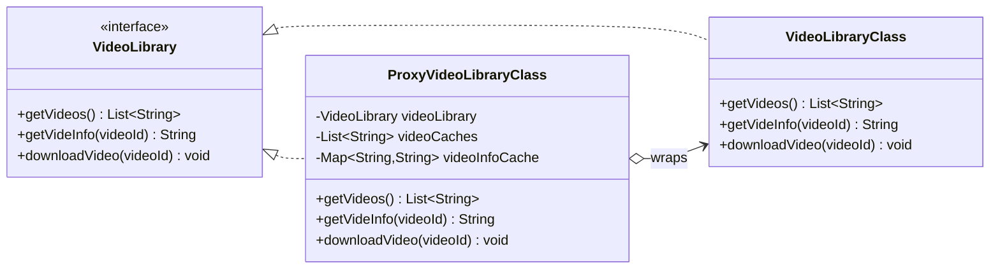

# Pattern Recognition #13: The Proxy Pattern

---

## Introduction

Hey there! Welcome back.

So far we’ve been building systems that are *clean on the inside* — patterns like State helped us manage complexity by splitting behavior across well-defined objects.

Today’s pattern is about something slightly different:

> **What if the object you want to use is expensive, remote, rate-limited, sensitive, or simply not safe to expose directly?**

That’s where the **Proxy Pattern** shows up. A proxy is a stand-in object that looks like the real object, but controls *how* you reach it.

---

## The Problem: Video Library calls are getting expensive

Imagine you’re building a small app that talks to a “Video Library” service:

- `getVideos()` returns a list of video IDs
- `getVideInfo(videoId)` returns metadata for a video
- `downloadVideo(videoId)` triggers a download

At first, you wire the UI directly to the real service.

But soon you notice:

- the UI calls `getVideos()` again and again (same data)
- it calls `getVideInfo("video1")` repeatedly while rendering
- the “server” calls are slow / costly / rate limited

In short: **you need control between client and real object**.

---

## The Naive Approach: Client talks directly to the real object

With no proxy, the client gets a `VideoLibraryClass` instance and calls it everywhere.

This “works”, but every call reaches the real service again:

- repeated network calls
- duplicated work
- performance costs pushed into client code (“let’s cache it in the UI…”)

Now caching and access control starts leaking into multiple places.

---

## The Conversation: Junior meets Senior

**Junior:** “Our UI is slow. I think the video service is the bottleneck. I’ll cache results inside the UI layer.”

**Senior:** “That’ll spread caching across screens and components. We need one place that controls access.”

**Junior:** “So… create a shared helper? Like a singleton cache?”

**Senior:** “Close. We want something that looks exactly like the service, but can add behaviors like caching, logging, rate limiting, or permissions. That’s a proxy.”

---

## The Solution: Enter the Proxy Pattern

**Proxy Pattern**: provide a substitute / placeholder for another object to control access to it.

In your implementation, we’ll use a **Caching Proxy**:

- Client still talks to `VideoLibrary` (an interface)
- Real object: `VideoLibraryClass`
- Proxy: `ProxyVideoLibraryClass` (caches repeated calls)

### What changes for the client?

Nothing — the client stays coded to the `VideoLibrary` interface.

That’s the magic:

- we add caching without changing the client’s method calls
- we keep real-service concerns out of UI/business logic

---

## Step-by-step: Build the caching proxy (repo code)

Code is already present in your repo:

- Interface: `interfaces/VideoLibrary.java`
- Real service: `RealClasses/VideoLibraryClass.java`
- Proxy: `ProxyClasses/ProxyVideoLibraryClass.java`
- Demo: `Main.java`

Run: `Proxy.Main`

---

### Step 1: Create a common interface

Both the proxy and the real service implement the same interface:

```java
public interface VideoLibrary {
    List<String> getVideos();
    String getVideInfo(String videoId);
    void downloadVideo(String videoId);
}
```

---

### Step 2: Implement the real object (the “Real Subject”)

`VideoLibraryClass` is the real service:

- returns a list of videos
- returns video info
- downloads from “server”

```java
public class VideoLibraryClass implements VideoLibrary {
    public List<String> getVideos() { ... }
    public String getVideInfo(String videoId) { ... }
    public void downloadVideo(String videoId) { ... }
}
```

---

### Step 3: Implement the proxy (the “Proxy”)

`ProxyVideoLibraryClass` wraps the real service and adds caching:

- caches the result of `getVideos()`
- caches `getVideInfo(videoId)` per videoId
- delegates `downloadVideo(videoId)` as-is (no caching there)

```java
public class ProxyVideoLibraryClass implements VideoLibrary {
    private VideoLibrary videoLibrary;
    private List<String> videoCaches;
    private Map<String, String> videoInfoCache = new HashMap<>();

    public List<String> getVideos() {
        if (videoCaches == null) {
            videoCaches = videoLibrary.getVideos();
        }
        return videoCaches;
    }

    public String getVideInfo(String videoId) {
        if (videoInfoCache.get(videoId) == null) {
            videoInfoCache.put(videoId, videoLibrary.getVideInfo(videoId));
        }
        return videoInfoCache.get(videoId);
    }

    public void downloadVideo(String videoId) {
        videoLibrary.downloadVideo(videoId);
    }
}
```

---

### Step 4: Client uses the interface (and doesn’t care what’s behind it)

The client composes the proxy with the real service:

```java
VideoLibrary videoProxyLibrary =
    new ProxyVideoLibraryClass(new VideoLibraryClass());
```

Then calls the same methods twice — the second time you’ll see cached behavior kick in.

---

## Class Diagram (Mermaid)



---

## Common Pitfalls

1. **Breaking the interface**
   - If proxy and real object don’t share the exact same interface, clients start branching and the pattern collapses.

2. **Proxy becomes the dumping ground**
   - Don’t pile everything into one proxy class (caching + retries + auth + metrics + fallback) unless you truly want a gateway.
   - Consider composing multiple proxies/decorators if needed.

3. **Cache invalidation**
   - The proxy makes caching easy… correctness harder.
   - Decide: TTL? manual invalidation? per-user cache? global cache?

4. **Thread safety**
   - If the proxy is shared across threads, caches must be safe (synchronization / concurrent maps).

5. **Hiding failures**
   - Proxies that wrap remote calls can fail. Don’t pretend remote calls are identical to local calls; handle timeouts/errors intentionally.

---

## Exercise for User: Remote Gumball Monitoring (Proxy continues State)

If you remember our **State Pattern** article, we built a `GumballMachine` whose behavior changes across states.

Now imagine there are multiple gumball machines across different locations and the CEO wants a **monitoring report**:

- machine location
- current inventory
- current state

You can start with a simple monitor:

```java
public class GumballMonitor {
    GumballMachine machine;
    public void report() {
        System.out.println("Gumball Machine: " + machine.getLocation());
        System.out.println("Current inventory: " + machine.getCount() + " gumballs");
        System.out.println("Current state: " + machine.getState());
    }
}
```

But the twist:

> The monitor must run on the CEO’s desktop, while the real gumball machines run elsewhere.

### Your goal

Keep `GumballMonitor` code basically the same, but instead of giving it a real `GumballMachine`, give it a **proxy** that:

- looks like a `GumballMachine` (or better, an interface like `GumballMachineRemote`)
- forwards calls over the network to the real machine

### Hints (don’t skip these)

- **Step 1**: Create an interface `GumballMachineRemote` with the getters the monitor needs:
  - `getLocation()`
  - `getCount()`
  - `getState()` (string is fine)
- **Step 2**: Update `GumballMonitor` to depend on `GumballMachineRemote`, not the concrete class.
- **Step 3**: Implement:
  - `RealGumballMachine` (the real object running on the machine)
  - `RemoteGumballMachineProxy` (client-side proxy)
- **Step 4 (optional, advanced)**: Use Java RMI (or any RPC mechanism) so the proxy truly calls across JVM boundaries.

If you do it right:

- the monitor thinks it’s calling local methods
- but the proxy is handling the “remote call” details

---

## Key Takeaways

- **Proxy controls access** to a real object.
- A proxy and real object typically share an interface, so clients don’t change.
- Proxies are great for **caching**, **lazy loading**, **access control**, **logging**, **rate limiting**, and **remote calls**.

---

## References

- Head First Design Patterns (2nd Edition) by Eric Freeman & Elisabeth Robson
- Github: Low-Level Design Repository ([`https://github.com/code123-tech/Low-Level-Design-Questions/`](https://github.com/code123-tech/Low-Level-Design-Questions/))

