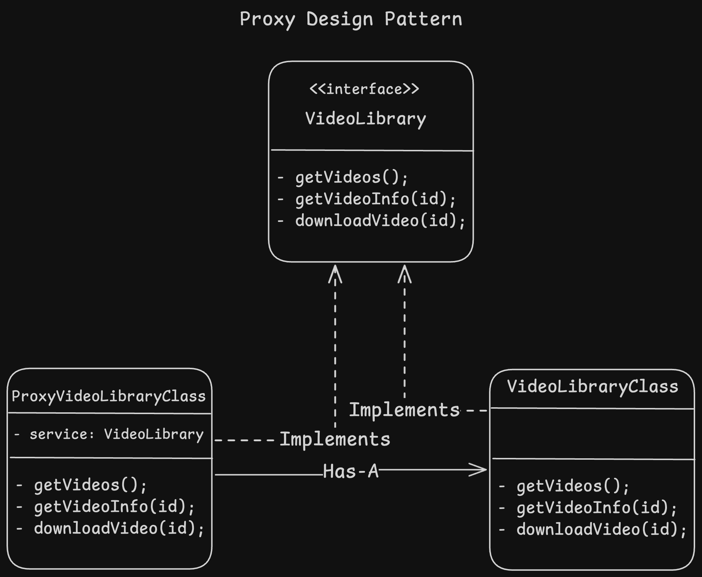

- Proxy design pattern is a structural design pattern which helps to create a middleware object which acts as a substitute object for a original object. it can control access for the real object.

#### example
- For example, a caching layer between server and DB.
- Load balancer works as proxy server to routing the request.
- middleware used to check access of upcoming request on the server.

#### Steps to-do
1. Create proxy class object similar to real-world object and both should implement a common interface.
2. proxy should have real-world object as a Has-A property.

#### Diagram

#### Pros
1. Control actual service object without client knowledge.
2. can introduct new Proxy/service without changing existing (Open/Closed principle)

#### Cons
1. code can be complicated as multiple classes can be introduced.

Learn more of this pattern here. [Learn More here](https://refactoring.guru/design-patterns/proxy)