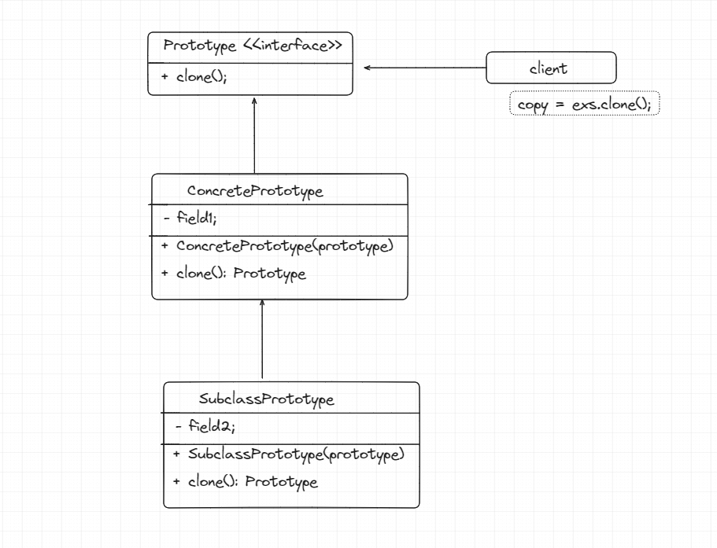

- Prototype is a creational design pattern which allows you to copy the existing object without depending on the class.
- It hides complexity for the client to create clone of an existing object.

**problem**
For ex: When our client wants to create copy of an object. what client will do?
- Client will create instance of the class, and will set the fields as per the existing object field? 
  - Not a feasible Solution if a lot of fields are present.
  - Not all objects can be copied as some fields maybe private.
- Here, Prototype pattern plays hero role, and transfers the responsibility of cloning process to the object which client is calling.
- Prototype Pattern declares common interface for all objects, and it supports cloning.

**Steps to Implement the Prototype Interface**
1. Create Prototype interface, and put a clone method in it, which will be implemented by all its hierarchy classes.
2. Prototype class implements clone method, which is usually of one line with new keyword.
3. Prototype class defines an alternative constructor that accepts an object of that class as an argument.

- Note:  In Java, Cloneable interface is working same as Prototype interface.

1. The Prototype interface has one method clone();
2. The ConcretePrototype class implements clone method, and copies field of existing object.
3. The client call this clone method and get a new copy of the existing object.

Learn more of this pattern here. [Learn More here](https://refactoring.guru/design-patterns/prototype)