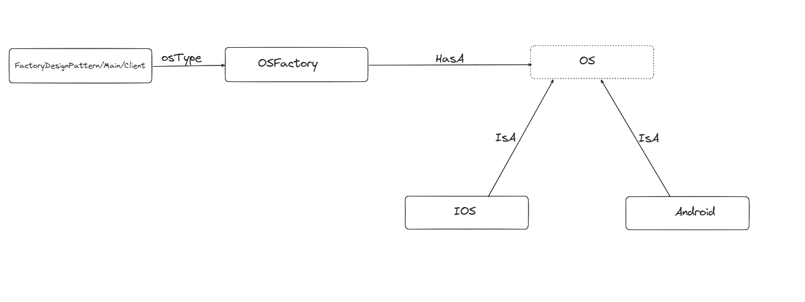

- Factory Design pattern is most useful and common Creational design pattern.
- This design pattern helps to create/use object of a concrete class (pointing to a common interface) at run time based on end user's input.
- This basically has factory class which keeps instances of all common interface implemented concrete classes.
- This is useful to abstract information from end user that how concrete classes are implemented.

- You have multiple type of Operation system (Android, Windows, IOS). Your application requirement is that based on user's input, further operation will happen to that particular OS Object.
   
- Here, interface is OS which is implemented by Android, IOS etc.
- `OSFactory` keeps instances of all above concreted classes, and it takes user input and return OS instance.

